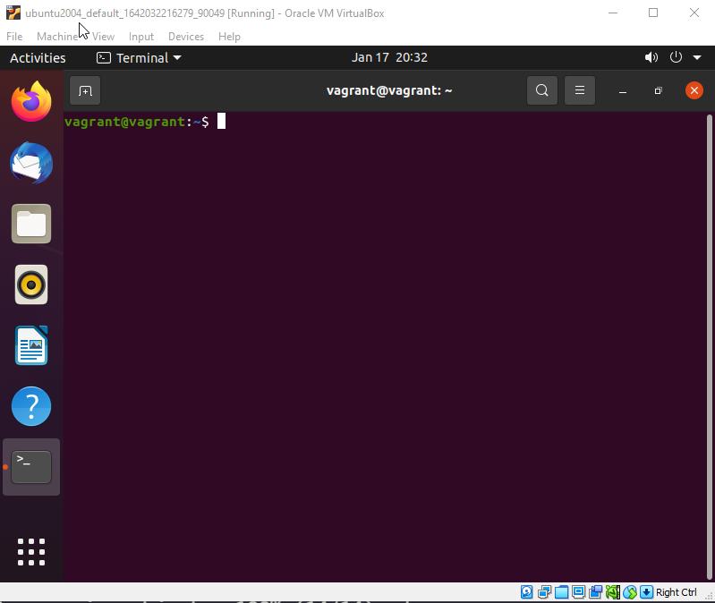
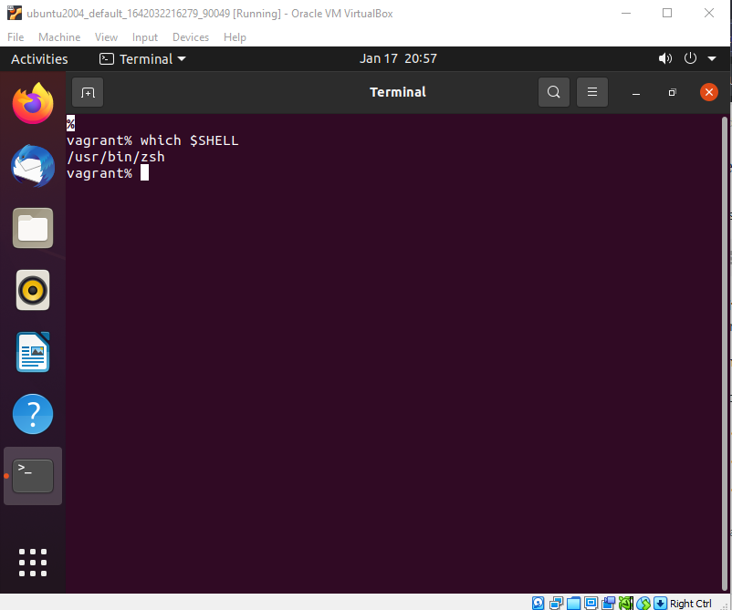

## Dev workstation setup - All the pretty things

Not to be confused with us setting Linux servers up this way but I wanted to also show off the choice and flexibility that we have within the Linux desktop.

I have been using a Linux Desktop for almost a year now and I have it configured just the way I want from a look and feel perspective. Using our Ubuntu VM on Virtual Box we can run through some of the customisations I have made to my daily driver.

I have put together a YouTube video walking through the rest as some people might be able to better follow along:

Out of the box, our system will look something like the below:

We can also see our default bash shell below,

A lot of this comes down to dotfiles something we will cover in this final Linux session of the series.

### dotfiles

First up I want to dig into dotfiles, I have said on a previous day that Linux is made up of configuration files. These dotfiles are configuration files for your Linux system and applications.

I will also add that dotfiles are not just used to customise and make your desktop look pretty, there are also dotfile changes and configurations that will help you with productivity.

As I mentioned many software programs store their configurations in these dotfiles. These dotfiles assist in managing functionality.

Each dotfile starts with a `.` You can probably guess where the naming came from?

So far we have been using bash as our shell which means you will have a .bashrc and .bash_profile in our home folder. You can see below a few dotfiles we have on our system.

We are going to be changing our shell, so we will later be seeing a new `.zshrc` configuration dotfile.

But now you know if we refer to dotfiles you know they are configuration files. We can use them to add aliases to our command prompt as well as paths to different locations. Some people publish their dotfiles so they are publicly available. You will find mine here on my GitHub [nholuongCade/dotfiles](https://github.com/nholuongCade/dotfiles) here you will find my custom `.zshrc` file, my terminal of choice is terminator which also has some configuration files in the folder and then also some background options.

### ZSH

As I mentioned throughout our interactions so far we have been using a bash shell the default shell with Ubuntu. ZSH is very similar but it does have some benefits over bash.

Zsh has features like interactive Tab completion, automated file searching, regex integration, advanced shorthand for defining command scope, and a rich theme engine.

We can use our `apt` package manager to get zsh installed on our system. Let's go ahead and run `sudo apt install zsh` from our bash terminal. I am going to do this from within the VM console vs being connected over SSH.

When the installation command is complete you can run `zsh` inside your terminal, this will then start a shell configuration script.

I selected `1` to the above question and now we have some more options.

You can see from this menu that we can make some out of the box edits to make ZSH configured to our needs.

If you exit the wizard with a `0` and then use the `ls -al | grep .zshrc` you should see we have a new configuration file.

Now we want to make zsh our default shell every time we open our terminal, we can do this by running the following command to change our shell `chsh -s $(which zsh)` we then need to log out and back in again for the changes to take place.

When you log back and open a terminal it should look something like this. We can also confirm our shell has now been changed over by running `which $SHELL`

I generally perform this step on each Ubuntu desktop I spin up and find in general without going any further that the zsh shell is a little faster than bash.

### OhMyZSH

Next up we want to make things look a little better and also add some functionality to help us move around within the terminal.

OhMyZSH is a free and open source framework for managing your zsh configuration. There are lots of plugins, themes and other things that just make interacting with the zsh shell a lot nicer.

You can find out more about [ohmyzsh](https://ohmyz.sh/)

Let's get Oh My ZSH installed, we have a few options with `curl` `wget` or `fetch` we have the first two available on our system but I will lead with `curl`

`sh -c "$(curl -fsSL https://raw.githubusercontent.com/ohmyzsh/ohmyzsh/master/tools/install.sh)"`

When you have run the above command you should see some output like the below.

Now we can move on to start putting a theme in for our experience, there are well over 100 bundled with Oh My ZSH but my go-to for all of my applications and everything is the Dracula theme.

I also want to add that these two plugins are a must when using Oh My ZSH.

`git clone https://github.com/zsh-users/zsh-autosuggestions.git $ZSH_CUSTOM/plugins/zsh-autosuggestions`

`git clone https://github.com/zsh-users/zsh-syntax-highlighting.git $ZSH_CUSTOM/plugins/zsh-syntax-highlighting`

`nano ~/.zshrc`

edit the plugins to now include `plugins=(git zsh-autosuggestions zsh-syntax-highlighting)`

## Gnome Extensions

I also use Gnome extensions, and in particular the list below

[Gnome extensions](https://extensions.gnome.org)

    - Caffeine
    - CPU Power Manager
    - Dash to Dock
    - Desktop Icons
    - User Themes

## Software Installation

A short list of the programs I install on the machine using `apt`

    - VSCode
    - azure-cli
    - containerd.io
    - docker
    - docker-ce
    - google-cloud-sdk
    - insomnia
    - packer
    - terminator
    - terraform
    - vagrant

### Dracula theme

This site is the only theme I am using at the moment. Looks clear, and clean and everything looks great. [Dracula Theme](https://draculatheme.com/) It also has you covered when you have lots of other programs you use on your machine.

From the link above we can search for zsh on the site and you will find at least two options.

Follow the instructions listed to install either manually or using git. Then you will need to finally edit your `.zshrc` configuration file as per below.

You are next going to want the [Gnome Terminal Dracula theme](https://draculatheme.com/gnome-terminal) with all instructions available here as well.

It would take a long time for me to document every step so I created a video walkthrough of the process. (**Click on the image below**)

If you made it this far, then we have now finished our Linux section of the #90-Days-of-DevOps-as-a-Learning. Once again I am open to feedback and additions to resources here.

I also thought on this it was easier to show you a lot of the steps through video vs writing them down here, what do you think about this? I do have a goal to work back through these days and where possible create video walkthroughs to add in and better maybe explain and show some of the things we have covered. What do you think?

### [Contact an Author]
* [Name: nho Luong]
* [Skype](luongutnho_skype)
* [Github](https://github.com/nholuongut/)
* [Linkedin](https://www.linkedin.com/in/nholuong/)
* [Email Address](luongutnho@hotmail.com)

Tomorrow we start our 7 days of diving into Networking, we will be looking to give ourselves the foundational knowledge and understanding of Networking around DevOps.

See you on [Day21](day21.md)
