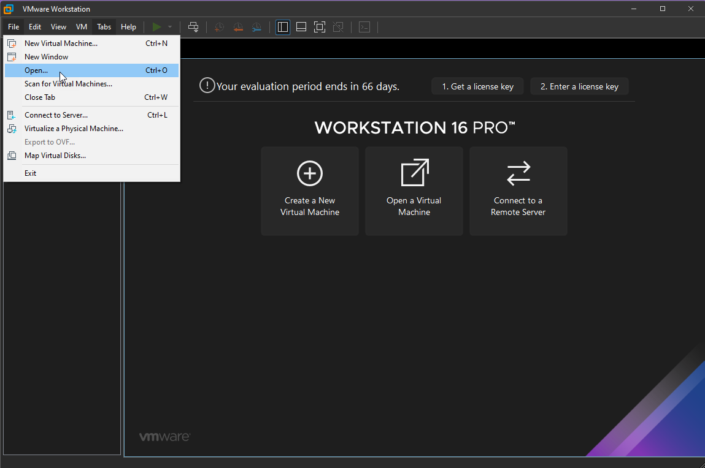
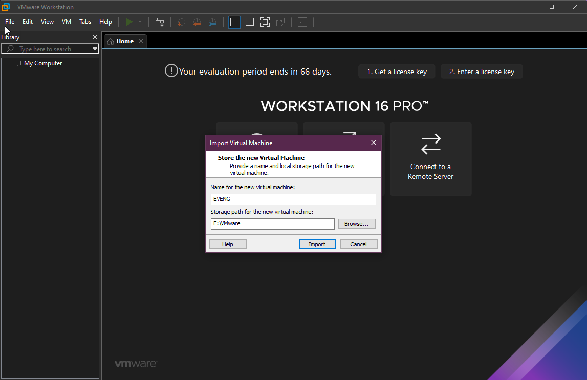

## Python for Network Automation

Python is the standard language used for automated network operations.

Whilst it is not only for network automation it seems to be everywhere when you are looking for resources and as previously mentioned if it's not Python then it's generally Ansible which is written also in Python.

I think I have mentioned this already but during the "Learn a programming language" section I chose Golang over Python for reasons around my company is developing in Go so that was a good reason for me to learn but if that was not the case then Python would have taken that time.

- Readability and ease of use - It seems that Python seems just makes sense. There don't seem to be the requirements around `{}` in the code to start and end blocks. Couple this with a strong IDE like VS Code you have a pretty easy start when wanting to run some python code.

Pycharm might be another IDE worth mentioning here.

- Libraries - The extensibility of Python is the real gold mine here, I mentioned before that this is not just for Network Automation but in fact, there are libraries plenty for all sorts of devices and configurations. You can see the vast amount here [PyPi](https://pypi.python.org/pypi)

When you want to download the library to your workstation, then you use a tool called `pip` to connect to PyPI and download it locally. Network vendors such as Cisco, Juniper, and Arista developed libraries to facilitate access to their devices.

- Powerful & Efficient - Remember during the Go days I went through the "Hello World" scenario and we went through I think 6 lines of code? In Python it is

```
print('hello world')
```

Put all of the above points together and it should be easy to see why Python is generally mentioned as the de-facto tool when working on automating.

I think it's important to note that it's possible that several years back there were scripts that might have interacted with your network devices to maybe automate the backup of configuration or to gather logs and other insights into your devices. The automation we are talking about here is a little different and that's because the overall networking landscape has also changed to suit this way of thinking better and enabled more automation.

- Software-Defined Network - SDN Controllers take the responsibility of delivering the control plane configuration to all devices on the network, meaning just a single point of contact for any network changes, no longer having to telnet or SSH into every device and also relying on humans to do this which has a repeatable chance of failure or misconfiguration.

- High-Level Orchestration - Go up a level from those SDN controllers and this allows for orchestration of service levels then there is the integration of this orchestration layer into your platforms of choice, VMware, Kubernetes, Public Clouds etc.

- Policy-based management - What do you want to have? What is the desired state? You describe this and the system has all the details on how to figure it out to become the desired state.

## Setting up the lab environment

Not everyone has access to physical routers, switches and other networking devices.

I wanted to make it possible for us to look at some of the tooling pre-mentioned but also get hands-on and learn how to automate the configuration of our networks.

When it comes to options there are a few that we can choose from.

- [GNS3 VM](https://www.gns3.com/software/download-vm)
- [Eve-ng](https://www.eve-ng.net/)
- [Unimus](https://unimus.net/) Not a lab environment but an interesting concept.

We will build our lab out using [Eve-ng](https://www.eve-ng.net/) as mentioned before you can use a physical device but to be honest a virtual environment means that we can have a sandbox environment to test many different scenarios. Plus being able to play with different devices and topologies might be of interest.

We are going to do everything on EVE-NG with the community edition.

### Getting started

The community edition comes in ISO and OVF formats for [download](https://www.eve-ng.net/index.php/download/)

We will be using the OVF download but with the ISO there is the option to build out on a bare metal server without the need for a hypervisor.


For our walkthrough, we will be using VMware Workstation as I have a license via my vExpert but you can equally use VMware Player or any of the other options mentioned in the [documentation](https://www.eve-ng.net/index.php/documentation/installation/system-requirement/). Unfortunately we cannot use our previously used Virtual box!

This is also where I had an issue with GNS3 with Virtual Box even though supported.

[Download VMware Workstation Player - FREE](https://www.vmware.com/uk/products/workstation-player.html)

[VMware Workstation PRO](https://www.vmware.com/uk/products/workstation-pro.html) Also noted that there is an evaluation period for free!

### Installation on VMware Workstation PRO

Now we have our hypervisor software downloaded and installed, and we have the EVE-NG OVF downloaded. If you are using VMware Player please let me know if this process is the same.

We are now ready to get things configured.

Open VMware Workstation and then select `file` and `open`



When you download the EVE-NG OVF Image it is going to be within a compressed file. Extract the contents out into its folder so it looks like this.


Navigate to the location where you downloaded the EVE-NG OVF image and begin the import.

Give it a recognisable name and store the virtual machine somewhere on your system.



When the import is complete increase the number of processors to 4 and the memory allocated to 8 GB. (This should be the case after import with the latest version if not then edit VM settings)

Also, make sure the Virtualise Intel VT-x/EPT or AMD-V/RVI checkbox is enabled. This option instructs the VMware workstation to pass the virtualisation flags to the guest OS (nested virtualisation) This was the issue I was having with GNS3 with Virtual Box even though my CPU allows this.


### Power on & Access

Sidenote & Rabbit hole: Remember I mentioned that this would not work with VirtualBox! Well yeah had the same issue with VMware Workstation and EVE-NG but it was not the fault of the virtualisation platform!

I have WSL2 running on my Windows Machine and this seems to remove the capability of being able to run anything nested inside of your environment. I am confused as to why the Ubuntu VM does run as it seems to take out the Intel VT-d virtualisation aspect of the CPU when using WSL2.

To resolve this we can run the following command on our Windows machine and reboot the system, note that whilst this is off then you will not be able to use WSL2.

`bcdedit /set hypervisorlaunchtype off`

When you want to go back and use WSL2 then you will need to run this command and reboot.

`bcdedit /set hypervisorlaunchtype auto`

Both of these commands should be run as administrator!

Ok back to the show, You should now have a powered-on machine in VMware Workstation and you should have a prompt looking similar to this.


On the prompt above you can use:

username = root
password = eve

You will then be asked to provide the root password again, this will be used to SSH into the host later on.

We then can change the hostname.


Next, we define a DNS Domain Name, I have used the one below but I am not sure if this will need to be changed later on.


We then configure networking, I am selecting static so that the IP address given will be persistent after reboots.


The final step, provide a static IP address from a network that is reachable from your workstation.


There are some additional steps here where you will have to provide a subnet mask for your network, default gateway and DNS.

Once finished it will reboot, when it is back up you can take your static IP address and put this into your browser.


The default username for the GUI is `admin` and the password is `eve` while the default username for SSH is `root` and the password is `eve` but this would have been changed if you changed during the setup.


I chose HTML5 for the console vs native as this will open a new tab in your browser when you are navigating through different consoles.

Next up we are going to:

- Install the EVE-NG client pack
- Load some network images into EVE-NG
- Build a Network Topology
- Adding Nodes
- Connecting Nodes
- Start building Python Scripts
- Look at telnetlib, Netmiko, Paramiko and Pexpect

### [Contact an Author]
* [Name: nho Luong]
* [Skype](luongutnho_skype)
* [Github](https://github.com/nholuongut/)
* [Linkedin](https://www.linkedin.com/in/nholuong/)
* [Email Address](luongutnho@hotmail.com)

See you on [Day 26](day26.md)
