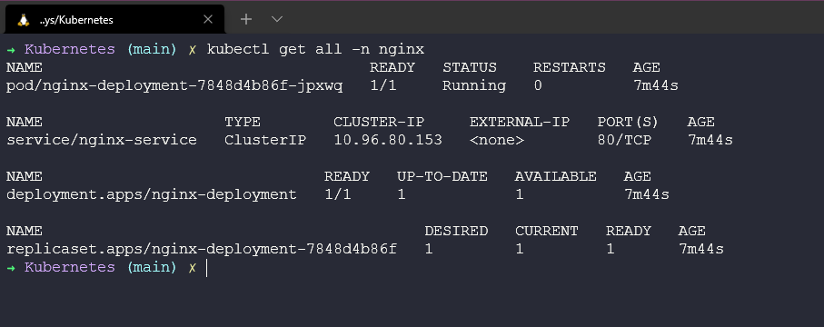
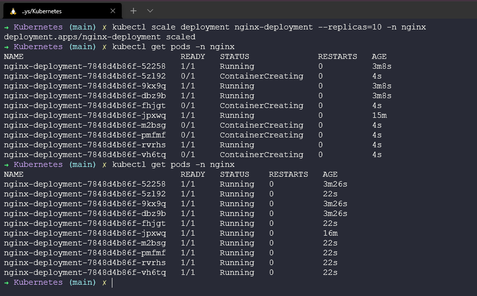
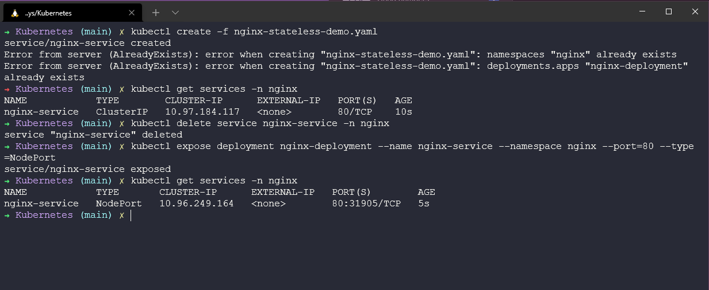

## Kubernetes Application Deployment

Now we finally get to deploying some applications into our clusters, some would say this is the reason Kubernetes exists, for Application delivery.

The idea here is that we can take our container images and now deploy these as pods into our Kubernetes cluster to take advantage of Kubernetes as a container orchestrator.

### Deploying Apps into Kubernetes

There are several ways in which we can deploy our applications into our Kubernetes cluster, we will cover two of the most common approaches which will be YAML files and Helm charts.

We will be using our minikube cluster for these application deployments. We will be walking through some of the previously mentioned components or building blocks of Kubernetes.

All through this section and the Container section we have discussed images and the benefits of Kubernetes and how we can handle scale quite easily on this platform.

In this first step, we are simply going to create a stateless application within our minikube cluster. We will be using the defacto standard stateless application in our first demonstration `nginx` we will configure a Deployment, which will provide us with our pods and then we will also create a service which will allow us to navigate to the simple web server hosted by the nginx pod. All of this will be contained in a namespace.


### Creating the YAML

In the first demo, we want to define everything we do with YAML, we could have a whole section on YAML but I am going to skim over this and leave some resources at the end that will cover YAML in more detail.

We could create the following as one YAML file or we could break this down for each aspect of our application, i.e this could be separate files for namespace, deployment and service creation but in this file, below we separate these by using `---` in one file. You can find this file located [here](Kubernetes) (File name:- nginx-stateless-demo.YAML)

```Yaml
apiVersion: v1
kind: Namespace
metadata:
  name: nginx
  "labels": {
    "name": "nginx"
  }
---
apiVersion: apps/v1
kind: Deployment
metadata:
  name: nginx-deployment
  namespace: nginx
spec:
  selector:
    matchLabels:
      app: nginx
  replicas: 1
  template:
    metadata:
      labels:
        app: nginx
    spec:
      containers:
      - name: nginx
        image: nginx
        ports:
        - containerPort: 80
---
apiVersion: v1
kind: Service
metadata:
  name: nginx-service
  namespace: nginx
spec:
  selector:
    app: nginx-deployment
  ports:
    - protocol: TCP
      port: 80
      targetPort: 80
```

### Checking our cluster

Before we deploy anything we should just make sure that we have no existing namespaces called `nginx` we can do this by running the `kubectl get namespace` command and as you can see below we do not have a namespace called `nginx`


### Time to deploy our App

Now we are ready to deploy our application to our minikube cluster, this same process will work on any other Kubernetes cluster.

We need to navigate to our YAML file location and then we can run `kubectl create -f nginx-stateless-demo.yaml` which you then see that 3 objects have been created, and we have a namespace, deployment and service.


Let's run the command again to see our available namespaces in our cluster `kubectl get namespace` and you can now see that we have our new namespace.


If we then check our namespace for pods using `kubectl get pods -n nginx` you will see that we have 1 pod in a ready and running state.


We can also check our service is created by running `kubectl get service -n nginx`


Finally, we can then go and check our deployment, the deployment is where and how we keep our desired configuration.


The above takes a few commands that are worth knowing but you can also use `kubectl get all -n nginx` to see everything we deployed with that one YAML file.



You will notice in the above that we also have a replicaset, in our deployment we define how many replicas of our image we would like to deploy. This was set to 1 initially, but if we wanted to quickly scale our application then we can do these several ways.

We can edit our file using `kubectl edit deployment nginx-deployment -n nginx` which will open a text editor within your terminal and enable you to modify your deployment.


Upon saving the above in your text editor within the terminal if there were no issues and the correct formatting was used then you should see additional deployed in your namespace.


We can also make a change to the number of replicas using kubectl and the `kubectl scale deployment nginx-deployment --replicas=10 -n nginx`



We can equally use this method to scale our application down back to 1 again if we wish to use either method. I used the edit option but you can also use the scale command above.


Hopefully, here you can see the use case not only are things super fast to spin up and down but we have the ability to quickly scale up and down our applications. If this was a web server we could scale up during busy times and down when the load is quiet.

### Exposing our app

But how do we access our web server?

If you look above at our service you will see there is no External IP available so we cannot just open a web browser and expect this to be there magically. For access, we have a few options.

**ClusterIP** - The IP you do see is a ClusterIP this is on an internal network on the cluster. Only things within the cluster can reach this IP.

**NodePort** - Exposes the service on the same port of each of the selected nodes in the cluster using NAT.

**LoadBalancer** - Creates an external load balancer in the current cloud, we are using minikube but also if you have built your own Kubernetes cluster i.e what we did in VirtualBox you would need to deploy a LoadBalancer such as metallb into your cluster to provide this functionality.

**Port-Forward** - We also have the ability to Port Forward, which allows you to access and interact with internal Kubernetes cluster processes from your localhost. This option is only for testing and fault finding.

We now have a few options to choose from, Minikube has some limitations or differences I should say to a full-blown Kubernetes cluster.

We could simply run the following command to port forward our access using our local workstation.

`kubectl port-forward deployment/nginx-deployment -n nginx 8090:80`


note that when you run the above command this terminal is now unusable as this is acting as your port forward to your local machine and port.


We are now going to run through specifically with Minikube how we can expose our application. We can also use minikube to create a URL to connect to a service [More details](https://minikube.sigs.k8s.io/docs/commands/service/)

First of all, we will delete our service using `kubectl delete service nginx-service -n nginx`

Next, we are going to create a new service using `kubectl expose deployment nginx-deployment --name nginx-service --namespace nginx --port=80 --type=NodePort` notice here that we are going to use the expose and change the type to NodePort.



Finally in a new terminal run `minikube --profile='mc-demo' service nginx-service --URL -n nginx` to create a tunnel for our service.


Open a browser or control and click on the link in your terminal.


### Helm

Helm is another way in which we can deploy our applications. Known as "The package manager for Kubernetes" You can find out more [here](https://helm.sh/)

Helm is a package manager for Kubernetes. Helm could be considered the Kubernetes equivalent of yum or apt. Helm deploys charts, which you can think of like a packaged application., it is a blueprint for your pre-configured application resources which can be deployed as one easy-to-use chart. You can then deploy another version of the chart with a different set of configurations.

They have a site where you can browse all the Helm charts available and of course, you can create your own. The documentation is also clear and concise and not as daunting as when I first started hearing the term helm amongst all of the other new words in this space.

It is super simple to get Helm up and running or installed. Simply. You can find the binaries and download links here for pretty much all distributions including your RaspberryPi arm64 devices.

Or you can use an installer script, the benefit here is that the latest version of the helm will be downloaded and installed.

```Shell
curl -fsSL -o get_helm.sh https://raw.githubusercontent.com/helm/helm/master/scripts/get-helm-3

chmod 700 get_helm.sh

./get_helm.sh
```

Finally, there is also the option to use a package manager for the application manager, homebrew for mac, chocolatey for windows, apt with Ubuntu/Debian, snap and pkg also.

Helm so far seems to be the go-to way to get different test applications downloaded and installed in your cluster.

A good resource to link here would be [ArtifactHUB](https://artifacthub.io/) which is a resource to find, install and publish Kubernetes packages. I will also give a shout-out to [KubeApps](https://kubeapps.com/) which is a UI to display helm charts.

### What we will cover in the series on Kubernetes

We have started covering some of these mentioned below but we are going to get more hands-on tomorrow with our second cluster deployment then we can start deploying applications into our clusters.

- Kubernetes Architecture
- Kubectl Commands
- Kubernetes YAML
- Kubernetes Ingress
- Kubernetes Services
- Helm Package Manager
- Persistent Storage
- Stateful Apps

### [Contact an Author]
* [Name: nho Luong]
* [Skype](luongutnho_skype)
* [Github](https://github.com/nholuongut/)
* [Linkedin](https://www.linkedin.com/in/nholuong/)
* [Email Address](luongutnho@hotmail.com)

See you on [Day 55](day55.md)
