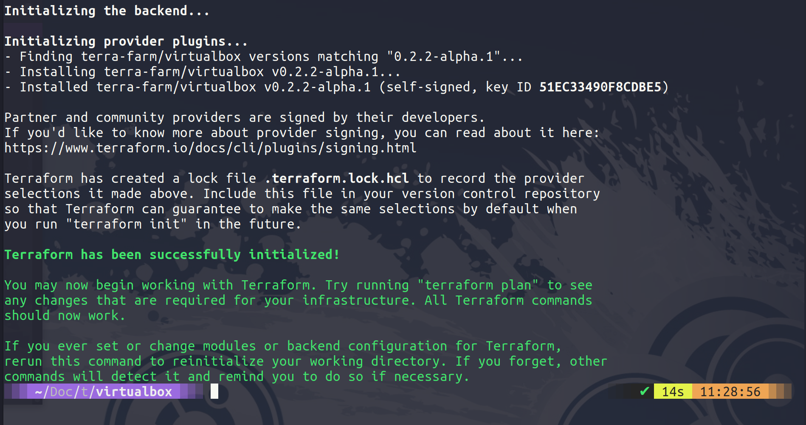
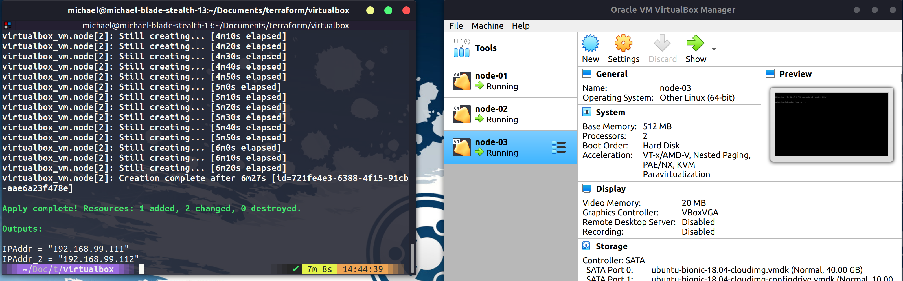

## Create a VM with Terraform & Variables

In this session, we are going to be creating a VM or two VMs using terraform inside VirtualBox. This is not normal, VirtualBox is a workstation virtualisation option and this would not be a use case for Terraform but I am currently 36,000ft in the air and as much as I have deployed public cloud resources this high in the clouds it is much faster to do this locally on my laptop.

Purely for demo purposes but the concept is the same we are going to have our desired state configuration code and then we are going to run that against the VirtualBox provider. In the past, we have used vagrant here and I covered the differences between vagrant and terraform at the beginning of the section.

### Create a virtual machine in VirtualBox

The first thing we are going to do is create a new folder called VirtualBox, we can then create a VirtualBox.tf file and this is going to be where we define our resources. The code below which can be found in the VirtualBox folder as VirtualBox.tf is going to create 2 VMs in Virtualbox.

You can find more about the community VirtualBox provider [here](https://registry.terraform.io/providers/terra-farm/virtualbox/latest/docs/resources/vm)

```
terraform {
  required_providers {
    virtualbox = {
      source = "terra-farm/virtualbox"
      version = "0.2.2-alpha.1"
    }
  }
}

# There are currently no configuration options for the provider itself.

resource "virtualbox_vm" "node" {
  count     = 2
  name      = format("node-%02d", count.index + 1)
  image     = "https://app.vagrantup.com/ubuntu/boxes/bionic64/versions/20180903.0.0/providers/virtualbox.box"
  cpus      = 2
  memory    = "512 mib"

  network_adapter {
    type           = "hostonly"
    host_interface = "vboxnet1"
  }
}

output "IPAddr" {
  value = element(virtualbox_vm.node.*.network_adapter.0.ipv4_address, 1)
}

output "IPAddr_2" {
  value = element(virtualbox_vm.node.*.network_adapter.0.ipv4_address, 2)
}

```

Now that we have our code defined we can now perform the `terraform init` on our folder to download the provider for Virtualbox.



You will also need to have VirtualBox installed on your system as well. We can then next run `terraform plan` to see what our code will create for us. Followed by `terraform apply` the below image shows your completed process.


In Virtualbox, you will now see your 2 virtual machines.


### Change configuration

Let's add another node to our deployment. We can simply change the count line to show our new desired number of nodes. When we run our `terraform apply` it will look something like the below.


Once complete in VirtualBox you can see we now have 3 nodes up and running.



When we are finished we can clear this up using the `terraform destroy` and our machines will be removed.


### Variables & Outputs

We did mention outputs when we ran our hello-world example in the last session. But we can get into more detail here.

But there are many other variables that we can use here as well, there are also a few different ways in which we can define variables.

- We can manually enter our variables with the `terraform plan` or `terraform apply` command

- We can define them in the .tf file within the block

- We can use environment variables within our system using `TF_VAR_NAME` as the format.

- My preference is to use a terraform.tfvars file in our project folder.

- There is an \*auto.tfvars file option

- or we can define when we run the `terraform plan` or `terraform apply` with the `-var` or `-var-file`.

Starting from the bottom moving up would be the order in which the variables are defined.

We have also mentioned that the state file will contain sensitive information. We can define our sensitive information as a variable and we can define this as being sensitive.

```
variable "some resource"  {
    description = "something important"
    type= string
    sensitive = true

}
```

### [Contact an Author]
* [Name: nho Luong]
* [Skype](luongutnho_skype)
* [Github](https://github.com/nholuongut/)
* [Linkedin](https://www.linkedin.com/in/nholuong/)
* [Email Address](luongutnho@hotmail.com)

See you on [Day 60](day60.md)
