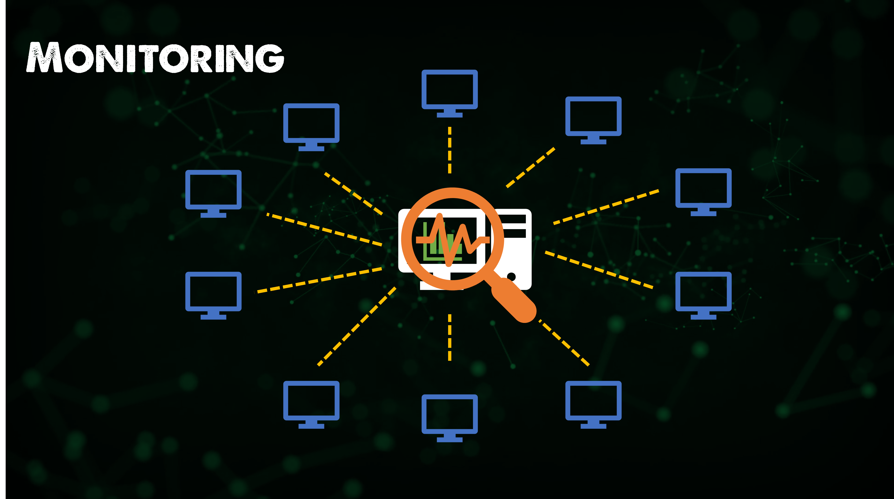

## The Big Picture: Monitoring

In this section we are going to talk about monitoring, what is it and why do we need it?

### What is Monitoring?

Monitoring is the process of keeping a close eye on the entire infrastructure

### and why do we need it?

Let's assume we're managing a thousand servers these include a variety of specialised servers like application servers, database servers and web servers. We could also complicate this further with additional services and different platforms including public cloud offerings and Kubernetes.

We are responsible for ensuring that all the services, applications and resources on the servers are running as they should be.

How do we do it? there are three ways:

- Login manually to all of our servers and check all the data about service processes and resources.
- Write a script that logs in to the servers for us and checks on the data.

Both of these options would require a considerable amount of work on our part,

The third option is easier, we could use a monitoring solution that is available in the market.

Nagios and Zabbix are possible solutions that are readily available which allow us to upscale our monitoring infrastructure to include as many servers as we want.

### Nagios

Nagios is an infrastructure monitoring tool that is made by a company that goes by the same name. The open-source version of this tool is called Nagios core while the commercial version is called Nagios XI. [Nagios Website](https://www.nagios.org/)

The tool allows us to monitor our servers and see if they are being sufficiently utilised or if there are any tasks of failure that need addressing.

Essentially monitoring allows us to achieve these two goals, check the status of our servers and services and determine the health of our infrastructure it also gives us a 40,000ft view of the complete infrastructure to see if our servers are up and running if the applications are working properly and the web servers are reachable or not.

It will tell us that our disk has been increasing by 10 per cent for the last 10 weeks in a particular server, that it will exhaust entirely within the next four or five days and we'll fail to respond soon it will alert us when your disk or server is in a critical state so that we can take appropriate actions to avoid possible outages.

In this case, we can free up some disk space and ensure that our servers don't fail and that our users are not affected.

The difficult question for most monitoring engineers is what do we monitor? and alternately what do we not?

Every system has several resources, which of these should we keep a close eye on and which ones can we turn a blind eye to for instance is it necessary to monitor CPU usage the answer is yes obviously nevertheless it is still a decision that has to be made is it necessary to monitor the number of open ports in the system we may or may not have to depend on the situation if it is a general-purpose server we probably won't have to but then again if it is a webserver we probably would have to.

### Continuous Monitoring

Monitoring is not a new item and even continuous monitoring has been an ideal that many enterprises have adopted for many years.

There are three key areas of focus when it comes to monitoring.

- Infrastructure Monitoring
- Application Monitoring
- Network Monitoring

The important thing to note is that there are many tools available we have mentioned two generic systems and tools in this session but there are lots. The real benefit of a monitoring solution comes when you have spent the time making sure you are answering the question of what should we be monitoring and what shouldn't we?

We could turn on a monitoring solution in any of our platforms and it will start grabbing information but if that information is simply too much then you are going to struggle to benefit from that solution, you have to spend the time to configure it.

In the next session, we will get hands-on with a monitoring tool and see what we can start monitoring.

### [Contact an Author]
* [Name: nho Luong]
* [Skype](luongutnho_skype)
* [Github](https://github.com/nholuongut/)
* [Linkedin](https://www.linkedin.com/in/nholuong/)
* [Email Address](luongutnho@hotmail.com)

See you on [Day 78](day78.md)
