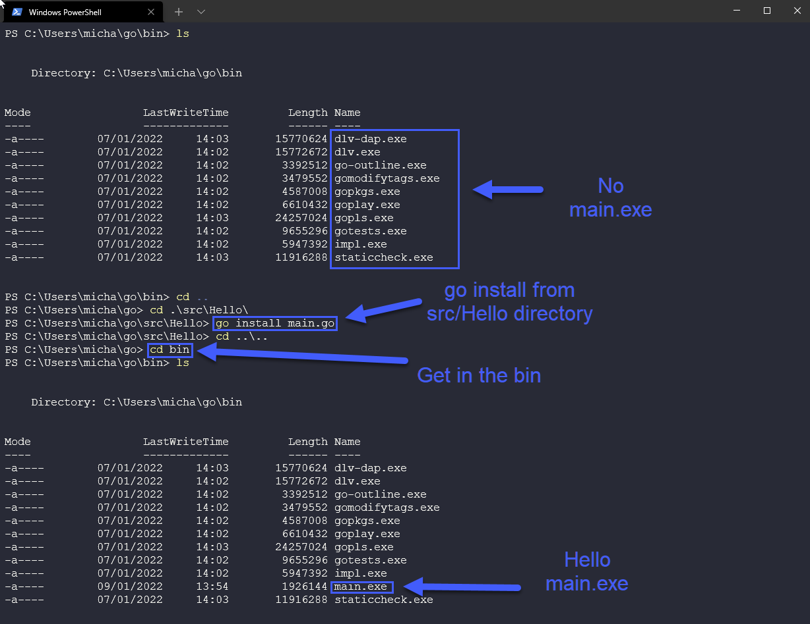

## The Go Workspace

En el [Día 8](day08.md) hablamos brevemente del espacio de trabajo Go para poner en marcha Go y llegar a la demo de `Hello #90-Days-of-DevOps-as-a-Learning`. Hay que explicar un poco más sobre el espacio de trabajo Go.

¿Recuerda que elegimos los valores predeterminados y luego pasamos a crear nuestra carpeta Go en el GOPATH que ya estaba definido? Pero en realidad, este GOPATH se puede cambiar para que esté donde quieras.

Si ejecutas

```shell
echo $GOPATH
```

La salida debería ser similar a la mía (con tu nombre de usuario):

```shell
/home/nholuong/projects/go
```
> **En Linux tenemos que configurarlo.** 
> 
> En mi caso que utilizo la shell zsh en el fichero `$HOME/.zshrc`. Si utilizan bash será en el fichero `$HOME/.bashrc`. 
> 
> Tan solo tenemos que añadir esta línea:
> ```shell
> export GOPATH=$HOME/work
> export PATH=$PATH:/usr/local/go/bin:$GOPATH/bin
> ```
>
> 
>
> Relanzamos la shell y hacemos el `echo` mencionado antes.
> 
> ```shell
> exec zsh
> echo $GOPATH
> ```
> 
> 
> 
> Más información en la [documentación oficial](https://go.dev/doc/install)

Entonces aquí, es donde creamos en anteriores días los 3 directorios. **src**, **pkg** y **bin**

 

- **src** es donde se almacenan todos tus programas y proyectos Go. Esto maneja la gestión de paquetes de namespacing para todos sus repositorios de Go. Aquí es donde verás que en nuestro equipo tenemos nuestra carpeta Hello para el proyecto Hello #90-Days-of-DevOps-as-a-Learning.


- **pkg** es donde se encuentran los ficheros archivados de los paquetes que están o estuvieron instalados en los programas. Esto ayuda a acelerar el proceso de compilación en función de si los paquetes que se utilizan han sido modificados.


- **bin** es donde se almacenan todos los binarios compilados.


Our Hello #90-Days-of-DevOps-as-a-Learning is not a complex program so here is an example of a more complex Go Program taken from another great resource worth looking at [GoChronicles](https://gochronicles.com/)


Nuestro Hello #90-Days-of-DevOps-as-a-Learning no es un programa complejo. Para que te hagas una idea, un ejemplo de un programa Go más complejo tomado de otro gran recurso que vale la pena mirar es [GoChronicles](https://gochronicles.com/)

## Compiling & running code

En el [Día 9](day09.md) también hicimos una breve introducción a la compilación de código, pero podemos profundizar un poco más. Vamos a ello.

Para ejecutar nuestro código, primero debemos **compilarlo**. Hay tres maneras de hacer esto dentro de Go.

- `go build`
- `go install`
- `go run`

Antes de que lleguemos a la etapa de compilación mencionada, necesitamos echar un vistazo a lo que obtenemos con la instalación de Go.

Cuando instalamos Go el [día 8](day08.md), instalamos algo conocido como herramientas Go, que consiste en varios programas que nos permiten construir y procesar nuestros ficheros fuente Go. Una de las herramientas es `Go`.

Vale la pena señalar que se pueden instalar herramientas adicionales que no están en la instalación estándar de Go que pueden ser muy útil según el proyecto que quieras desarrollar.

Si abres tu terminal y escribes `go` deberías ver algo como la imagen de abajo y luego verás  "Additional Help Topics" (Temas de ayuda adicionales) de los que, por ahora, no necesitamos preocuparnos.


> [Traducción ayuda go](Go/Ayuda_go_traducida.md).

Si estás aquí desde días anteriores, recordarás que ya hemos utilizado al menos dos de estos comandos en el [Día 8](day08.md).


Las que vamos a aprender son las de `build`, `install` y `run`.


- `go run` - Este comando compila y ejecuta el paquete principal compuesto por los ficheros .go especificados en la línea de comandos. El comando se compila en una carpeta temporal.
- `go build` - Para compilar los paquetes y las dependencias, compila el paquete en el directorio actual. Así el paquete `main`, colocará el ejecutable en el directorio actual, si no colocará el ejecutable en la carpeta `pkg`. `go build` también permite construir un fichero ejecutable para cualquier sistema operativo compatible con Go.
- `go install` - Lo mismo que `go build` pero colocará el ejecutable en la carpeta `bin`.

Ya hemos visto go build y go run, pero si quieres puedes volver a hacer un `go install`, como ya hemos dicho, coloca el ejecutable en nuestra carpeta bin.



Si estás siguiendo los recursos con las listas de reproducción o videos que se proponen abajo verás que se están tomando pedazos de estos traducidos en estas notas para poder adquirir un conocimiento básico del lenguaje Golang. Estos recursos probablemente darán una comprensión mucho mejor de una gran cantidad de las áreas que necesita en general, pero se está intentando de documentar los 7 días (o 7 horas) en lo más relevante.

## Recursos

- [StackOverflow 2021 Developer Survey](https://insights.stackoverflow.com/survey/2021)
- [Why we are choosing Golang to learn](https://www.youtube.com/watch?v=7pLqIIAqZD4&t=9s)
- [Jake Wright - Learn Go in 12 minutes](https://www.youtube.com/watch?v=C8LgvuEBraI&t=312s)
- [Techworld with Nana - Golang full course - 3 hours 24 mins](https://www.youtube.com/watch?v=yyUHQIec83I)
- [**NOT FREE** Nigel Poulton Pluralsight - Go Fundamentals - 3 hours 26 mins](https://www.pluralsight.com/courses/go-fundamentals)
- [FreeCodeCamp - Learn Go Programming - Golang Tutorial for Beginners](https://www.youtube.com/watch?v=YS4e4q9oBaU&t=1025s)
- [Hitesh Choudhary - Complete playlist](https://www.youtube.com/playlist?list=PLRAV69dS1uWSR89FRQGZ6q9BR2b44Tr9N)

Nos vemos en el [Día 11](day11.md).
