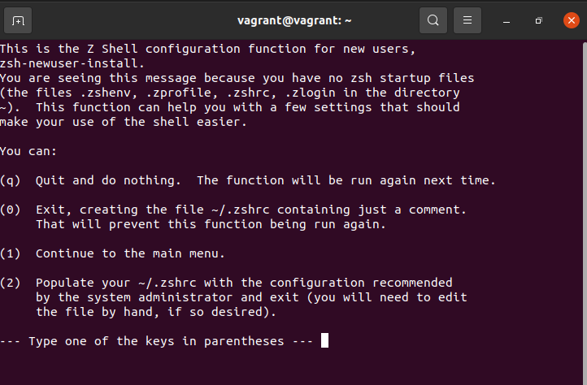
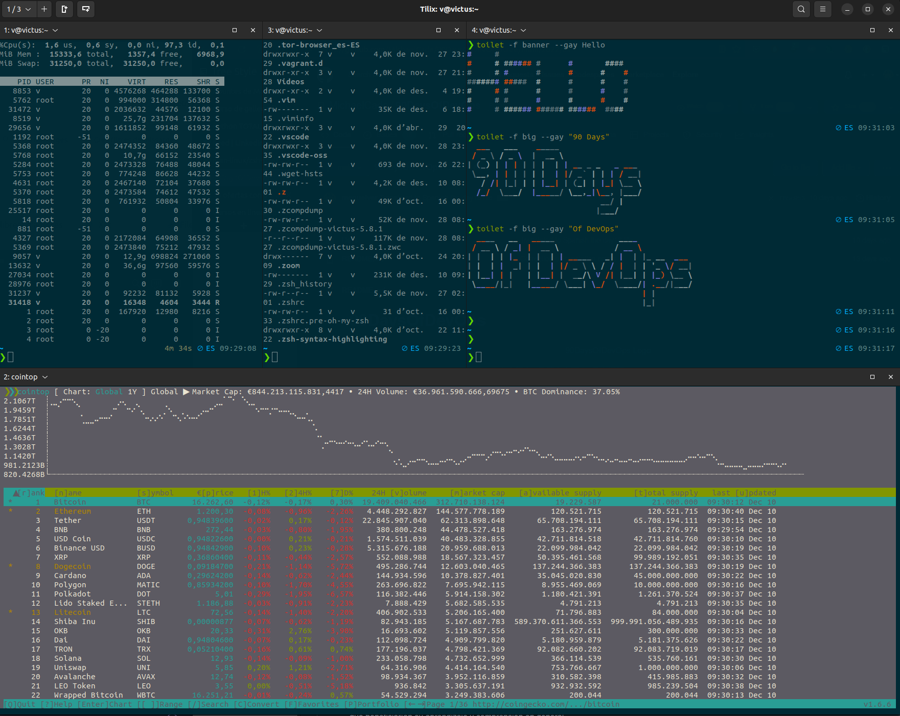

## Configuración de la estación de trabajo de desarrollo - Todas las cosas bonitas

No debemos confundirnos la configuración de servidores Linux con la de escritorio, pero es relevante mostrar la elección y la flexibilidad que podemos tener en el escritorio Linux.

El autor, estuvo usando un escritorio Linux durante casi un año y su configuración muestra una perspectiva de apariencia especializada para el trabajo SysAdmin. Podemos probar en la máquina virtual de Ubuntu en Virtual Box, para poder ver algunas de estas personalizaciones. El traductor lleva más de 10 años en entornos Linux así que algún aporte encontraréis en la versión en castellano.

Vídeo en YouTube para quien quiera seguirlo por esta vía (Clicar en imagen):

[](https://youtu.be/jeEslAtHfKc)

Recordemos, nuestro Ubuntu 20.04 en Virtual box se verá algo así:


También podemos ver el shell bash por defecto a continuación:


Mucho de esto se reduce a dotfiles algo que cubriremos en esta última sesión de Linux de nuestro viaje 90-Days-of-DevOps-as-a-Learning.

### dotfiles

Primero vamos a profundizar en los dotfiles. Linux está hecho de archivos de configuración de sistema y de aplicaciones, los llamados dotfiles. 

Los dotfiles no sólo se usan para personalizar y hacer que se vea más bonito tu escritorio, también hay cambios y configuraciones de dotfiles que te ayudarán con la productividad añadiendo funcionalidades o quitando, si prefieres el minimalismo.

La mayoría del software que encontrarás para Linux almacenana sus configuraciones en estos dotfiles. Cada dotfile comienza con un punto `.` para que permanezcan ocultos y no incurrir en error.

Hasta ahora hemos estado utilizando bash como nuestro shell. Pues bien, bash tiene varios archivos de configuración en nuestra carpeta `$HOME`: .bashrc y .bash_profile . A continuación puedes ver algunos dotfiles que tenemos en nuestro sistema recién instalado.


Vamos a cambiar nuestro shell por zsh, así que más adelante veremos un nuevo dotfile de configuración `.zshrc`.

Ahora ya sabes que si nos referimos a dotfiles estamos hablando de los archivos de configuración. Por ejemplo, los de shell, podemos utilizarlos para añadir alias a nuestro símbolo del sistema, así como rutas a diferentes ubicaciones. Algunas personas publican sus dotfiles para que estén disponibles públicamente. Encontrarás el del autor, nholuong Cade, en [nholuongCade/dotfiles](https://github.com/nholuongCade/dotfiles) con el archivo personalizado `.zshrc`. La terminal escogida, Terminator, también tiene algunos archivos de configuración en la carpeta y también algunas opciones de fondo.

Por otra parte, el traductor también tiene publicada la configuración de la shell en [gitea.vergaracarmona.es/man-linux/zsh-shell](https://gitea.vergaracarmona.es/man-linux/zsh-shell). Aquí encontrarás otra forma de personalizar, cada uno debe buscar su comodidad. En este caso también se usa zsh con Oh my zsh y la terminal [Tilix](https://github.com/gnunn1/tilix).

### ZSH

Como hemos mencionado, hasta ahora hemos estado usando un shell bash que es el que viene por defecto con Ubuntu. ZSH es muy similar pero tiene algunos beneficios sobre bash.

Zsh tiene características como:
- El completado interactivo de Tabuladores.
- Búsqueda automatizada de archivos.
- Integración regex.
- Taquigrafía avanzada para definir el alcance de los comandos.
- Un extenso motor de temas.
- etc.

Podemos instalar zsh con nuestro gestor de paquetes `apt`. Vamos a ejecutar:
```shell
sudo apt install zsh
```
En la imagen veréis que se utiliza la consola de la máquina virtual en lugar de estar conectado a través de SSH. Lo podéis hacer como queráis, no necesitáis interfaz gráfica.

Cuando el comando de instalación se haya completado puedes ejecutar `zsh`. La primera vez que se haga iniciará un script de configuración del nuevo shell. 



De base, sin ningún tipo de extensión o plugin, ya es muy configurable. Seleccionamos `1` a la pregunta anterior para ver algunas opciones más.


Podrás ver que podemos hacer algunos cambios para configurar ZSH a nuestro gusto o necesidades.

Si sales del asistente con un `0` y luego usas 

```shell
ls -al | grep .zshrc
``` 

deberías ver que tenemos un nuevo archivo de configuración.

Ya que tenemos un shell más potente y personalizable que bash, vamos a hacer que zsh sea el shell por defecto cada vez que abramos un terminal. Podemos hacer esto ejecutando el siguiente comando

```shell
chsh -s $(which zsh)
``` 

Entonces tendremos que cerrar la sesión y volver a entrar de nuevo para que se realicen los cambios. También podemos ejecutar en la/s terminal/es abierta/s el comando

```shell
exec zsh
```

También podemos confirmar que nuestro shell ha cambiado ejecutando `which $SHELL`.


El autor, nholuong Cade, generalmente realiza este paso en cada escritorio Ubuntu que arranca ya que considera que el shell zsh es un poco más rápido que bash.

El traductor lo instala tan solo en los equipos con los que trabaja habitualmente. Bash va incorporado dentro de zsh, al igual que sh, y considera que como velocidad el más liviano siempre ganará la partida. Entre estos tres es sh. Pero zsh tiene grandes posibilidades de personalización, con lo cuál puede ser mucho más productivo para trabajar con él. Esto es importante tenerlo en cuenta a la hora de crear scripts, sh siempre será estará instalado y será el más rápido, pero seguramente las distros con tan solo sh no tendrán muchos de los scripts y programas básicos, como los que puedes encontrar en Ubuntu.

### OhMyZSH

Para hacer que las cosas se vean un poco mejor y también añadir un poco de funcionalidades utilizaremos el framework gratuito y de código abierto
OhMyZSH. 

Con este framework, podremos gestionar la configuración y personalización de zsh hasta niveles estratosféricos. Tiene un montón de plugins, temas y muchos otros recursos que hacen que interactuar con el shell zsh sea mucho más agradable y productivo. Todo esto gracias a una gran comunidad que mantiene y alimenta el proyecto.

Es muy recomendable que dediques un tiempo a examinar todo su potencial, tanto en su [web](https://ohmyz.sh/) como en su [repositorio](https://github.com/ohmyzsh/ohmyzsh/).

Vamos a instalar Oh My ZSH. Si vamos a su documentación veremos que tenemos distintas opciones: `curl` `wget` o `fetch`. Las dos primeras están disponibles por defecto en Ubuntu. Para hacerlo con `curl` sería así:

```shell
sh -c "$(curl -fsSL https://raw.githubusercontent.com/ohmyzsh/ohmyzsh/master/tools/install.sh)"
```

Cuando hayas ejecutado el comando anterior deberías ver una salida como la mostrada en la siguiente captura de pantalla.


Ahora podemos empezar a poner un tema, hay más de 100 incluidos con Oh My ZSH. El favorito de nholuonges el tema de Drácula. 

Dos plugins imprescindibles para Oh My ZSH se instala así:

```shell
git clone https://github.com/zsh-users/zsh-autosuggestions.git $ZSH_CUSTOM/plugins/zsh-autosuggestions
```

```shell
git clone https://github.com/zsh-users/zsh-syntax-highlighting.git $ZSH_CUSTOM/plugins/zsh-syntax-highlighting
```
Luego tendremos que editar el dotfile con nuestro editor favorito (Como vimos en días anteriores, puede ser nano o vim) `~/.zshrc`

Para incluir los plugins debes añadirlos en:

```sh
plugins=(
    git
    zsh-autosuggestions
    zsh-syntax-highlighting
)
```

Así ya tendrás los primeros plugins añadidos. Puedes ver el dotfile completo del traductor [aquí](https://gitea.vergaracarmona.es/man-linux/zsh-shell/src/branch/master/files/zshrc).

## Extensiones Gnome

También puedes usar las extensiones de Gnome. En particular, nholuong Cade, te recomienda la siguiente lista:

[Extensiones Gnome](https://extensions.gnome.org)

- Caffeine
- CPU Power Manager
- Dash to Dock
- Desktop Icons
- User Themes

## Instalación de Software

Una breve lista de los programas que instala el autor usando `apt`.

- VSCode
- azure-cli
- containerd.io
- docker
- docker-ce
- google-cloud-sdk
- insomnia
- packer
- terminator
- terraform
- vagrant

### Dracula theme

Este es el tema que usa el autor nholuong Cade. Se ve claro, y limpio y todo se ve muy bien. [Dracula Theme](https://draculatheme.com/) también cubre cuando tienes muchos otros programas en tu máquina.

Desde el enlace anterior podemos buscar zsh en el sitio y encontrarás al menos dos opciones.

Sigue las instrucciones listadas para instalar ya sea manualmente o usando git. Luego necesitarás finalmente editar tu archivo de configuración `.zshrc` como se indica a continuación.


También puedes escoger el [Gnome Terminal Dracula theme](https://draculatheme.com/gnome-terminal). Llevaría mucho tiempo documentar cada paso, pero puedes ver un vídeo con el proceso. (Haga clic en la imagen)

[](https://youtu.be/jeEslAtHfKc)

Como mencioné anteriormente, también puedes ver otra personalización del traductor en el [repositorio zsh-shell](https://gitea.vergaracarmona.es/man-linux/zsh-shell). 

Puedes ver el resultado en la siguiente captura.



## Extra del traductor

En diciembre de 2022 se realizó la instalación de Ubuntu 22.04.01 en un equipo de trabajo. Se documento un índice de los pasos seguidos y, en el futuro, se irá completando con guías de cada una de las instalaciones. Puede que incluso con un script que instale todos los programas extras con una sola ejecución: [Repositorio "Preparación de un equipo"](https://gitea.vergaracarmona.es/manuelver/preparacion-equipo).

---

Si has llegado hasta aquí te tengo que dar la enhorabuena, hemos terminado los días de Linux de los #90-Days-of-DevOps-as-a-Learning. No olvides investigar por tu cuenta y prácticas mucho muchísimo. Los conocimientos adquiridos de manera autodidacta suelen ser los que nunca se olvidan.


## Recursos

- [Bash in 100 seconds](https://www.youtube.com/watch?v=I4EWvMFj37g)
- [Bash script with practical examples - Full Course](https://www.youtube.com/watch?v=TPRSJbtfK4M)
- [Client SSH GUI - Remmina](https://remmina.org/)
- [The Beginner's guide to SSH](https://www.youtube.com/watch?v=2QXkrLVsRmk)
- [Vim in 100 Seconds](https://www.youtube.com/watch?v=-txKSRn0qeA)
- [Vim tutorial](https://www.youtube.com/watch?v=IiwGbcd8S7I)
- [Guía básica de Vim](https://gitea.vergaracarmona.es/man-linux/Guia-VIM)
- [Learn the Linux Fundamentals - Part 1](https://www.youtube.com/watch?v=kPylihJRG70)
- [Linux for hackers (don't worry you don't need to be a hacker!)](https://www.youtube.com/watch?v=VbEx7B_PTOE)
- [Webminal](https://www.webminal.org/) 
- [Preparación de un equipo Ubuntu 22.04](https://gitea.vergaracarmona.es/manuelver/preparacion-equipo)
- [Configuración personal de la shell con zsh](https://gitea.vergaracarmona.es/man-linux/zsh-shell)

Mañana empezamos nuestros 7 días de inmersión en Redes, vamos a tratar de ver los conocimientos básicos y la comprensión de Redes en torno a DevOps. Abróchate el cinturón y...

Nos vemos en el [Día 21](day21.md) 🦾
