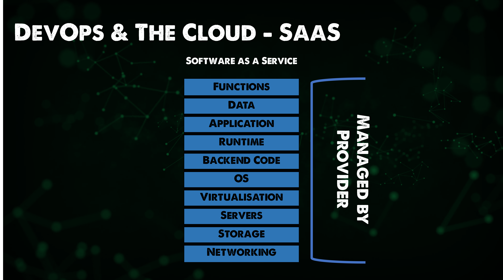
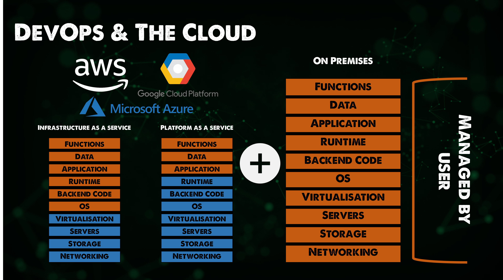

## El panorama: DevOps & The Cloud

Cuando se trata de la computación en nube y lo que se ofrece, va muy bien con la ética y los procesos DevOps. Podemos pensar que la computación en nube aporta tecnología y servicios, mientras que DevOps, como ya hemos mencionado muchas veces, trata del proceso y de la mejora del proceso.

Pero para empezar, el viaje de aprendizaje de la nube es empinado y asegurarse de conocer y entender todos los elementos o el mejor servicio a elegir para el punto de precio correcto es confuso.

¿Requiere la nube pública una mentalidad DevOps? Mi respuesta aquí es no, pero para realmente tomar ventaja de la computación en nube y posiblemente evitar esas grandes facturas de nube que tanta gente ha sido golpeada con entonces es importante pensar en Cloud Computing y DevOps juntos.

Si nos fijamos en lo que queremos decir con la nube pública en una vista de 40.000 pies, se trata de la eliminación de algunas responsabilidades a un servicio gestionado para permitir que usted y su equipo para centrarse en aspectos más importantes que el nombre debe ser la aplicación y los usuarios finales. Al fin y al cabo, la nube pública no es más que el ordenador de otra persona.

En esta primera sección, quiero entrar y describir un poco más de lo que es una Nube Pública y algunos de los bloques de construcción que se refieren a la Nube Pública en general.

### SaaS

La primera área a tratar es el software como servicio, que elimina casi toda la sobrecarga de gestión de un servicio que antes se ejecutaba in situ. Pensemos en Microsoft Exchange para nuestro correo electrónico: antes era una caja física que vivía en el centro de datos o quizá en el armario de debajo de las escaleras. Había que alimentar y regar ese servidor. Con esto quiero decir que tendrías que mantenerlo actualizado y que serías responsable de comprar el hardware del servidor, probablemente instalar el sistema operativo, instalar las aplicaciones necesarias y luego mantenerlo parcheado, si algo fuera mal tendrías que solucionar los problemas y hacer que las cosas volvieran a funcionar.

Ah, y también habría que asegurarse de hacer copias de seguridad de los datos, aunque esto tampoco cambia con SaaS en su mayor parte.

Lo que hace SaaS y, en particular, Microsoft 365, ya que he mencionado Exchange, es eliminar esa sobrecarga de administración y ofrecer un servicio que proporciona la funcionalidad de Exchange a través del correo, pero también muchas otras opciones de productividad (Office 365) y almacenamiento (OneDrive) que, en general, ofrecen una gran experiencia al usuario final.

Otras aplicaciones SaaS son ampliamente adoptadas, como Salesforce, SAP, Oracle, Google y Apple. Todas ellas eliminan esa carga de tener que gestionar más de la pila.

Estoy seguro de que hay una historia con DevOps y aplicaciones basadas en SaaS, pero estoy luchando para averiguar lo que pueden ser. Sé que Azure DevOps tiene algunas grandes integraciones con Microsoft 365 que podría echar un vistazo e informar. 

### Cloud público

A continuación tenemos la nube pública, la mayoría de la gente podría pensar en esto de varias maneras diferentes, algunos verían esto como los hiperescaladores sólo como Microsoft Azure, Google Cloud Platform y AWS.

Algunos también verán la nube pública como una oferta mucho más amplia que incluye a los hiperescaladores, pero también a los miles de MSP de todo el mundo. Para este post, vamos a considerar la nube pública incluyendo hiperescaladores y MSPs, aunque más adelante, nos sumergiremos específicamente en uno o más de los hiperescaladores para obtener ese conocimiento fundacional.

_Podría haber miles de empresas más en esta lista, sólo estoy seleccionando las marcas locales, regionales, de telecomunicaciones y globales con las que he trabajado y que conozco._

Mencionamos en la sección SaaS que Cloud eliminaba la responsabilidad o la carga de tener que administrar partes de un sistema. Si hablamos de SaaS, vemos que se eliminan muchas de las capas de abstracción, es decir, los sistemas físicos, la red, el almacenamiento, el sistema operativo e incluso la aplicación hasta cierto punto. Cuando se trata de la nube, hay varios niveles de abstracción que podemos eliminar o mantener en función de nuestros requisitos.

Ya hemos mencionado SaaS, pero hay al menos dos más que mencionar en relación con la nube pública.

Infraestructura como servicio: puede pensar en esta capa como una máquina virtual, pero mientras que en las instalaciones tendrá que ocuparse de la capa física, en la nube no es así, la física es responsabilidad del proveedor de la nube y usted gestionará y administrará el sistema operativo, los datos y las aplicaciones que desee ejecutar.

Plataforma como servicio: sigue eliminando la responsabilidad de las capas y en realidad se trata de que usted tome el control de los datos y la aplicación, pero sin tener que preocuparse por el hardware o el sistema operativo subyacentes.

Existen muchas otras ofertas de aaS, pero éstas son las dos fundamentales. Puede que haya ofertas de StaaS (almacenamiento como servicio) que le proporcionan la capa de almacenamiento sin tener que preocuparse por el hardware subyacente. O puede que hayas oído hablar de CaaS (Containers as a Service), del que hablaremos más adelante. Otro aaS que trataremos en los próximos 7 días es FaaS (Functions as a Service), en el que puede que no necesites un sistema en funcionamiento todo el tiempo y sólo quieras que una función se ejecute cuando y como quieras.

Hay muchas maneras en que la nube pública puede proporcionar capas de abstracción de control que usted desea pasar y pagar.

### Cloud privado

Tener su propio centro de datos no es una cosa del pasado, creo que esto se ha convertido en un resurgimiento entre una gran cantidad de empresas que han encontrado el modelo OPEX difícil de manejar, así como conjuntos de habilidades en sólo el uso de la nube pública.

Lo importante a tener en cuenta aquí es la nube pública es probable que ahora va a ser su responsabilidad y va a estar en sus instalaciones.

En este espacio están ocurriendo cosas interesantes, no sólo con VMware, que dominó la era de la virtualización y los entornos de infraestructura locales. También tenemos a los hiperescaladores que ofrecen una versión local de sus nubes públicas.

### Cloud híbrida

Para continuar con las menciones a la nube pública y privada, también podemos abarcar ambos entornos para proporcionar flexibilidad entre los dos, tal vez aprovechando los servicios disponibles en la nube pública, pero también aprovechando las características y la funcionalidad de estar en las instalaciones o podría ser una regulación que dicta que tienes que almacenar los datos localmente.

Si juntamos todo esto, tenemos muchas opciones para elegir dónde almacenar y ejecutar nuestras cargas de trabajo.

Antes de entrar en una hiperescala específica, he preguntado al poder de Twitter ¿dónde deberíamos ir?

[Link to Twitter Poll](https://twitter.com/nholuong/status/1486814904510259208?s=20&t=x2n6QhyOXSUs7Pq0itdIIQ)

Cualquiera que obtenga el porcentaje más alto vamos a tomar una inmersión más profunda en las ofertas, creo que el importante mencionar sin embargo es que los servicios de todos ellos son bastante similares por lo que digo que empezar con uno porque he encontrado que en el conocimiento de la base de uno y cómo crear máquinas virtuales, configurar la red, etc . He sido capaz de ir a los otros y rápidamente la rampa en esas áreas.

De cualquier manera, voy a compartir algunos recursos **GRATIS** que cubren los tres hiperescaladores.

También voy a construir un escenario como lo he hecho en las otras secciones donde podemos construir algo a medida que avanzamos a través de los días.

## Recursos

- [Hybrid Cloud and MultiCloud](https://www.youtube.com/watch?v=qkj5W98Xdvw)
- [Microsoft Azure Fundamentals](https://www.youtube.com/watch?v=NKEFWyqJ5XA&list=WL&index=130&t=12s)
- [Google Cloud Digital Leader Certification Course](https://www.youtube.com/watch?v=UGRDM86MBIQ&list=WL&index=131&t=10s)
- [AWS Basics for Beginners - Full Course](https://www.youtube.com/watch?v=ulprqHHWlng&t=5352s)

Nos vemos en el [Día 29](day29.md).
