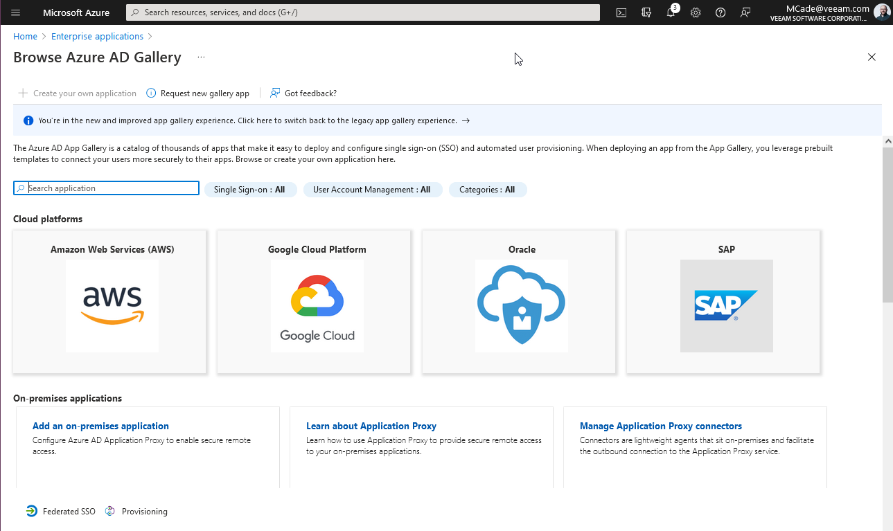
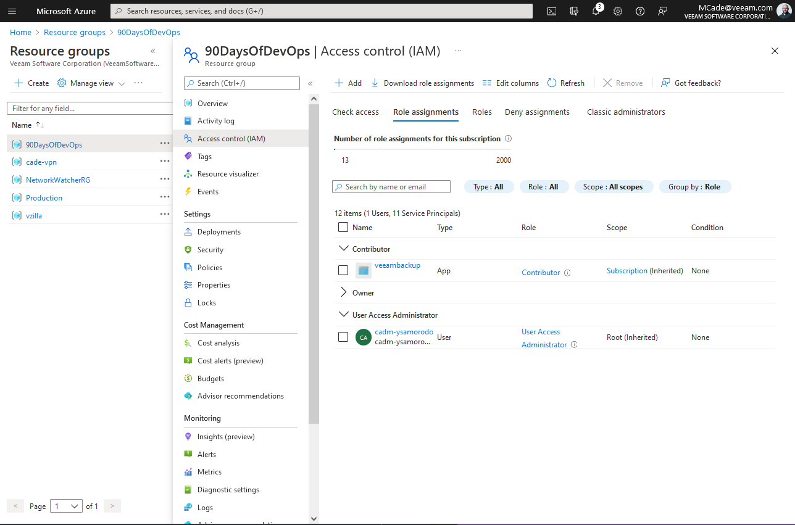
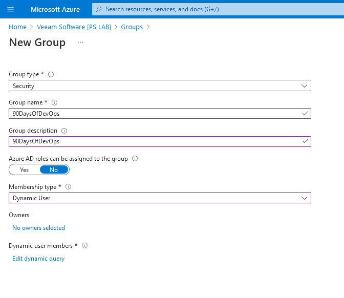
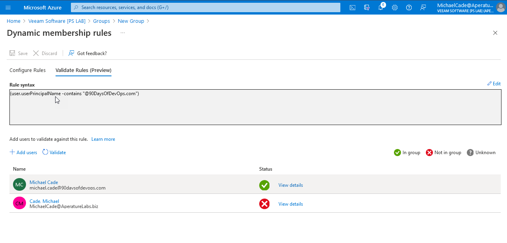

## Modelos de seguridad de Microsoft Azure

Siguiendo con la visión general de Microsoft Azure, vamos a empezar con Azure Security y ver cómo esto puede ayudar. En gran medida, con los roles por defecto son suficientes, pero además podemos trabajar con muchas áreas diferentes de autenticación y configuraciones. Microsoft Azure puede ser bastante avanzado gracias a Active Directory en comparación con otras nubes públicas.

Esta es un área en la que Microsoft Azure aparentemente funciona de manera diferente a otros proveedores de nube pública, en Azure SIEMPRE tiene Active Directory.

### Servicios de directorio

- Azure Active Directory alberga los principios de seguridad utilizados por Microsoft Azure y otros servicios en la nube de Microsoft.
- La autenticación se realiza a través de protocolos como SAML, WS-Federation, OpenID Connect y OAuth2.
- Las consultas se realizan a través de la API REST denominada Microsoft Graph API.
- Los tenants tienen un nombre por defecto tenant.onmicrosoft.com pero también pueden tener nombres de dominio personalizados.
- Las suscripciones están asociadas a un tenant de Azure Active Directory.

Si pensamos en AWS para comparar el servicio equivalente sería AWS IAM (Identity & Access Management), aunque es bastante diferente

Azure AD Connect ofrece la posibilidad de replicar cuentas de AD a Azure AD. Esto también puede incluir grupos y a veces objetos. Esto puede ser granulado y filtrado. Admite varios bosques y dominios.

Es posible crear cuentas en la nube en Microsoft Azure Active Directory (AD), pero la mayoría de las organizaciones ya tienen contabilizados a sus usuarios en su propio Active Directory local.

Azure AD Connect también permite ver no sólo los servidores Windows AD sino también otros Azure AD, Google y otros. Esto también proporciona la capacidad de colaborar con personas y organizaciones externas, lo que se denomina Azure B2B.

Las opciones de autenticación entre Active Directory Domain Services y Microsoft Azure Active Directory son posibles con ambas identidades sincronizadas con un hash de contraseña.

El paso del hash de la contraseña es opcional, si esto no se utiliza entonces se requiere autenticación passthrough.

Hay un vídeo enlazado a continuación que entra en detalle sobre la autenticación Passthrough.

[Inicio de sesión de usuario con autenticación Pass-through de Azure Active Directory](https://docs.microsoft.com/en-us/azure/active-directory/hybrid/how-to-connect-pta)

### Federación

Es justo decir que utilizando Microsoft 365, Microsoft Dynamics y Active Directory local es bastante fácil de entender e integrar en Azure AD para la federación. Sin embargo, es posible utilizar otros servicios fuera del ecosistema de Microsoft.

Azure AD puede actuar como intermediario de federación para estas otras aplicaciones ajenas a Microsoft y otros servicios de directorio.

Esto se verá en el Portal Azure como Aplicaciones Empresariales de las cuales hay un gran número de opciones.

Desplazando hacia abajo la página de aplicaciones empresariales se puede obtener una larga lista de aplicaciones destacadas.

Esta opción también permite "traer su propia" integración, una aplicación que está desarrollando o una aplicación no galería.

No he mirado en esto antes, pero puedo ver que esto es bastante el conjunto de características en comparación con los otros proveedores de nube y capacidades.

### Control de acceso basado en roles

Ya hemos cubierto en [Día 29](day29.md) los ámbitos que vamos a cubrir aquí, podemos establecer nuestro control de acceso basado en roles de acuerdo a uno de estos ámbitos:

- Suscripciones
- Grupo de Gestión
- Grupo de Recursos
- Recursos

Los roles se pueden dividir en tres, hay muchos roles incorporados en Microsoft Azure. Estos tres son:

- Propietario
- Contribuidor
- Lector

Propietario y Contribuidor son muy similares en sus límites de alcance. Sin embargo, el propietario puede cambiar permisos.

Otros roles son específicos para ciertos tipos de Azure Resources, así como roles personalizados.

Deberíamos centrarnos en asignar permisos a grupos frente a usuarios.

Los permisos se heredan.

Si volvemos atrás y miramos el grupo de Recursos "90-Days-of-DevOps-as-a-Learning" creado y comprobamos el Control de Acceso (IAM) dentro podemos ver que tenemos una lista de contribuidores y un cliente Administrador de Acceso de Usuario, y tenemos una lista de propietarios (Pero no puedo mostrar esto)

Podemos comprobar aquí si los roles que tenemos asignados son BuiltInRoles y a qué categoría pertenecen.

También podemos comprobar acceso si queremos comprobar una cuenta contra este grupo de recursos y asegurarnos de que la cuenta a la que queremos dar ese acceso tiene los permisos correctos o quizás queremos comprobar si un usuario tiene demasiado acceso.

### Microsoft Defender for Cloud

- Microsoft Defender for Cloud (anteriormente conocido como Azure Security Center) proporciona información sobre la seguridad de todo el entorno Azure.

- Un único panel de control para la visibilidad del estado general de la seguridad de todos los recursos Azure y no Azure (a través de Azure Arc) y orientación sobre el refuerzo de la seguridad.

- El nivel gratuito incluye evaluación continua y recomendaciones de seguridad.

- Planes de pago para tipos de recursos protegidos (por ejemplo, Servidores, AppService, SQL, Almacenamiento, Contenedores, KeyVault).

He cambiado a otra suscripción para ver el Centro de Seguridad de Azure y se puede ver aquí sobre la base de muy pocos recursos con algunas recomendaciones en un solo lugar.

### Azure Policy

- Azure Policy es un servicio nativo de Azure que ayuda a aplicar las normas de la organización y evaluar el cumplimiento a escala.

- Integrado en Microsoft Defender for Cloud. Azure Policy audita los recursos no conformes y aplica correcciones.

- Se utiliza habitualmente para regular la coherencia de los recursos, el cumplimiento normativo, la seguridad, los costes y las normas de gestión.

- Utiliza el formato JSON para almacenar la lógica de evaluación y determinar si un recurso es conforme o no, así como las medidas que deben tomarse en caso de incumplimiento (por ejemplo, Audit, AuditIfNotExists, Deny, Modify, DeployIfNotExists).

- Uso gratuito. La excepción son los recursos conectados a Azure Arc que se cobran por servidor/mes para el uso de Azure Policy Guest Configuration.

### Manos a la obra

He comprado www.90-Days-of-DevOps-as-a-Learning.com y quisiera añadir el dominio al portal Azure Active Directory, [Añada su nombre de dominio personalizado utilizando el portal Azure Active Directory](https://docs.microsoft.com/en-us/azure/active-directory/fundamentals/add-custom-domain)

Con eso ahora, podemos crear un nuevo usuario en nuestro nuevo dominio de Active Directory.

Ahora queremos crear un grupo para todos los nuevos usuarios 90-Days-of-DevOps-as-a-Learning en un grupo. Podemos crear un grupo como el siguiente. Tenga en cuenta que estoy usando "Usuario dinámico", lo que significa que Azure AD consultará las cuentas de usuario y agregarlos dinámicamente.Asignado es donde se agrega manualmente el usuario al grupo.

Hay muchas opciones a la hora de crear la consulta, como buscar el nombre de la entidad de seguridad y asegurar de que el nombre contiene @90-Days-of-DevOps-as-a-Learning.com.

Ahora que ya hemos creado la cuenta de usuario para nholuong.cade@90-Days-of-DevOps-as-a-Learning.com podemos validar que las reglas funcionan. Para comparar se ha añadido otra cuenta asociada a otro dominio y podéis ver que debido a esta regla nuestro usuario no aterrizará en este grupo.

Se añade un nuevo user1@90-Days-of-DevOps-as-a-Learning.com y comprobando el grupo podemos ver a todos los miembros.

Si tenemos este requisito x100 no querremos hacer todo esto en la consola, podemos tomar ventaja de cualquiera de las opciones a granel para crear, invitar y eliminar usuarios o lo haremos en PowerShell para lograr este enfoque automatizado a escala.

Ahora podemos ir a nuestro grupo de recursos y especificar que en el grupo de recursos 90-Days-of-DevOps-as-a-Learning queremos que el propietario sea el grupo que acabamos de crear.

Igualmente podemos denegar también el acceso de las asignaciones a nuestro grupo de recursos.

Si entramos en el Azure Portal con la nueva cuenta de usuario, podemos ver que sólo tenemos acceso a nuestro grupo de recursos 90-Days-of-DevOps-as-a-Learning y no a los otros vistos en imágenes anteriores.

Lo anterior está muy bien si se trata de un usuario que tiene acceso a los recursos dentro de su portal de Azure, no todos los usuarios necesitan conocer el portal, pero para comprobar el acceso podemos utilizar el [Apps Portal](https://myapps.microsoft.com/) Es un portal de inicio de sesión único para que podamos probar.

Puedes personalizar este portal con tu marca y esto podría ser algo a lo que volveremos más adelante.

## Recursos

- [Hybrid Cloud and MultiCloud](https://www.youtube.com/watch?v=qkj5W98Xdvw)
- [Microsoft Azure Fundamentals](https://www.youtube.com/watch?v=NKEFWyqJ5XA&list=WL&index=130&t=12s)
- [Google Cloud Digital Leader Certification Course](https://www.youtube.com/watch?v=UGRDM86MBIQ&list=WL&index=131&t=10s)
- [AWS Basics for Beginners - Full Course](https://www.youtube.com/watch?v=ulprqHHWlng&t=5352s)

Nos vemos en el [Día 31](day31.md).