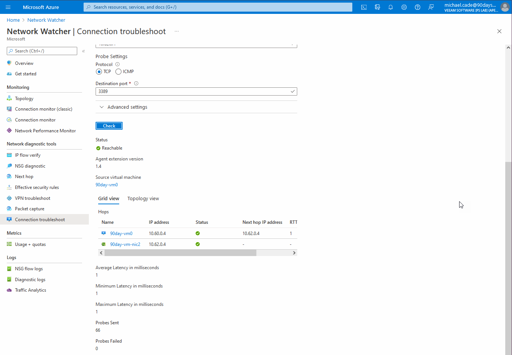
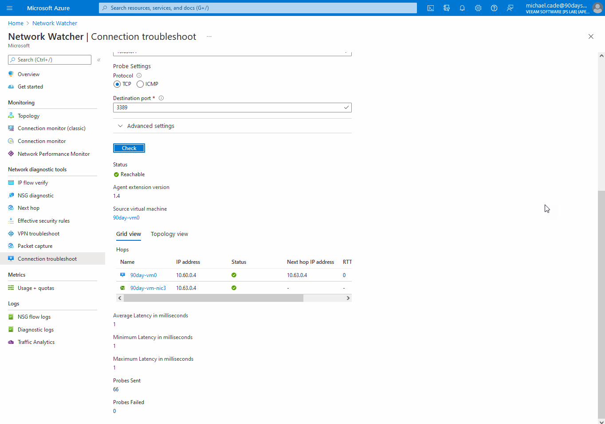
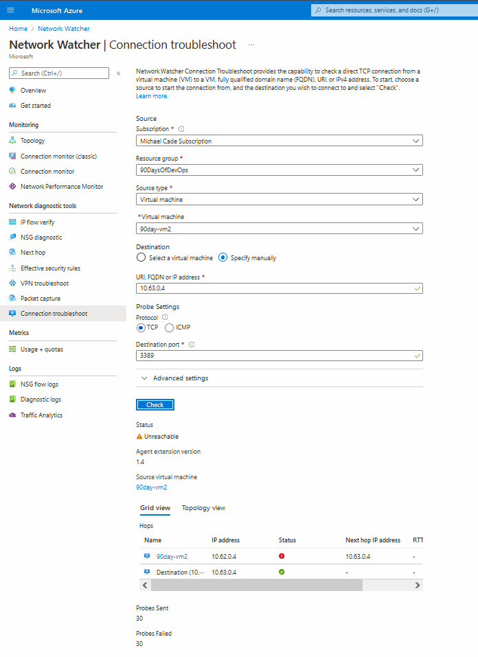
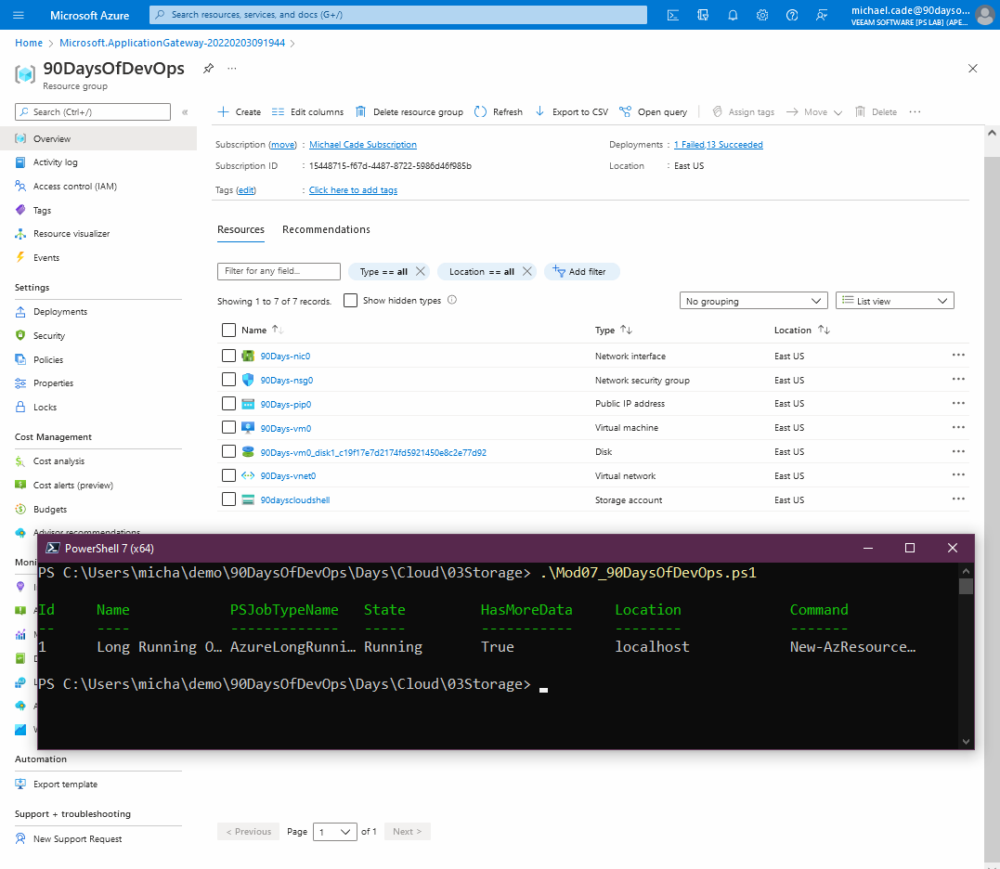
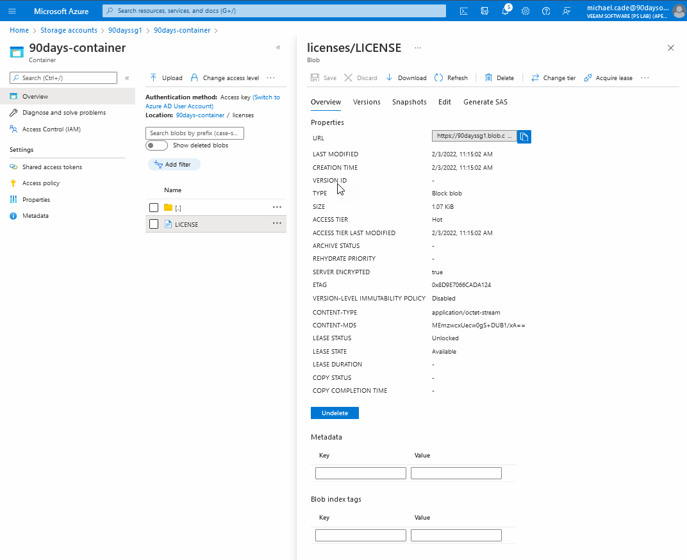
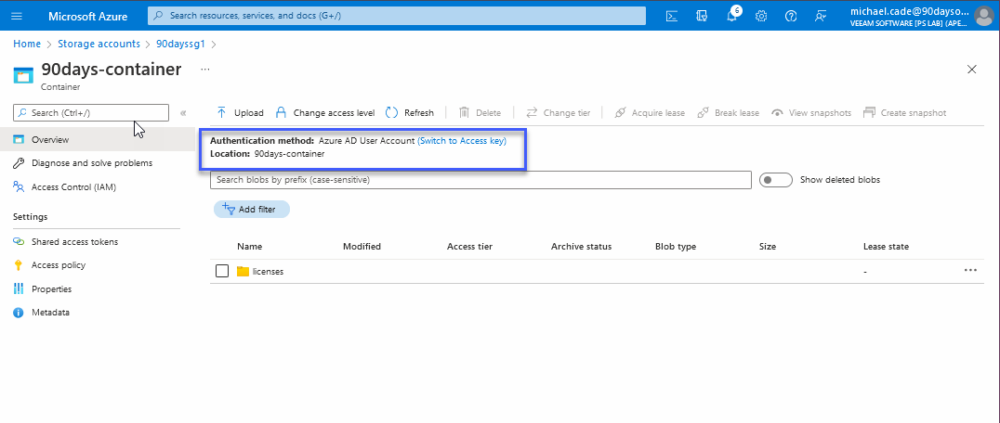
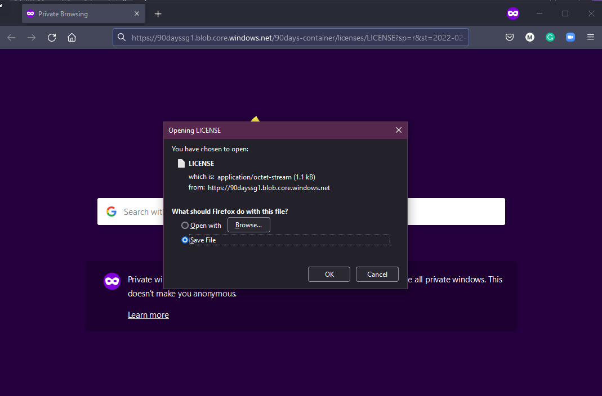

## Microsoft Azure Escenarios Prácticos

En los últimos 6 días nos hemos centrado en Microsoft Azure y la nube pública para conseguir una mínima base, teníamos que pasar por la teoría para entender los bloques de construcción de Azure. Lo bueno es que esto se traduce muy bien a los otros proveedores de la nube más importantes, tan solo hay que saber como le llaman a cada componente o servicio homólogo.

Al principio se mencionó esta necesidad de obtener un conocimiento básico de la nube pública y importación de la elección de un proveedor, al menos para empezar, porque si estás danzando entre diferentes nubes puede crear confusiones y perderse con facilidad. Mientras que con la elección de una en concreto se llega a entender mejor los fundamentos, así cuando surja la necesidad de saltar a otras nubes será mucho más ágil el aprendizaje.

En esta última sesión veremos escenarios prácticos de la siguiente página que se enlaza, una referencia creada por Microsoft para la preparación del examen [AZ-104 Microsoft Azure Administrator](https://microsoftlearning.github.io/AZ-104-MicrosoftAzureAdministrator/).

Algunos como contenedores y Kubernetes aun no están cubiertos en detalle en este viaje, así que no adelantemos acontecimientos todavía.

En los días anteriores sí que se ha visto gran parte de los Módulos 1,2 y 3 👍

### Redes Virtuales

Siguiendo y revisando el [Módulo 04](https://microsoftlearning.github.io/AZ-104-MicrosoftAzureAdministrator/Instructions/Labs/LAB_04-Implement_Virtual_Networking.html) se han cambiado algunos nombres para #90-Days-of-DevOps-as-a-Learning.

También, en lugar de utilizar el Cloud Shell iniciamos sesión con el nuevo usuario creado en días anteriores con el CLI de Azure.

Se puede hacer esto usando el `az login` que abrirá un navegador y permite autenticar en la cuenta.

A continuación, veremos un script PowerShell y algunas referencias del módulo a utilizar para construir algunas de las tareas. Puedes encontrar los archivos asociados en esta carpeta [Cloud\01VirtualNetworking](Cloud/01VirtualNetworking/)

Asegúrese de cambiar la ubicación del archivo en el script para adaptarlo a tu entorno.

En esta primera etapa, no tenemos ninguna red virtual o máquinas virtuales creadas en nuestro entorno, sólo tengo una ubicación de almacenamiento shell en la nube configurada en mi grupo de recursos.

En primer lugar ejecuto mi [script PowerShell](Cloud/01VirtualNetworking/Module4_90-Days-of-DevOps-as-a-Learning.ps1).

- Tarea 1: Crear y configurar una red virtual.

- Tarea 2: Desplegar máquina virtual en la red virtual.

- Tarea 3: Configurar las direcciones IP privadas y públicas de las máquinas virtuales Azure.

- Tarea 4: Configurar grupos de seguridad en red.

- Tarea 5: Configurar Azure DNS para la resolución de nombres internos.

### Gestión de tráfico de red

Siguiendo el [Módulo 06](https://microsoftlearning.github.io/AZ-104-MicrosoftAzureAdministrator/Instructions/Labs/LAB_06-Implement_Network_Traffic_Management.html):

Si no has configurado la cuenta de usuario para que sólo tenga acceso a ese grupo de recursos, puedes seguir el módulo cambiando el nombre a '90 días*'. Esto eliminará todos los recursos y el grupo de recursos. Este será el proceso para cada uno de los siguientes laboratorios.

Para este laboratorio, también se ha creado una secuencia de comandos PowerShell y algunas referencias del módulo a utilizar para construir algunas de las tareas. Puede encontrar los archivos asociados en esta carpeta.
[Nube\02GestiónDeTráfico](Nube\02GestiónDeTráfico)

- Tarea 1: Provisión del entorno de laboratorio

En primer lugar ejecuto mi [script PowerShell](Cloud/02TrafficManagement/Mod06_90-Days-of-DevOps-as-a-Learning.ps1)

- Tarea 2: Configurar la [topología de red de concentrador y radio (Hub-and-spoke)](https://learn.microsoft.com/es-es/azure/cloud-adoption-framework/ready/azure-best-practices/hub-spoke-network-topology)

- Tarea 3: Probar la transitividad del peering de la red virtual

El grupo 90-Days-of-DevOps-as-a-Learning no tenía acceso al Network Watcher debido a los permisos, espero que esto se deba a que los Network Watchers son uno de esos recursos que no están ligados a un grupo de recursos, que es donde nuestro RBAC estaba cubierto para este usuario. Se ha añadido el rol de colaborador del Vigilante de Red del Este de EEUU al grupo 90-Days-of-DevOps-as-a-Learning.

^ Esto es lo esperado ya que las dos redes virtuales spoke no son peer entre sí (el peering de redes virtuales no es transitivo).

- Tarea 4: Configurar el enrutamiento en la topología de red de concentrador y radio

Tuve otro problema aquí con mi cuenta no ser capaz de ejecutar el script como mi usuario dentro del grupo 90-Days-of-DevOps-as-a-Learning que no estoy seguro de lo que hice saltar de nuevo en mi cuenta de administrador principal. El grupo 90-Days-of-DevOps-as-a-Learning es el propietario de todo lo que hay en el grupo de recursos 90-Days-of-DevOps-as-a-Learning, así que me gustaría saber por qué no puedo ejecutar un comando dentro de la máquina virtual.

Entonces pude volver a entrar en la cuenta nholuong.cade@90-Days-of-DevOps-as-a-Learning.com y continuar con esta sección. Aquí estamos ejecutando la misma prueba de nuevo pero ahora con el resultado alcanzable.

- Tarea 5: Implementar Azure Load Balancer

- Tarea 6: Implementar Azure Application Gateway

### Almcacenamiento Azure

Siguiendo el [Módulo 07](https://microsoftlearning.github.io/AZ-104-MicrosoftAzureAdministrator/Instructions/Labs/LAB_07-Manage_Azure_Storage.html):

Para el siguiente laboratorio, también tenemos un script de PowerShell y algunas referencias del módulo a utilizar para construir algunas de las tareas. Puedes encontrar los archivos asociados en la carpeta [Cloud\03Storage](Cloud\03Storage).

- Tarea 1: Provisión del entorno de laboratorio.

En primer lugar se ejecuta el [script PowerShell](Cloud/03Storage/Mod07_90DaysOfDeveOps.ps1)

- Tarea 2: Crear y configurar cuentas Azure Storage.

- Tarea 3: Gestionar el almacenamiento blob

- Tarea 4: Gestionar la autenticación y autorización para Azure Storage

I was a little impatient waiting for this to be allowed but it did work eventually.

- Task 5: Create and configure an Azure Files shares

Se debe tener paciencia esperando a que esto se autorice.

- Tarea 6: Gestionar acceso a la red para Azure Storage

### Serverless (Implementar Web Apps)

Ahora toca el [Módulo 09a](https://microsoftlearning.github.io/AZ-104-MicrosoftAzureAdministrator/Instructions/Labs/LAB_09a-Implement_Web_Apps.html):

- Tarea 1: Crear un Azure web app

- Tarea 2: Crear un slot de despliegue de preparación

- Tarea 3: Configurar opciones del despliegue web app

- Tarea 4: Desplegar el código en el slot de despliegue de preparación

- Tarea 5: Intercambiar slots de preparación

- Tarea 6: Configurar y testear el autoescalado de Azure web app

Este script que estoy usando se puede encontrar en la carpeta [Cloud/05Serverless](Cloud/05Serverless)

Con esto terminamos la sección sobre Microsoft Azure y la nube pública en general. Espero que te hayas divertido trabajando los distintos escenarios.

## Recursos

- [Hybrid Cloud and MultiCloud](https://www.youtube.com/watch?v=qkj5W98Xdvw)
- [Microsoft Azure Fundamentals](https://www.youtube.com/watch?v=NKEFWyqJ5XA&list=WL&index=130&t=12s)
- [Google Cloud Digital Leader Certification Course](https://www.youtube.com/watch?v=UGRDM86MBIQ&list=WL&index=131&t=10s)
- [AWS Basics for Beginners - Full Course](https://www.youtube.com/watch?v=ulprqHHWlng&t=5352s)

A continuación, vamos a sumergirnos en los sistemas de control de versiones, en concreto en torno a git. Para los repositorios de código veremos GitHub, una de las opciones más utilizadas.

Nos vemos en el [Día 35](day35.md)
