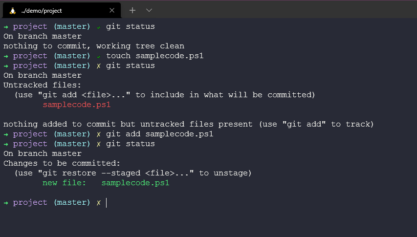
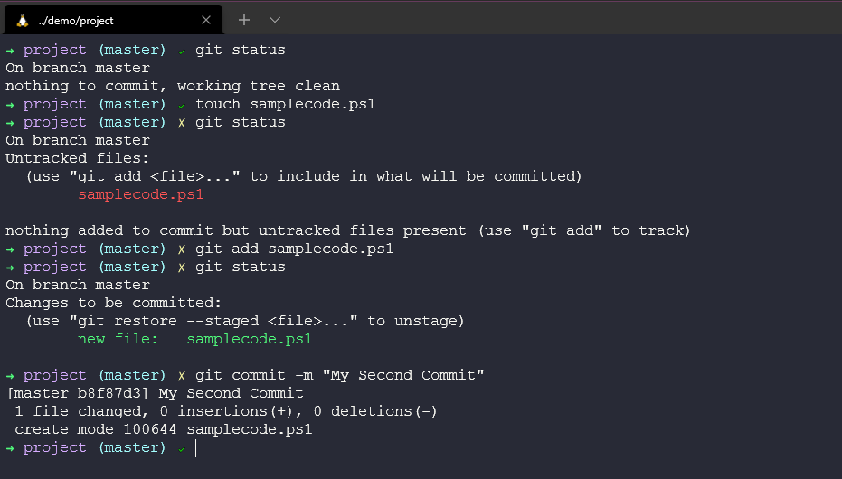

## El panorama: Git - Control de versiones

Antes de adentrarnos en git, necesitamos entender qué es el control de versiones y por qué. En esta introducción a Git, le echaremos un vistazo al control de versiones y a los fundamentos de git.

### ¿Qué es el control de versiones?

Git no es el único sistema de control de versiones, así que aquí queremos cubrir qué opciones y qué metodologías hay disponibles en torno al control de versiones.

El más obvio y gran beneficio del Control de Versiones es la capacidad de rastrear la historia de un proyecto. Podemos mirar atrás en este repositorio usando `git log` y ver que tenemos muchos commits (Confirmaciones de cambios), muchos comentarios y analizar lo que ha pasado desde el principio del proyecto. No te preocupes, hablaremos de los comandos más tarde. Ahora piensa en un proyecto de software real lleno de código fuente y con varias personas haciendo commits a nuestro software en diferentes momentos, diferentes autores, luego revisores... todo se registra para que sepamos lo que ha sucedido, cuándo, por quién y quién revisó.

El control de versiones antes de que fuera cool, habría sido algo como crear manualmente una copia de tu versión antes de hacer cambios y, manualmente también, hacer anotaciones de los cambios en un documento típicamente llamado changelog. Podría ser también que comentaras código viejo inútil con la mentalidad del "por si acaso" y lo dejarás entre el código fuente haciendo bulto.

Una vez te das cuenta de los beneficios del control de versiones no sólo lo utilizas sobre el código fuente, sino sobre prácticamente cualquier cosa, como proyectos como 90-Days-of-DevOps-as-a-Learning. ¿Por qué no aprovechar las características que rollback y el registro de todo lo que ha pasado?

Sin embargo, una gran advertencia: ⚠️ **¡Control de versiones no es una copia de seguridad!** ⚠️

Otro beneficio del Control de Versiones es la capacidad de gestionar múltiples versiones de un proyecto, vamos a crear un ejemplo, tenemos una aplicación gratuita que está disponible en todos los sistemas operativos y luego tenemos una aplicación de pago también disponible en todos los sistemas operativos. La mayor parte del código se comparte entre ambas aplicaciones. Podríamos copiar y pegar nuestro código en cada commit para cada aplicación, pero eso va a ser muy desordenado, especialmente a medida que escalas tu desarrollo a más de una persona, también se cometerán errores.

La aplicación premium es donde vamos a tener características adicionales, vamos a llamarlos commits premium, la edición gratuita sólo contendrá los commits normales.

La forma en que esto se logra en el Control de Versiones es a través de la ramificación.

La ramificación (branching) permite dos flujos de código para la misma aplicación, como hemos dicho anteriormente. Pero todavía queremos nuevas características que aterrizan en nuestra versión código libre para estar en nuestra prima y para lograr esto tenemos algo que se llama fusión (merging).

Hacer esto mismo ahora es facilísimo, pero la fusión puede ser complicada porque podrías tener un equipo trabajando en la edición gratuita y podrías tener otro equipo trabajando en la versión premium de pago y ¿qué pasa si ambos equipos cambian código que afecta a aspectos del código general? Tal vez una variable se actualiza y rompe algo. Aquí se produce un conflicto que rompe una de las características. El control de versiones no puede arreglar los conflictos pero permite gestionarlos fácilmente.

La razón principal de utilizar el control de versiones, en general, es la capacidad de poder colaborar. La capacidad de compartir código entre los desarrolladores es algo principal, pero cada vez se ven más casos de uso. Por ejemplo, en una presentación conjunta que trabajas con un colega o en un reto 90-Days-of-DevOps-as-a-Learning donde tienes una comunidad que ofrece sus correcciones y actualizaciones en todo el proyecto, como esta traducción.

Sin el control de versiones, ¿cómo se las arreglaban los equipos de desarrolladores de software? Cuando trabajo en mis proyectos me resulta bastante difícil hacer un seguimiento de las cosas. Supongo que dividirían el código en módulos funcionales y luego, como un puzzle, iban juntando las piezas y resolviendo los problemas antes de que algo se publicara. [El desarrollo en cascada](https://es.wikipedia.org/wiki/Desarrollo_en_cascada).

Con el control de versiones, tenemos una única fuente de verdad. Puede que todos sigamos trabajando en módulos diferentes, pero nos permite colaborar mejor porque vemos en tiempo real el trabajo de los demás.

Otra cosa importante a mencionar es que no son sólo los desarrolladores quienes pueden beneficiarse del Control de Versiones. Todos los miembros del equipo deben tener visibilidad, pero también las herramientas que todos deben conocer o aprovechar. Las herramientas de Gestión de Proyectos pueden estar vinculadas aquí, rastreando el trabajo. También podríamos tener una máquina de construcción, por ejemplo Jenkins, de la que hablaremos en otro módulo. Una herramienta que construye y empaqueta el sistema, automatizando las pruebas de despliegue y las métricas. Y mucho más...

### ¿Qué es Git?

Git es una herramienta que rastrea los cambios en el código fuente o en cualquier archivo, o también podríamos decir que Git es un sistema de control de versiones distribuido de código abierto.

Hay muchas formas de utilizar git en nuestros sistemas, lo más habitual es usarlo en la línea de comandos, pero también tenemos interfaces gráficas de usuario y herramientas como Visual Studio Code que tienen operaciones git-aware que podemos aprovechar.

Ahora vamos a ejecutar a través de una visión general de alto nivel, incluso antes de tener Git instalado en nuestra máquina local.

Utilicemos la carpeta que hemos creado antes.

Para usar esta carpeta con el control de versiones primero necesitamos iniciar este directorio usando el comando `git init`. Por ahora, piensa que este comando pone nuestro directorio como repositorio en una base de datos en algún lugar de nuestro ordenador. 

Ahora podemos crear algunos archivos y carpetas y nuestro código fuente puede comenzar. Podemos usar el comando `git add .` que pone todos los archivos y carpetas de nuestro directorio en una instantánea pero todavía no hemos confirmado nada en esa base de datos. Sólo estamos diciendo que todos los archivos con el `.` están listos para ser añadidos.

A continuación, queremos seguir adelante y confirmar nuestros archivos, lo hacemos con el comando `git commit -m "Mi primer commit"`. Podemos dar una razón para nuestro commit y es recomendable para que sepamos lo que ha sucedido en cada commit. Se hace con la opción de mensaje `-m`.

Ahora podemos ver lo que ha pasado en la historia del proyecto. Usando el comando `git log`.

Si creamos un fichero adicional llamado `samplecode.ps1` el estado de este será diferente. Podemos comprobar el estado de nuestro repositorio mediante el uso de `git status` esto muestra que no tenemos nada que confirmar y podemos añadir un nuevo archivo llamado `samplecode.ps1`. Ejecutamos el mismo `git status` y veremos que tenemos un fichero para añadir y confirmar (comitear, commit verborizado al español por los murcianos).

Añadimos nuestro nuevo fichero usando el comando `git add sample code.ps1` y entonces podemos ejecutar `git status` de nuevo y ver que nuestro fichero está listo para ser comiteado.

Pues a comitear se ha dicho, ejecutamos el comando `git commit -m "My Second Commit"`.

Otro `git status` nos muestra que todo está limpio, lo tenemos subido al repositorio local.

Podemos usar el comando `git log` que muestra los últimos cambios y el primer commit.

Si quisiéramos ver los cambios entre nuestras confirmaciones, es decir, qué archivos se han añadido o modificado, podemos usar `git diff b8f8 709a`.

Nos mostrará lo que ha cambiado. En nuestro caso veremos el fichero añadido.

Profundizaremos en esto más adelante pero para empezar a degustar las delicias de git: podemos saltar entre nuestros commits, es decir, ¡podemos viajar en el tiempo! Usando nuestro número de commit con el comando `git checkout 709a` para saltar atrás en el tiempo sin perder nuestro nuevo archivo.

Igualmente podemos avanzar de la misma manera, con el número de commit. También puedes ver que estamos usando el comando `git switch -` para deshacer nuestra operación.

El TLDR;

- Seguimiento de la historia de un proyecto.
- Gestión de múltiples versiones de un proyecto.
- Compartir código entre desarrolladores. Un mayor número de equipos y herramientas.
- Coordinar el trabajo en equipo.
- Ah, ¡y hay algunos viajes en el tiempo!

Esto ha sido una introducción, espero que se pueda percibir los poderes y el panorama general detrás del Control de Versiones.

A continuación vamos a instalar git y configurarlo en una máquina local y bucear un poco más profundo en algunos casos de uso y los comandos que podemos necesitar en Git.

## Recursos

- [What is Version Control?](https://www.youtube.com/watch?v=Yc8sCSeMhi4)
- [Types of Version Control System](https://www.youtube.com/watch?v=kr62e_n6QuQ)
- [Git Tutorial for Beginners](https://www.youtube.com/watch?v=8JJ101D3knE&t=52s)
- [Git for Professionals Tutorial](https://www.youtube.com/watch?v=Uszj_k0DGsg)
- [Git and GitHub for Beginners - Crash Course](https://www.youtube.com/watch?v=RGOj5yH7evk&t=8s)
- [Complete Git and GitHub Tutorial](https://www.youtube.com/watch?v=apGV9Kg7ics)
- [En español] [Comandos Git](https://gitea.vergaracarmona.es/man-linux/comandos-git)
- [En español] [Apuntes Curso de Git](https://vergaracarmona.es/wp-content/uploads/2022/10/Curso-git_vergaracarmona.es_.pdf).
- [En español] En los [apuntes](https://vergaracarmona.es/apuntes/) del traductor:
  - ["Instalar git en ubuntu"](https://vergaracarmona.es/instalar-git-en-ubuntu/)
  - ["Comandos de git"](https://vergaracarmona.es/comandos-de-git/)
  - ["Estrategias de fusión en git: Ship / Show / Ask"](https://vergaracarmona.es/estrategias-bifurcacion-git-ship-show-ask/)
  - ["Resolver conflictos en Git. Merge, Squash, Rebase o Pull"](https://vergaracarmona.es/merge-squash-rebase-pull/)
  - ["Borrar commits de git: reset, rebase y cherry-pick"](https://vergaracarmona.es/reset-rebase-cherry-pick/)

Nos vemos en el [Día 36](day36.md)
