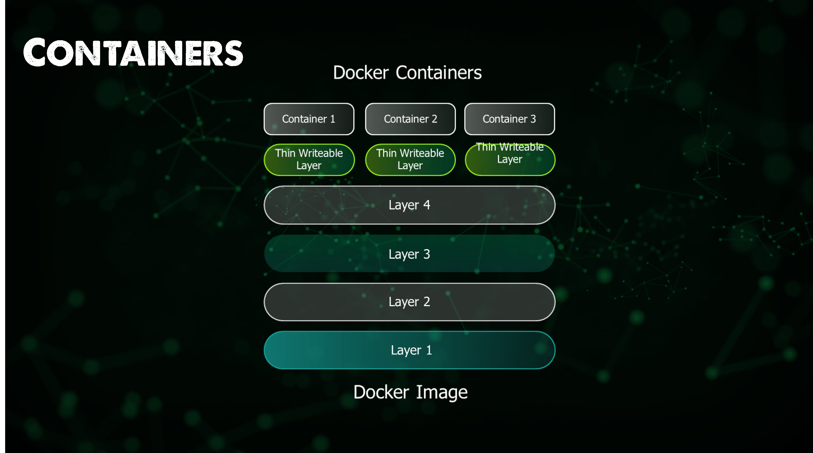
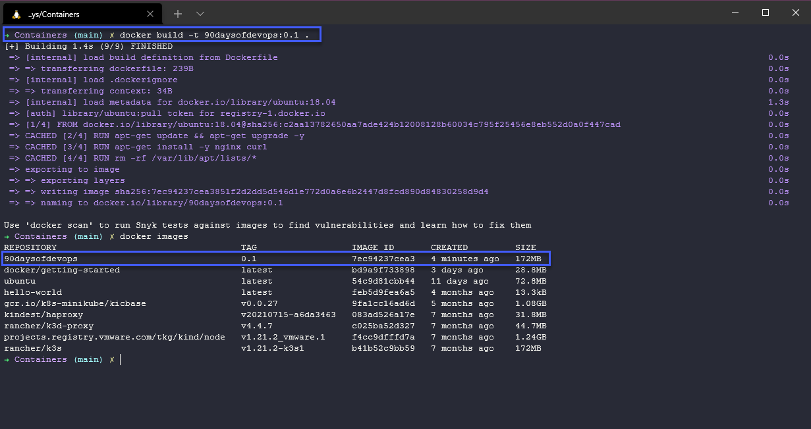
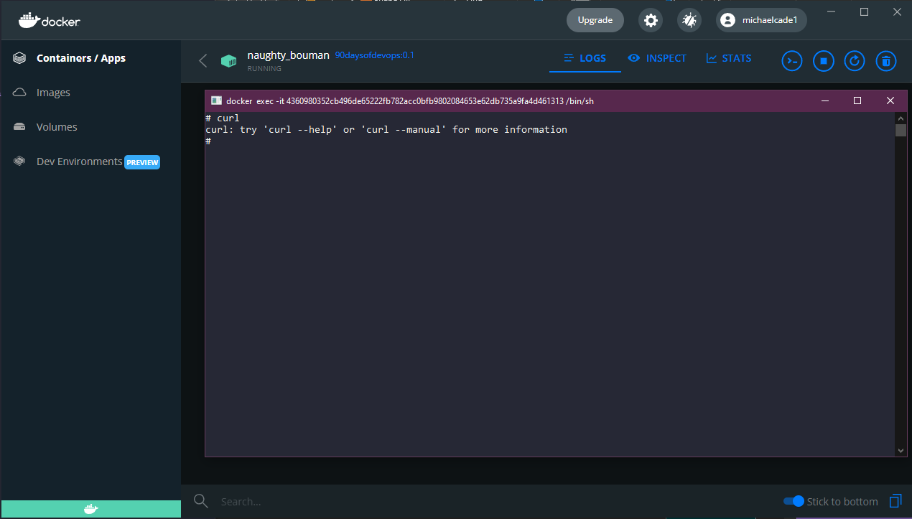
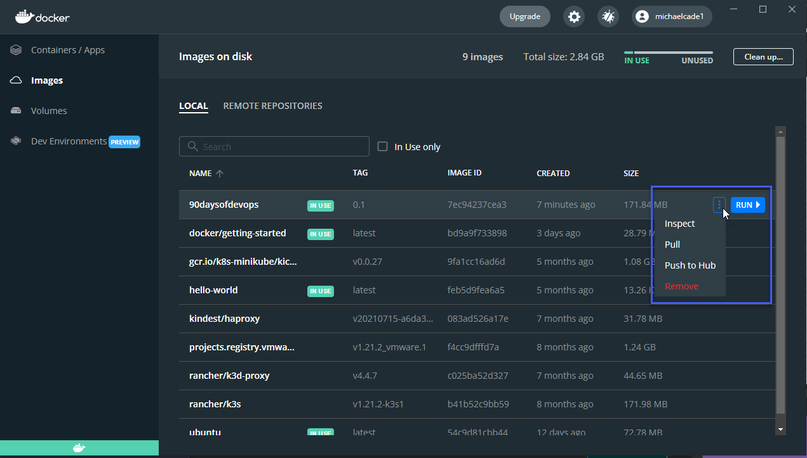
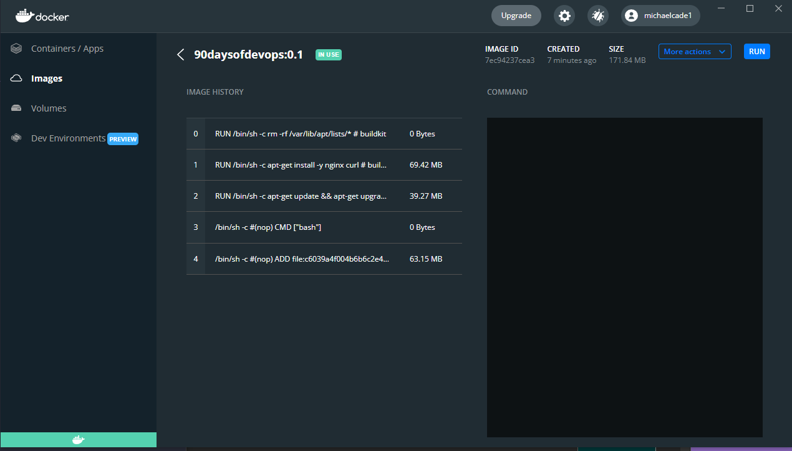
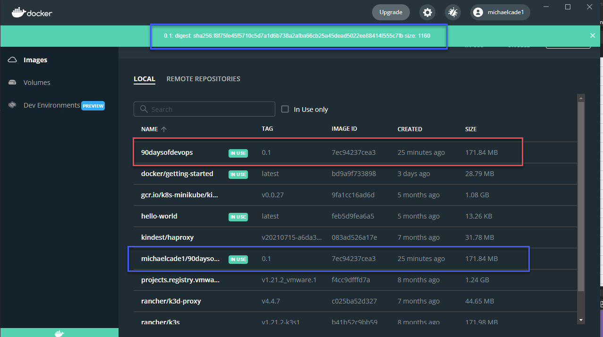
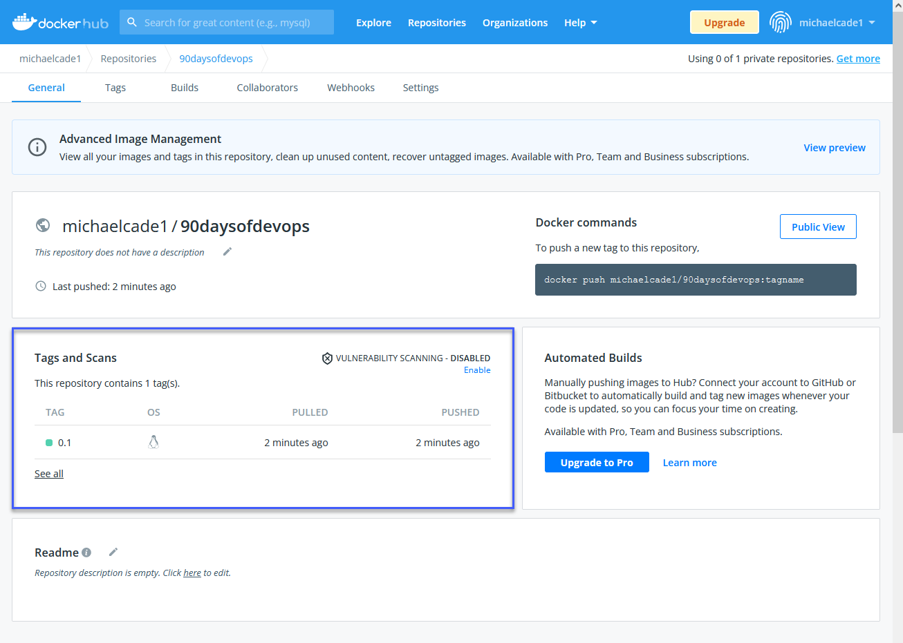

## La anatomía de una imagen Docker

En la última sesión, vimos algunos aspectos básicos de cómo podemos utilizar Docker Desktop combinado con DockerHub para desplegar y ejecutar algunas imágenes verificadas. Una recapitulación sobre lo que es una imagen, no olvidarás cosas si sigo mencionándolas. 

Una imagen Docker es una plantilla de sólo lectura que contiene un conjunto de instrucciones para crear un contenedor que se puede ejecutar en la plataforma Docker. Proporciona una forma práctica de empaquetar aplicaciones y entornos de servidor preconfigurados, que puedes utilizar para tu uso privado o compartir públicamente con otros usuarios de Docker. Las imágenes Docker son también el punto de partida para cualquiera que utilice Docker por primera vez.

¿Qué ocurre si queremos crear nuestra propia imagen Docker? Para ello crearíamos un Dockerfile. Ya viste cómo podríamos tomar esa imagen de contenedor Ubuntu y añadir nuestro software. Con lo que tendríamos nuestra imagen de contenedor con el software que queremos, sin embargo, si ese contenedor se apaga o se destruye todas esas actualizaciones de software y las instalaciones desaparecen, perdemos los cambios sin una versión repetible. Así que eso es genial para mostrar las capacidades, pero no ayuda con el transporte de imágenes a través de múltiples entornos con el mismo conjunto de software instalado cada vez que se ejecuta el contenedor, que es la potencia de docker. 

### ¿Qué es un Dockerfile? 

Un dockerfile es un archivo de texto que contiene comandos que normalmente ejecutarías manualmente para construir una imagen docker. Docker puede construir imágenes automáticamente leyendo las instrucciones que tenemos en nuestro dockerfile.

Cada uno de los archivos que componen una imagen docker se conoce como una capa. Estas capas forman una serie de imágenes, construidas unas sobre otras por etapas. Cada capa depende de la capa inmediatamente inferior. El orden de tus capas es clave para la eficiencia de la gestión del ciclo de vida de tus imágenes docker. 

Debemos organizar nuestras capas que cambian más a menudo lo más alto posible en la pila, esto se debe a que cuando se realizan cambios en una capa de la imagen, Docker no sólo reconstruye esa capa en particular, sino todas las capas construidas a partir de ella. Por lo tanto, un cambio en una capa en la parte superior implica la menor cantidad de trabajo para reconstruir toda la imagen. 

Cada vez que docker lanza un contenedor desde una imagen (como hicimos ayer) añade una capa escribible, conocida como la capa del contenedor. Esto almacena todos los cambios en el contenedor a lo largo de su tiempo de ejecución. Esta capa es la única diferencia entre un contenedor operativo en vivo y la propia imagen de origen. Cualquier número de contenedores similares pueden compartir el acceso a la misma imagen subyacente, manteniendo su estado. 

Volviendo al ejemplo que utilizamos ayer con la imagen de Ubuntu. Podríamos ejecutar ese mismo comando múltiples veces y en el primer contenedor podríamos instalar pinta y en el segundo podríamos instalar figlet con dos aplicaciones diferentes, diferentes propósitos, diferentes tamaños, etc. Cada contenedor que desplegamos comparte la misma imagen pero no el mismo estado y luego ese estado desaparece cuando eliminamos el contenedor. 



Estas imágenes se conocen generalmente como la imagen padre. Es la base sobre la que se construyen todas las demás capas y proporciona los bloques de construcción básicos para nuestros entornos de contenedores. 

Junto con un conjunto de archivos de capas individuales, una imagen Docker también incluye un archivo adicional conocido como manifiesto. Se trata básicamente de una descripción de la imagen en formato JSON y contiene información como las etiquetas de la imagen, una firma digital y detalles sobre cómo configurar el contenedor para distintos tipos de plataformas host.


### Cómo crear una imagen docker 

 Hay dos maneras en que podemos crear una imagen docker. Podemos hacerlo un poco sobre la marcha con el proceso que empezamos ayer, elegimos nuestra imagen base, giramos ese contenedor e instalamos todo el software y las dependencias que deseamos tener en nuestro contenedor. 

 Luego podemos usar el `docker commit container name` entonces tenemos una copia local de esta imagen bajo docker images y en nuestra pestaña docker desktop images. 

 Con este método no entenderás el proceso y será muy difícil manejar la gestión del ciclo de vida, además de tener un montón de configuraciones manuales/reconfiguraciones. Pero se entiende que es la forma más rápida y sencilla de construir una imagen docker. Aunque no sea recomendable puede resultar ideal para pruebas, resolución de problemas, validación de dependencias, etc. 

La mejor práctica de construir imágenes es a través de un dockerfile. Lo que nos da una forma limpia, compacta y repetible para crear nuestras imágenes con unas pocas líneas. La gestión del ciclo de vida es mucho más fácil, así como la integración en procesos de CI/CD. Pero como se puede deducir, implica un aprendizaje. El saber no ocupa lugar. 

El uso del método dockerfile está mucho más en sintonía con el mundo real, los despliegues de contenedores de nivel empresarial. 

Un dockerfile es un proceso de tres pasos mediante el cual se crea el dockerfile y se añaden los comandos necesarios para montar la imagen. 

La siguiente tabla muestra algunas de las sentencias dockerfile que utilizaremos o que probablemente necesitarás. 

| Comando    | Propósito                                                                                                                   |
| ---------- | --------------------------------------------------------------------------------------------------------------------------- |
| FROM       | Para especificar la imagen base.                                                                                            |
| WORKDIR    | Para establecer el directorio de trabajo para cualquier comando que siga en el Dockerfile.                                  |
| RUN        | Para instalar las aplicaciones y paquetes necesarios para su contenedor.                                                    |
| COPY       | Para copiar archivos o directorios desde una ubicación específica.                                                          |
| ADD        | Como COPY, pero también capaz de manejar URLs remotas y desempaquetar archivos comprimidos.                                 |
| ENTRYPOINT | Comando que se ejecutará siempre cuando se inicie el contenedor. Si no se especifica, el valor por defecto es `/bin/sh -c`  |
| CMD        | Argumentos pasados al punto de entrada. Si no se establece ENTRYPOINT, el CMD serán los comandos que ejecute el contenedor. |
| EXPOSE     | Para definir el puerto a través del cual acceder a su aplicación contenedora.                                               |
| LABEL      | Para añadir metadatos a la imagen.                                                                                          |

Con estos detalles ya podemos crear un directorio de trabajo para construir el primer dockerfile. En este repositorio puedes encontrar el directorio de trabajo con los archivos y carpetas que veremos: [Containers](Containers)

En este directorio tendré el archivo `.dockerignore` que es similar al `.gitignore`, ¿Lo recuerdas?. Este archivo enumerará todos los archivos que se desean excluir en el proceso de construcción de Docker, para evitarlos en la construcción final.

Recuerda, en la creación de los contenedores es importante ser compacto, tan rápido como sea posible sin bloat (código hinchado). 

Así que haremos un Dockerfile muy simple con el siguiente diseño:


```
# Use the official Ubuntu 18.04 as base
FROM ubuntu:18.04
# Install nginx and curl
RUN apt-get update && apt-get upgrade -y
RUN apt-get install -y nginx curl
RUN rm -rf /var/lib/apt/lists/*
```

Es importante que le fichero se llame `Dockerfile` para que docker lo pueda reconocer. Cuando lo tengas ejecuta `docker build -t 90-Days-of-DevOps-as-a-Learning:0.1 .`. Fíjate que usamos el punto para que busque el Dockerfile en el directorio donde estamos ubicados. Con el anterior comando estamos usando la `-t` y luego estableciendo un nombre de imagen y una etiqueta. 



Ahora que hemos creado nuestra imagen podemos ir y ejecutar nuestra imagen utilizando Docker Desktop o podríamos utilizar la línea de comandos docker. He utilizado Docker Desktop, he lanzado un contenedor y puedes ver que tenemos `curl` disponible para nosotros en el cli del contenedor. 



Mientras que en Docker Desktop también existe la posibilidad de aprovechar la interfaz de usuario para hacer algunas tareas más con esta nueva imagen. 



Podemos inspeccionar nuestra imagen, al hacerlo se ve gran parte del dockerfile y las líneas de código que queríamos ejecutar dentro de nuestro contenedor. 



Tenemos una opción pull, ahora esto fallaría porque la imagen no está alojada en ningún lugar por lo que obtendríamos un error. Sin embargo, tenemos una opción Push al hub que nos permitiría enviar nuestra imagen a nuestro registro DockerHub. 

Si estás usando el mismo `docker build` que ejecutamos antes, esto tampoco funcionaría, necesitarías que el comando de compilación fuera `docker build -t {{username}}/{{imagename}}:{{version}}`. 



A continuación, si echamos un vistazo a nuestro repositorio DockerHub se puede ver que acabamos de subir una nueva imagen. Ahora en Docker Desktop, seríamos capaces de utilizar la pestaña pull. 



## Recursos 

- [TechWorld with Nana - Docker Tutorial for Beginners](https://www.youtube.com/watch?v=3c-iBn73dDE)
- [Programming with Mosh - Docker Tutorial for Beginners](https://www.youtube.com/watch?v=pTFZFxd4hOI)
- [Docker Tutorial for Beginners - What is Docker? Introduction to Containers](https://www.youtube.com/watch?v=17Bl31rlnRM&list=WL&index=128&t=61s)
- [WSL 2 with Docker getting started](https://www.youtube.com/watch?v=5RQbdMn04Oc)
- [Blog on gettng started building a docker image](https://stackify.com/docker-build-a-beginners-guide-to-building-docker-images/)
- [Docker documentation for building an image](https://docs.docker.com/develop/develop-images/dockerfile_best-practices/)
- [En español] En los [apuntes](https://vergaracarmona.es/apuntes/) del traductor:
  - [Preparación de entorno de pruebas local para docker](https://vergaracarmona.es/preparacion-de-entorno-de-pruebas-local-para-docker/)
  - [Uso básico de docker](https://vergaracarmona.es/uso-basico-de-docker/)
  - [Una breve historia sobre contenedores](https://vergaracarmona.es/breve-historia-de-contenedores/)
  - [Desplegar con docker-compose los servicios Traefik y Portainer](https://vergaracarmona.es/desplegar-con-docker-compose-los-servicios-traefik-y-portainer/)

Nos vemos en el [Día 46](day46.md)
