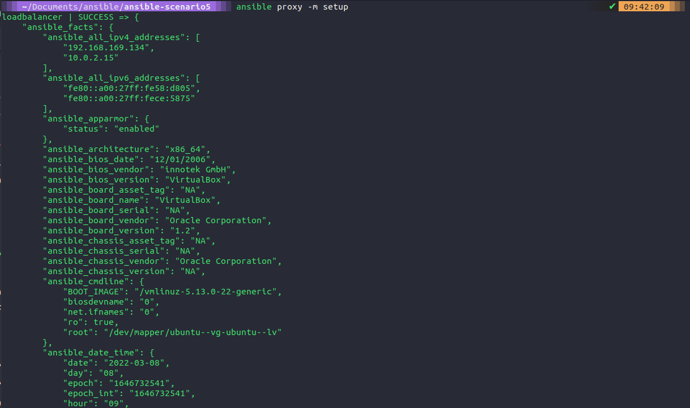
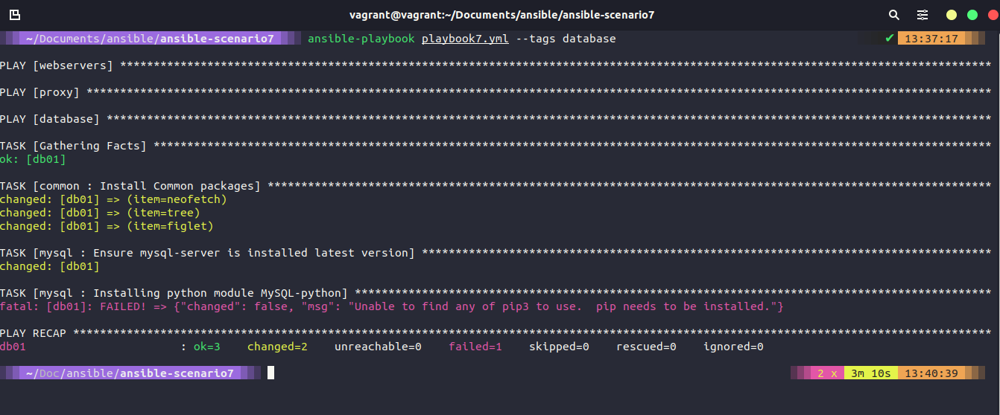
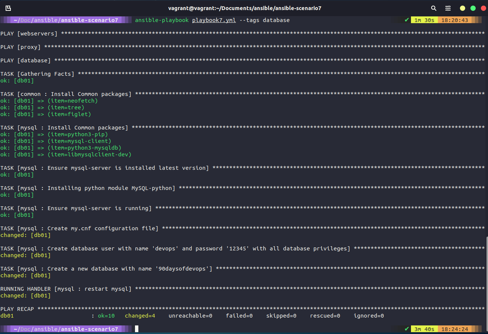
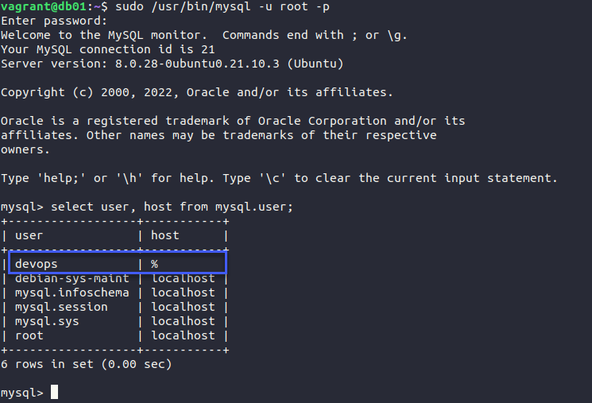

## Etiquetas, Variables, Configuración del servidor de inventario y base de datos

### Etiquetas

Como dejamos nuestro libro de jugadas en la sesión de ayer, necesitaríamos ejecutar cada tarea y jugada dentro de ese libro de jugadas. Esto significa que tendríamos que ejecutar las jugadas y tareas de los servidores web y el equilibrador de carga hasta su finalización.

Sin embargo, las etiquetas nos permiten separarlos si así lo deseamos. Esto podría ser un movimiento eficiente si tenemos libros de jugadas muy grandes y largos en nuestros entornos.

En nuestro archivo de libro de jugadas, en este caso, estamos utilizando [ansible-scenario5](Configmgmt/ansible-scenario5/playbook5.yml)

```Yaml
- hosts: webservers
  become: yes
  vars:
    http_port: 8000
    https_port: 4443
    html_welcome_msg: "Hello 90-Days-of-DevOps-as-a-Learning - Welcome to Day 66!"
  roles:
    - common
    - apache2
  tags: web

- hosts: proxy
  become: yes
  roles:
    - common
    - nginx
  tags: proxy
```

Podemos confirmar esto utilizando el comando `ansible-playbook playbook5.yml --list-tags` y la lista de etiquetas mostrará las etiquetas que hemos definido en nuestro libro de jugadas.


Ahora, si quisiéramos dirigirnos solo al proxy, podríamos hacerlo ejecutando `ansible-playbook playbook5.yml --tags proxy` y esto, como se puede ver a continuación, solo ejecutará el libro de jugadas contra el proxy.


Las etiquetas también se pueden agregar a nivel de tarea para que podamos ser más detallados sobre dónde y qué queremos que suceda. Podrían ser etiquetas enfocadas en la aplicación, podríamos pasar por las tareas y etiquetarlas según la instalación, configuración o eliminación.

Otra etiqueta muy útil que se puede usar es `tag: always`, esto asegurará que sin importar qué `--tags` estés usando en tu comando, si algo está etiquetado con el valor "always", siempre se ejecutará cuando ejecutes el comando `ansible-playbook`.

Con las etiquetas, también podemos agrupar varias etiquetas juntas y si elegimos ejecutar `ansible-playbook playbook5.yml --tags proxy,web`, esto ejecutará todos los elementos con esas etiquetas. Obviamente, en nuestro caso, eso significaría lo mismo que ejecutar el libro de jugadas, pero si tuviéramos múltiples jugadas adicionales, tendría sentido.

También se pueden definir más de una etiqueta.

### Variables

Hay dos tipos principales de variables en Ansible.

- Variables creadas por el usuario
- Hechos de Ansible

### Hechos de Ansible

Cada vez que ejecutamos nuestros libros de jugadas, tenemos una tarea que no hemos definido llamada "Recopilación de hechos". Podemos usar estas variables o hechos para realizar acciones con nuestras tareas de automatización.


Si ejecutamos el siguiente comando `ansible proxy -m setup`, deberíamos ver una gran cantidad de información en formato JSON. Sin embargo, habrá mucha información en tu terminal, por lo que nos gustaría redirigir esta salida a un archivo usando `ansible proxy -m setup >> facts.json`. Puedes encontrar este archivo en este repositorio: [ansible-scenario5](Configmgmt/ansible-scenario5/facts.json)



Si abres este archivo, podrás ver todo tipo de información sobre nuestro comando. Podemos obtener nuestras direcciones IP, arquitectura y versión de BIOS. Es información muy útil si queremos aprovecharla y utilizarla en nuestros playbooks.

Una idea sería usar una de estas variables dentro de nuestra plantilla de Nginx `mysite.j2`, donde hemos codificado las direcciones IP de nuestros servidores web. Puedes hacer esto creando un bucle `for` en tu `mysite.j2` que recorra el grupo `[webservers]`. Esto nos permitirá tener más de nuestros 2 servidores web creados o agregados automáticamente y de forma dinámica a esta configuración de equilibrador de carga.

```
#Dynamic Config for server {{ ansible_facts['nodename'] }}
    upstream webservers {
  
        server {{ hostvars[host]['ansible_facts']['nodename'] }}:8000;
    
    }

    server {
        listen 80;

        location / {
                proxy_pass http://webservers;
        }
    }
```

El resultado de lo anterior se verá igual que ahora, pero si agregamos más servidores web o eliminamos uno, esto cambiará dinámicamente la configuración del proxy. Para que esto funcione, deberás tener la resolución de nombres configurada.

### Variables creadas por el usuario

Las variables creadas por el usuario son aquellas que hemos creado nosotros mismos. Si observas nuestro playbook, verás que tenemos `vars:` y luego una lista de 3 variables que estamos utilizando allí.

```Yaml
- hosts: webservers
  become: yes
  vars:
    http_port: 8000
    https_port: 4443
    html_welcome_msg: "Hello 90-Days-of-DevOps-as-a-Learning - Welcome to Day 68!"
  roles:
    - common
    - apache2
  tags: web

- hosts: proxy
  become: yes
  roles:
    - common
    - nginx
  tags: proxy
```
Sin embargo, podemos mantener nuestro playbook libre de variables moviéndolas a sus propios archivos. Vamos a hacer esto, pero nos moveremos a la carpeta [ansible-scenario6](Configmgmt/ansible-scenario6). En la raíz de esa carpeta, crearemos una carpeta llamada group_vars. Luego crearemos otra carpeta llamada all (todas las agrupaciones obtendrán estas variables). Dentro de ella, crearemos un archivo llamado `common_variables.yml` y copiaremos nuestras variables del playbook en este archivo. Las eliminaremos del playbook junto con vars: también.

```Yaml
http_port: 8000
https_port: 4443
html_welcome_msg: "Hello 90-Days-of-DevOps-as-a-Learning - Welcome to Day 68!"
```

Debido a que estamos asociando esto como una variable global, también podríamos agregar nuestros servidores NTP y DNS aquí. Las variables se establecen en función de la estructura de carpetas que hemos creado. Puedes ver a continuación lo limpio que se ve nuestro playbook ahora.

```Yaml
- hosts: webservers
  become: yes
  roles:
    - common
    - apache2
  tags: web

- hosts: proxy
  become: yes
  roles:
    - common
    - nginx
  tags: proxy
```
Una de esas variables fue `http_port`, y podemos usarla nuevamente en nuestro bucle `for` dentro de `mysite.j2`, de la siguiente manera:

```J2
#Dynamic Config for server {{ ansible_facts['nodename'] }}
    upstream webservers {
  
        server {{ hostvars[host]['ansible_facts']['nodename'] }}:{{ http_port }};
    
    }

    server {
        listen 80;

        location / {
                proxy_pass http://webservers;
        }
    }
```

También podemos definir un hecho de Ansible en nuestro archivo `roles/apache2/templates/index.HTML.j2` para entender en qué servidor web nos encontramos.

```J2
<html>

<h1>{{ html_welcome_msg }}! I'm webserver {{ ansible_facts['nodename'] }} </h1>

</html>
```
Los resultados de ejecutar el comando `ansible-playbook playbook6.yml` con los cambios en las variables significan que, cuando accedemos a nuestro balanceador de carga, podemos ver que estamos llegando a cualquiera de los servidores web que tenemos en nuestro grupo.


También podríamos agregar una carpeta llamada host_vars y crear un archivo web01.yml para tener un mensaje específico o cambiar cómo se ve en cada host, si así lo deseamos.

### Archivos de inventario

Hasta ahora hemos utilizado el archivo de hosts predeterminado en la carpeta `/etc/ansible` para determinar nuestros hosts. Sin embargo, podríamos tener diferentes archivos para diferentes entornos, como producción y puesta en escena. No voy a crear más entornos, pero podemos crear nuestros archivos de host.

Podemos crear varios archivos para nuestras diferentes configuraciones de servidores y nodos. Podemos llamar a estos archivos utilizando el comando `ansible-playbook -i dev playbook.yml`. También puedes definir variables dentro de tu archivo de hosts y luego imprimir o utilizar esa variable en otro lugar de tus playbooks. Por ejemplo, en el ejemplo del curso de capacitación que estoy siguiendo, han agregado la variable de entorno creada en el archivo de hosts a la plantilla de la página web del balanceador de carga para mostrar el entorno como parte del mensaje de la página web.

### Implementación de nuestro servidor de base de datos

Todavía nos queda una máquina que no hemos encendido ni configurado. Podemos hacerlo usando el comando `vagrant up db01` desde donde se encuentra nuestro archivo Vagrantfile. Cuando esté encendida y accesible, debemos asegurarnos de copiar la clave SSH utilizando el comando `ssh-copy-id db01` para poder acceder a ella.

Vamos a trabajar desde la carpeta [ansible-scenario7](Configmgmt/ansible-scenario7).

Luego, usemos `ansible-galaxy init roles/mysql` para crear una nueva estructura de carpetas para un nuevo rol llamado "MySQL".

En nuestro playbook, vamos a agregar un nuevo bloque de tareas para la configuración de la base de datos. Tenemos nuestro grupo database definido en nuestro archivo /etc/ansible/hosts. Luego, instruimos a nuestro grupo de bases de datos que tenga el rol common y un nuevo rol llamado MySQL, que creamos en el paso anterior. También estamos etiquetando nuestro grupo de bases de datos con database, lo que significa que, como discutimos anteriormente, podemos elegir ejecutar solo las tareas etiquetadas si así lo deseamos.

```Yaml
- hosts: webservers
  become: yes
  roles:
    - common
    - apache2
  tags:
    web

- hosts: proxy
  become: yes
  roles:
    - common
    - nginx
  tags:
    proxy

- hosts: database
  become: yes
  roles:
    - common
    - mysql
  tags: database
```

Dentro de nuestra estructura de carpetas roles, ahora tendrás la siguiente estructura creada automáticamente, y necesitamos llenar lo siguiente:

Handlers - main.yml

```Yaml
# handlers file for roles/mysql
- name: restart mysql
  service:
    name: mysql
    state: restarted
```

Tasks - install_mysql.yml, main.yml y setup_mysql.yml

install_mysql.yml - esta tarea se encargará de instalar MySQL y asegurarse de que el servicio esté en ejecución.

```Yaml
- name: "Install Common packages"
  apt: name={{ item }} state=latest
  with_items:
   - python3-pip
   - mysql-client
   - python3-mysqldb
   - libmysqlclient-dev

- name: Ensure mysql-server is installed latest version
  apt: name=mysql-server state=latest

- name: Installing python module MySQL-python
  pip:
    name: PyMySQL

- name: Ensure mysql-server is running
  service:
    name: mysql
    state: started
```

`main.yml` es un archivo puntero que sugiere que importemos tareas desde estos archivos.

```Yaml
# tasks file for roles/mysql
- import_tasks: install_mysql.yml
- import_tasks: setup_mysql.yml
```

setup_mysql.yml: esta tarea creará nuestra base de datos y el usuario de la base de datos.

```Yaml
- name: Create my.cnf configuration file
  template: src=templates/my.cnf.j2 dest=/etc/mysql/conf.d/mysql.cnf
  notify: restart mysql

- name: Create database user with name 'devops' and password 'DevOps90' with all database privileges
  community.mysql.mysql_user:
    login_unix_socket: /var/run/mysqld/mysqld.sock
    login_user: "{{ mysql_user_name }}"
    login_password: "{{ mysql_user_password }}"
    name: "{{db_user}}"
    password: "{{db_pass}}"
    priv: '*.*:ALL'
    host: '%'
    state: present

- name: Create a new database with name '90-Days-of-DevOps-as-a-Learning'
  mysql_db:
    login_user: "{{ mysql_user_name }}"
    login_password: "{{ mysql_user_password }}"
    name: "{{ db_name }}"
    state: present
```

Como se puede ver arriba, estamos utilizando algunas variables para determinar parte de nuestra configuración, como contraseñas, nombres de usuario y bases de datos. Todo esto se almacena en nuestro archivo `group_vars/all/common_variables.yml`.

```Yaml
http_port: 8000
https_port: 4443
html_welcome_msg: "Hello 90-Days-of-DevOps-as-a-Learning - Welcome to Day 68!"

mysql_user_name: root
mysql_user_password: "vagrant"
db_user: devops
db_pass: DevOps90
db_name: 90-Days-of-DevOps-as-a-Learning
```

También tenemos el archivo `my.cnf.j2` en la carpeta de plantillas, que se ve así:

```J2
[mysql]
bind-address = 0.0.0.0
```

### Ejecutando el playbook

Ahora que tenemos nuestra máquina virtual en funcionamiento y nuestros archivos de configuración en su lugar, estamos listos para ejecutar nuestro playbook, que incluirá todo lo que hemos hecho antes si ejecutamos el siguiente comando `ansible-playbook playbook7.yml`. También podríamos elegir implementar solo en nuestro grupo de bases de datos con el comando `ansible-playbook playbook7.yml` --tags database, que ejecutará solo nuestros nuevos archivos de configuración.

Ejecuté el playbook solo para la etiqueta de la base de datos, pero me encontré con un error. Este error me indica que no tenemos pip3 (Python) instalado. Podemos solucionar esto agregando esto a nuestras tareas comunes e instalándolo.



Arreglamos lo anterior y ejecutamos el playbook nuevamente, y obtuvimos un cambio exitoso.



Deberíamos asegurarnos de que todo esté como queremos en nuestro servidor db01 recién configurado. Podemos hacer esto desde nuestro nodo de control usando el comando `ssh db01`.

Para conectarnos a MySQL, utilicé `sudo /usr/bin/mysql -u root -p` y proporcioné la contraseña de vagrant para root cuando se solicitó.

Una vez que nos hayamos conectado, asegurémonos primero de que se haya creado nuestro usuario llamado DevOps. Ejecutamos `select user, host from mysql.user;`.



Ahora podemos ejecutar el comando `SHOW DATABASES;` para ver nuestra nueva base de datos que también se ha creado.


Utilicé root para conectarme, pero también podríamos iniciar sesión con nuestra cuenta de DevOps de la misma manera, usando `sudo /usr/bin/MySQL -u devops -p`, pero la contraseña aquí es DevOps90.

Una cosa que he descubierto es que en nuestro archivo `setup_mysql.yml` tuve que agregar la línea `login_unix_socket: /var/run/mysqld/mysqld.sock` para conectarme correctamente a mi instancia de MySQL en db01, y ahora cada vez que ejecuto esto, se informa un cambio al crear el usuario. Cualquier sugerencia sería muy apreciada.

## Recursos

- [What is Ansible](https://www.youtube.com/watch?v=1id6ERvfozo)
- [Ansible 101 - Episode 1 - Introduction to Ansible](https://www.youtube.com/watch?v=goclfp6a2IQ)
- [NetworkChuck - You need to learn Ansible right now!](https://www.youtube.com/watch?v=5hycyr-8EKs&t=955s)
- [Your complete guide to Ansible](https://www.youtube.com/playlist?list=PLnFWJCugpwfzTlIJ-JtuATD2MBBD7_m3u)
- [Chef vs Puppet vs Ansible vs Saltstack](https://vergaracarmona.es/chef-vs-puppet-vs-ansible-vs-saltstack/)

Esta última lista de reproducción mencionada anteriormente es de donde proviene gran parte del código e ideas para esta sección, es un recurso excelente y un recorrido en formato de video.

Nos vemos en el [Día 69](day69.md)
