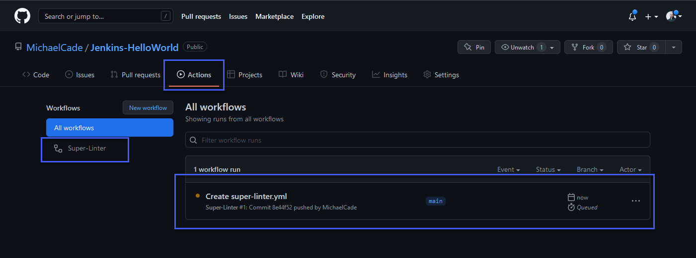
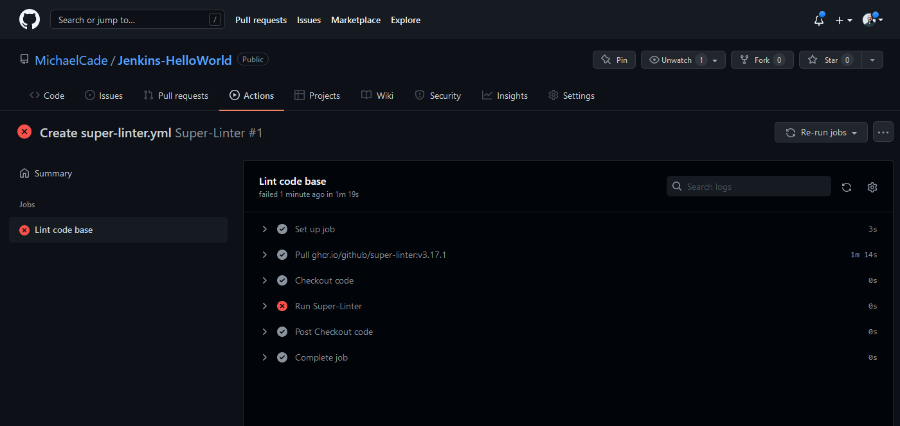
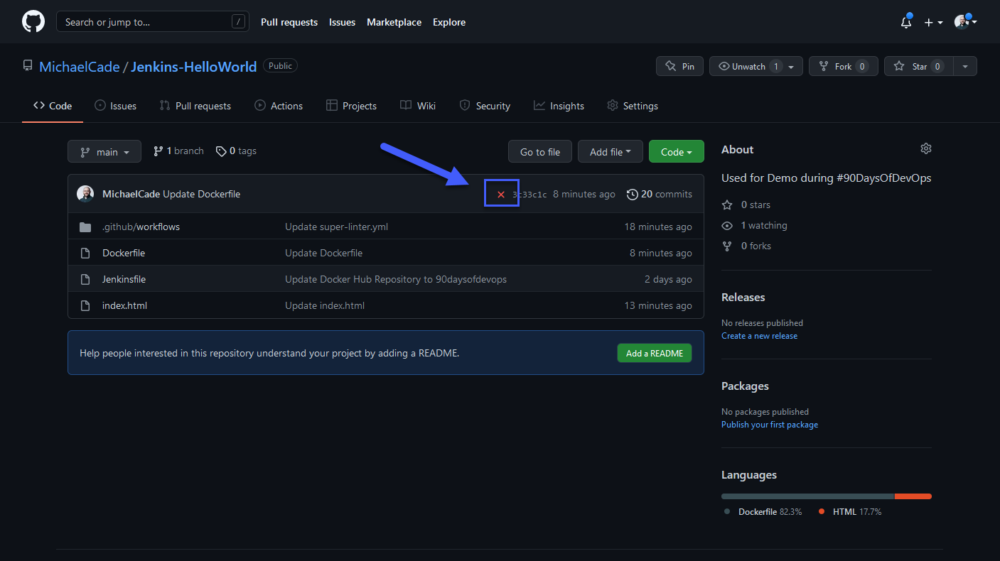
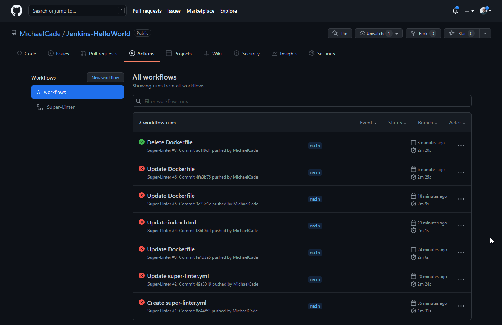
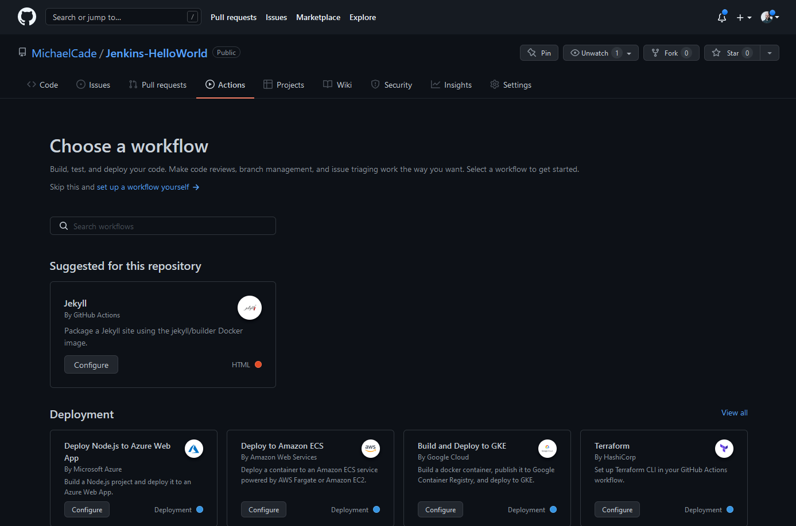

## Información general sobre GitHub Actions

En esta sección, quería pasar y echar un vistazo a un enfoque diferente a lo que acabamos de hacer. En esta sesión nos centraremos en GitHub Actions.

GitHub Actions es una plataforma de CI/CD que nos permite construir, probar y implementar, entre otras tareas, en nuestra canalización. Tiene el concepto de flujos de trabajo que construyen y prueban un repositorio de GitHub. También se puede utilizar GitHub Actions para ejecutar otros flujos de trabajo basados en eventos que ocurren dentro de tu repositorio.
Flujos de trabajo

En general, en GitHub Actions, nuestra tarea se llama 

## workflow.

- Un workflow es el proceso automatizado configurable.
- Se define en archivos YAML.
- Contiene y ejecuta uno o más trabajos.
- Se ejecutará cuando se desencadene un evento en tu repositorio o se puede ejecutar manualmente.
- Puedes tener varios flujos de trabajo por repositorio.
- Un workflow contendrá un trabajo y luego pasos para lograr ese trabajo.
- Dentro de nuestro workflow, también tendremos un runner en el que se ejecutará nuestro workflow.

Por ejemplo, puedes tener un workflow para construir y probar solicitudes de extracción, otro workflow para implementar tu aplicación cada vez que se crea una versión, y otro workflow que agrega una etiqueta cada vez que alguien abre un nuevo problema.

## Eventos

Los eventos son eventos específicos en un repositorio que desencadenan la ejecución del workflow.

### Trabajos

Un trabajo es un conjunto de pasos en el workflow que se ejecutan en un runner.

### Pasos

Cada paso dentro del trabajo puede ser un script de shell que se ejecuta o una acción. Los pasos se ejecutan en orden y dependen entre sí.

### Acciones

Es una aplicación personalizada repetible que se utiliza para tareas que se repiten con frecuencia.

### Runners

Un runner es un servidor que ejecuta el workflow, cada runner ejecuta un solo trabajo a la vez. GitHub Actions proporciona la capacidad de ejecutar runners de Ubuntu Linux, Microsoft Windows y macOS. También puedes alojar tu propio runner en un sistema operativo o hardware específico.

A continuación, puedes ver cómo se ve esto. Tenemos nuestro evento que desencadena nuestro workflow > nuestro workflow consta de dos trabajos > dentro de nuestros trabajos tenemos pasos y luego acciones.


### YAML

Antes de comenzar con un caso de uso real, echemos un vistazo rápido a la imagen anterior en forma de un archivo YAML de ejemplo.

He agregado "#" para comentar dónde podemos encontrar los componentes del workflow YAML.

```Yaml
#Workflow
name: 90-Days-of-DevOps-as-a-Learning
#Event
on: [push]
#Jobs
jobs:
  check-bats-version:
    #Runners
    runs-on: ubuntu-latest
    #Steps
    steps:
        #Actions
      - uses: actions/checkout@v2
      - uses: actions/setup-node@v2
        with:
          node-version: '14'
      - run: npm install -g bats
      - run: bats -v
```

### Comenzando con GitHub Actions

Creo que hay muchas opciones cuando se trata de GitHub Actions. Sí, satisfará tus necesidades de CI/CD en cuanto a construir, probar e implementar tu código y los pasos continuos posteriores.

Puedo ver muchas opciones y otras tareas automatizadas que podríamos utilizar GitHub Actions para realizar.

### Utilizando GitHub Actions para el linting de tu código

Una opción es asegurarse de que tu código esté limpio y ordenado dentro de tu repositorio. Este será nuestro primer ejemplo práctico.

Voy a utilizar un código de ejemplo vinculado en uno de los recursos de esta sección, vamos a usar `GitHub/super-linter` para verificar nuestro código.

```Yaml
name: Super-Linter

on: push

jobs:
  super-lint:
    name: Lint code base
    runs-on: ubuntu-latest
    steps:
      - name: Checkout code
        uses: actions/checkout@v2

      - name: Run Super-Linter
        uses: github/super-linter@v3
        env:
          DEFAULT_BRANCH: main
          GITHUB_TOKEN: ${{ secrets.GITHUB_TOKEN }}
```

**github/super-linter**

Puedes ver que para uno de nuestros pasos tenemos una acción llamada GitHub/super-linter, y esto se refiere a un paso que ya ha sido escrito por la comunidad. Puedes obtener más información al respecto aquí [Super-Linter](https://github.com/github/super-linter)

"Este repositorio es para la Acción de GitHub para ejecutar un Super-Linter. Es una combinación simple de varios linters, escritos en bash, para ayudar a validar tu código fuente".

También en el fragmento de código anterior se menciona GITHUB_TOKEN, así que me interesó saber por qué y para qué se necesita esto.

"NOTA: Si pasas la variable de entorno `GITHUB_TOKEN: ${{ secrets.GITHUB_TOKEN }}` en tu workflow, entonces el Super-Linter de GitHub marcará el estado de cada ejecución del linter en la sección de comprobaciones de una solicitud de extracción. Sin esto, solo verás el estado general de la ejecución completa. **No es necesario establecer el Secreto de GitHub ya que se establece automáticamente por GitHub, solo necesita pasarse a la acción".**

El texto en negrita es importante tener en cuenta en esta etapa. Lo estamos utilizando, pero no es necesario configurar ninguna variable de entorno dentro de nuestro repositorio.

Utilizaremos el repositorio que usamos en nuestra demostración de Jenkins para probarlo. [Jenkins-HelloWorld](https://github.com/nholuongCade/Jenkins-HelloWorld)

Aquí está nuestro repositorio como lo dejamos en las sesiones de Jenkins.


Para aprovecharlo, tenemos que usar la pestaña "Actions" (Acciones) de arriba para elegir del mercado, lo cual cubriré en breve, o podemos crear nuestros propios archivos usando nuestro código de super-linter mencionado anteriormente. Para crear el tuyo propio, debes crear un nuevo archivo en tu repositorio en esta ubicación exacta: `.github/workflows/nombre_del_flujo_de_trabajo`, asegurándote de que "nombre_del_flujo_de_trabajo" sea algo útil para que lo reconozcas. Aquí dentro podemos tener muchos flujos de trabajo diferentes realizando diferentes trabajos y tareas en nuestro repositorio.

Vamos a crear `.github/workflows/super-linter.yml`


Luego podemos pegar nuestro código y confirmarlo en nuestro repositorio. Si luego nos dirigimos a la pestaña "Actions" (Acciones), ahora veremos nuestro workflow de Super-Linter listado a continuación.



Hemos definido en nuestro código que este workflow se ejecutará cuando enviemos cualquier cosa a nuestro repositorio, por lo que al enviar el archivo super-linter.yml a nuestro repositorio, activamos el workflow.



Como se puede ver en el ejemplo anterior, tenemos algunos errores, probablemente debido a mi habilidad de hacker en comparación con mi habilidad de programación.

Aunque no fue mi código, al ejecutar esto y obtener un error, encontré este [issue](https://github.com/github/super-linter/issues/2255)

En el segundo intento, cambié la versión de Super-Linter de la versión 3 a la 4 y volví a ejecutar la tarea.


Como era de esperar, mi habilidad de hacker mostró algunos problemas y puedes verlos aquí en el [workflow](https://github.com/nholuongCade/Jenkins-HelloWorld/runs/5600278515?check_suite_focus=true).

Quería mostrar cómo se ve ahora en nuestro repositorio cuando algo en el workflow ha fallado o ha informado un error.



Ahora, si resolvemos el problema con mi código y enviamos los cambios, nuestro workflow se ejecutará nuevamente (puedes ver en la imagen que llevó un tiempo solucionar nuestros "errores"). Probablemente no se recomienda eliminar un archivo, pero es una forma muy rápida de mostrar que se ha resuelto el problema.



Si haces clic en el botón de workflow nuevo resaltado anteriormente, se abrirá la puerta a una gran cantidad de acciones. Una cosa que quizás hayas notado a lo largo de este desafío es que no queremos reinventar la rueda, queremos pararnos sobre los hombros de gigantes y compartir nuestro código, automatización y habilidades de manera amplia para hacer nuestras vidas más fáciles.



Oh, no te mostré la marca de verificación verde en el repositorio cuando nuestro workflow fue exitoso.


Creo que esto cubre los aspectos fundamentales de GitHub Actions, pero si eres como yo, probablemente estés pensando en cómo más se puede usar GitHub Actions para automatizar muchas tareas.

A continuación, abordaremos otra área de CD, donde veremos ArgoCD para implementar nuestras aplicaciones en nuestros entornos.

## Recursos

- [Jenkins is the way to build, test, deploy](https://youtu.be/_MXtbjwsz3A)
- [Jenkins.io](https://www.jenkins.io/)
- [ArgoCD](https://argo-cd.readthedocs.io/en/stable/)
- [ArgoCD Tutorial for Beginners](https://www.youtube.com/watch?v=MeU5_k9ssrs)
- [What is Jenkins?](https://www.youtube.com/watch?v=LFDrDnKPOTg)
- [Complete Jenkins Tutorial](https://www.youtube.com/watch?v=nCKxl7Q_20I&t=3s)
- [GitHub Actions](https://www.youtube.com/watch?v=R8_veQiYBjI)
- [GitHub Actions CI/CD](https://www.youtube.com/watch?v=mFFXuXjVgkU)

Nos vemos en el [Día 76](day76.md)
