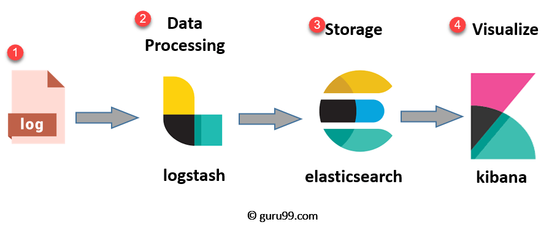
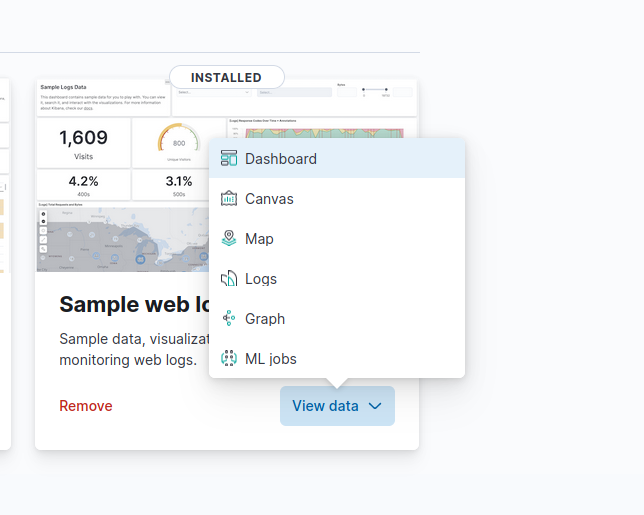

## ELK Stack

En esta sesión, vamos a profundizar un poco más en algunas de las opciones que hemos mencionado.

ELK Stack es la combinación de 3 herramientas separadas:

- [Elasticsearch](https://www.elastic.co/what-is/elasticsearch) es un motor de búsqueda y análisis distribuido, gratuito y de código abierto para todo tipo de datos, incluidos datos textuales, numéricos, geoespaciales, estructurados y no estructurados.

- [Logstash](https://www.elastic.co/logstash/) es un canal de procesamiento de datos en el lado del servidor, gratuito y de código abierto, que recopila datos de múltiples fuentes, los transforma y luego los envía a tu "almacén" favorito.

- [Kibana](https://www.elastic.co/kibana/) es una interfaz de usuario gratuita y de código abierto que te permite visualizar tus datos de Elasticsearch y navegar por Elastic Stack. Puedes hacer desde realizar un seguimiento de la carga de consultas hasta comprender cómo fluyen las solicitudes en tus aplicaciones.

ELK Stack nos permite tomar datos de cualquier fuente, en cualquier formato, de manera confiable y segura, y luego buscar, analizar y visualizar esos datos en tiempo real.

Además de los componentes mencionados anteriormente, también puedes encontrar Beats, que son agentes ligeros instalados en hosts periféricos para recopilar diferentes tipos de datos y enviarlos al stack.

- Logs: Se identifican los registros del servidor que necesitan ser analizados.

- Logstash: Recopila registros y datos de eventos. Incluso los analiza y transforma.

- Elasticsearch: Almacena, busca e indexa los datos transformados de Logstash.

- Kibana utiliza la base de datos Elasticsearch para explorar, visualizar y compartir datos.

[Imagen tomada de Guru99](https://www.guru99.com/elk-stack-tutorial.html)

Un buen recurso que explica esto en detalle es [The Complete Guide to the ELK Stack.](https://logz.io/learn/complete-guide-elk-stack/)

Con la adición de Beats, ELK Stack también se conoce ahora como Elastic Stack.

Para el escenario práctico, hay muchos lugares donde puedes implementar Elastic Stack, pero vamos a utilizar docker-compose para implementarlo localmente en nuestro sistema.

[Inicia Elastic Stack con Docker Compose](https://www.elastic.co/guide/en/elastic-stack-get-started/current/get-started-stack-docker.html#get-started-docker-tls)

Encontrarás los archivos originales y el paso a paso que utilicé aquí deviantony/docker-elk.

Ahora podemos ejecutar `docker-compose up -d`, la primera vez que se ejecute requerirá la descarga de las imágenes.

Si sigues este repositorio o el que utilicé, tendrás la contraseña "changeme" o en mi repositorio la contraseña "90-Days-of-DevOps-as-a-Learning". El nombre de usuario es "elastic".

Después de unos minutos, podemos acceder a `http://localhost:5601/`, que es nuestro servidor Kibana / contenedor Docker.

Tu pantalla de inicio inicial se verá algo así.

En la sección titulada "Comienza añadiendo integraciones", hay un enlace "try sample data" haz clic en él y podemos agregar uno de los que se muestran a continuación.

Voy a seleccionar "Sample weblogs", pero esto es solo para tener una idea de los conjuntos de datos que puedes agregar al ELK Stack.

Una vez que hayas seleccionado "Add Data", tomará un tiempo completar la carga de algunos de esos datos y luego tendrás la opción de "View Data" y una lista de las formas disponibles de ver esos datos en el menú desplegable.

Como se indica en la vista del panel de control:

**Sample Logs Data**

> Este panel contiene datos de muestra con los que puedes experimentar. Puedes verlos, buscarlos e interactuar con las visualizaciones. Para obtener más información sobre Kibana, consulta nuestra documentación.

Esto utiliza Kibana para visualizar los datos que se han agregado a Elasticsearch a través de Logstash. Esta no es la única opción, pero quería implementarlo y verlo en acción.

En algún momento también cubriremos Grafana y verás similitudes en la visualización de datos entre ambas herramientas, y también has visto Prometheus.

La principal diferencia entre Elastic Stack y Prometheus + Grafana que he encontrado es que Elastic Stack o ELK Stack se centra en los registros (logs) y Prometheus se centra en las métricas.

Estaba leyendo este artículo de MetricFire [Prometheus vs. ELK](https://www.metricfire.com/blog/prometheus-vs-elk/) para tener una mejor comprensión de las diferentes opciones.

## Recursos

- [Understanding Logging: Containers & Microservices](https://www.youtube.com/watch?v=MMVdkzeQ848)
- [The Importance of Monitoring in DevOps](https://www.devopsonline.co.uk/the-importance-of-monitoring-in-devops/)
- [Understanding Continuous Monitoring in DevOps?](https://medium.com/devopscurry/understanding-continuous-monitoring-in-devops-f6695b004e3b)
- [DevOps Monitoring Tools](https://www.youtube.com/watch?v=Zu53QQuYqJ0)
- [Top 5 - DevOps Monitoring Tools](https://www.youtube.com/watch?v=4t71iv_9t_4)
- [How Prometheus Monitoring works](https://www.youtube.com/watch?v=h4Sl21AKiDg)
- [Introduction to Prometheus monitoring](https://www.youtube.com/watch?v=5o37CGlNLr8)
- [Promql cheat sheet with examples](https://www.containiq.com/post/promql-cheat-sheet-with-examples)
- [Log Management for DevOps | Manage application, server, and cloud logs with Site24x7](https://www.youtube.com/watch?v=J0csO_Shsj0)
- [Log Management what DevOps need to know](https://devops.com/log-management-what-devops-teams-need-to-know/)
- [What is ELK Stack?](https://www.youtube.com/watch?v=4X0WLg05ASw)
- [Fluentd simply explained](https://www.youtube.com/watch?v=5ofsNyHZwWE&t=14s)

Nos vemos en el [Día 81](day81.md)
