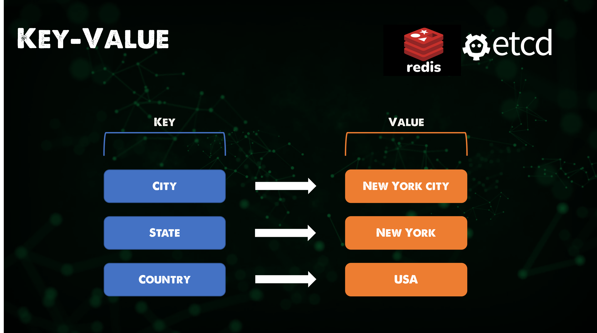
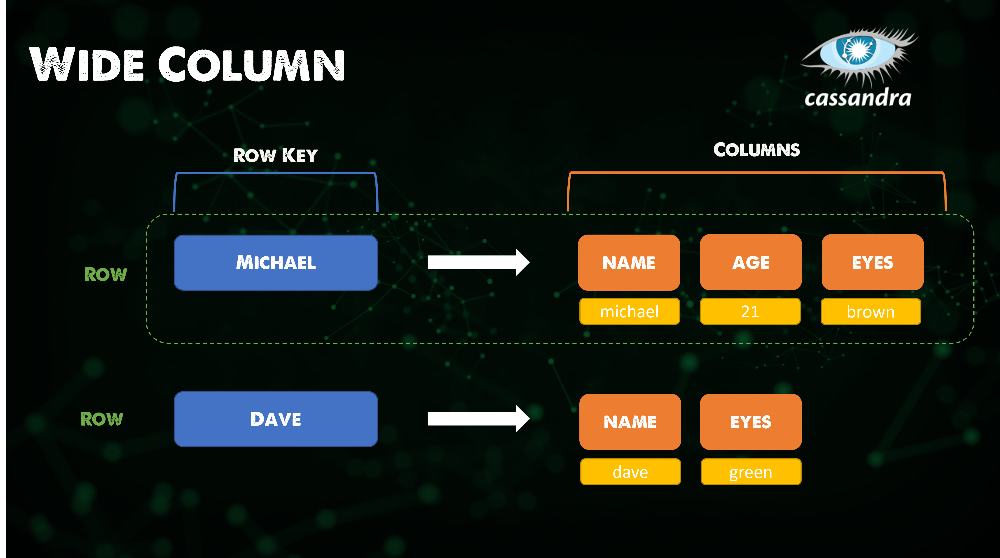

## Servicios de datos

Las bases de datos serán el servicio de datos más común que encontraremos en nuestros entornos. Quería aprovechar esta sesión para explorar algunos de los diferentes tipos de bases de datos y algunos de los casos de uso que cada una tiene. Algunos los hemos utilizado y visto a lo largo del desafío.

Desde el punto de vista del desarrollo de aplicaciones, elegir el servicio de datos o la base de datos adecuada será una decisión importante en cuanto al rendimiento y la escalabilidad de su aplicación.

https://www.youtube.com/watch?v=W2Z7fbCLSTw

### Clave-valor

Una base de datos clave-valor es un tipo de base de datos no relacional que utiliza un método simple de clave-valor para almacenar datos. Una base de datos clave-valor almacena datos como una colección de pares clave-valor en los que una clave sirve como identificador único. Tanto las claves como los valores pueden ser cualquier cosa, desde objetos simples hasta objetos compuestos complejos. Las bases de datos clave-valor son altamente particionables y permiten una escalabilidad horizontal en escalas que otros tipos de bases de datos no pueden lograr.

Un ejemplo de una base de datos clave-valor es Redis.

*Redis es una tienda de estructuras de datos en memoria, utilizado como base de datos distribuida en memoria clave-valor, caché y agente de mensajes, con durabilidad opcional. Redis admite diferentes tipos de estructuras de datos abstractas, como cadenas, listas, mapas, conjuntos, conjuntos ordenados, HyperLogLogs, mapas de bits, flujos e índices espaciales.*

Como se puede ver en la descripción de Redis, esto significa que nuestra base de datos es rápida pero estamos limitados en espacio como un compromiso. Además, no hay consultas ni uniones, lo que significa que las opciones de modelado de datos son muy limitadas.

Ideal para:

- Caché
- Pub/Sub (publicación/suscripción)
- Tablas de clasificación
- Carritos de compras

Generalmente se utiliza como una caché por encima de otra capa de datos persistente.

### Columnas anchas

Una base de datos de columnas anchas es una base de datos NoSQL que organiza el almacenamiento de datos en columnas flexibles que pueden distribuirse en varios servidores o nodos de la base de datos, utilizando un mapeo multidimensional para hacer referencia a los datos por columna, fila y marca de tiempo.

*Cassandra es un sistema de gestión de bases de datos distribuido, de almacenamiento de columnas anchas, de código abierto, diseñado para manejar grandes cantidades de datos en muchos servidores de baja calidad, proporcionando alta disponibilidad sin un único punto de fallo.*

Sin esquema, lo que significa que puede manejar datos no estructurados, lo cual puede ser beneficioso para algunas cargas de trabajo.

Ideal para:

- Series temporales
- Registros históricos
- Alta escritura, baja lectura

### Documentos

Una base de datos de documentos (también conocida como base de datos orientada a documentos o almacenamiento de documentos) es una base de datos que almacena información en documentos.

*MongoDB es un programa de base de datos orientada a documentos de código fuente abierto, multiplataforma. Clasificado como un programa de base de datos NoSQL, MongoDB utiliza documentos similares a JSON con esquemas opcionales. MongoDB es desarrollado por MongoDB Inc. y tiene licencia bajo la Licencia Pública del Servidor.*

Las bases de datos de documentos NoSQL permiten a las empresas almacenar datos simples sin utilizar códigos SQL complejos. Almacenamiento rápido sin comprometer la confiabilidad.

Ideal para:

- La mayoría de las aplicaciones
- Juegos
- Internet de las cosas

### Relacionales

Si eres nuevo en las bases de datos pero tienes conocimiento de ellas, supongo que has encontrado una base de datos relacional.

Una base de datos relacional es una base de datos digital basada en el modelo relacional de datos, propuesto por E. F. Codd en 1970. Un sistema utilizado para mantener bases de datos relacionales es un sistema de gestión de bases de datos relacionales. Muchos sistemas de bases de datos relacionales tienen la opción de utilizar SQL para consultar y mantener la base de datos.

*MySQL es un sistema de gestión de bases de datos relacionales de código abierto. Su nombre es una combinación de "My", el nombre de la hija del cofundador nholuong Widenius, y "SQL", la abreviatura de Structured Query Language (lenguaje de consulta estructurado).*

MySQL es un ejemplo de una base de datos relacional, hay muchas otras opciones.

Al investigar las bases de datos relacionales, se ha mencionado mucho el término o abreviatura **ACID** (atomicidad, consistencia, aislamiento, durabilidad), que es un conjunto de propiedades de transacciones de bases de datos destinadas a garantizar la validez de los datos a pesar de errores, cortes de energía y otros contratiempos. En el contexto de las bases de datos, una secuencia de operaciones de base de datos que cumple con las propiedades ACID (que se puede percibir como una sola operación lógica en los datos) se llama transacción. Por ejemplo, una transferencia de fondos de una cuenta bancaria a otra, que involucra múltiples cambios como el débito de una cuenta y el crédito de otra, es una sola transacción.

Ideal para:

- La mayoría de las aplicaciones (ha estado disponible durante años, pero eso no significa que sea la mejor opción)

No es ideal para datos no estructurados o para la capacidad de escalar, donde algunas de las otras menciones NoSQL ofrecen una mejor capacidad de escalado para ciertas cargas de trabajo.

### Grafos

Una base de datos de grafos almacena nodos y relaciones en lugar de tablas o documentos. Los datos se almacenan de la misma manera que podrías hacer un boceto de ideas en una pizarra. Sus datos se almacenan sin restricciones en un modelo predefinido, lo que permite una forma muy flexible de pensar y usarlos.

Neo4j es un sistema de gestión de bases de datos de grafos desarrollado por Neo4j, Inc. Descrito por sus desarrolladores como una base de datos transaccional compatible con ACID con almacenamiento y procesamiento nativos de grafos.

Ideal para:

- Grafos
- Grafos de conocimiento
- Motores de recomendación

### Motor de búsqueda

En la última sección, usamos una base de datos de motor de búsqueda en forma de Elasticsearch.

Una base de datos de motor de búsqueda es un tipo de base de datos no relacional dedicada a la búsqueda de contenido de datos. Las bases de datos de motores de búsqueda utilizan índices para categorizar características similares entre los datos y facilitar la capacidad de búsqueda.

*Elasticsearch es un motor de búsqueda basado en la biblioteca Lucene. Proporciona un motor de búsqueda de texto completo distribuido capaz de múltiples inquilinos con una interfaz web HTTP y documentos JSON sin esquema.*

Ideal para:

- Motores de búsqueda
- Búsqueda anticipada
- Búsqueda de registros

### Multi-modelo

Una base de datos multi-modelo es un sistema de gestión de bases de datos diseñado para admitir múltiples modelos de datos en un único backend integrado. En contraste, la mayoría de los sistemas de gestión de bases de datos están organizados en torno a un solo modelo de datos que determina cómo se pueden organizar, almacenar y manipular los datos. Los modelos de documentos, grafos, relacionales y clave-valor son ejemplos de modelos de datos que pueden ser compatibles con una base de datos multi-modelo.

*Fauna es una base de datos flexible y fácil de usar, entregada como una API segura y escalable en la nube con GraphQL nativo.*

Ideal para:

- No estar limitado a elegir un modelo de datos
- Compatible con ACID
- Rápido
- Sin sobrecarga de aprovisionamiento
- Cómo quieres consumir tus datos y permitir que la nube haga el trabajo pesado

Eso concluye esta sesión general sobre bases de datos. No importa en qué industria te encuentres, en algún momento te encontrarás con áreas de bases de datos. Luego, examinaremos algunos ejemplos de gestión de datos, especialmente la protección y el almacenamiento de estos servicios de datos más adelante en la sección.

Hay una gran cantidad de recursos que he enlazado a continuación. Honestamente, podrías pasar 90 años sumergiéndote en todos los tipos de bases de datos y todo lo que conllevan.

## Recursos

- [Redis Crash Course - the What, Why and How to use Redis as your primary database](https://www.youtube.com/watch?v=OqCK95AS-YE)
- [Redis: How to setup a cluster - for beginners](https://www.youtube.com/watch?v=GEg7s3i6Jak)
- [Redis on Kubernetes for beginners](https://www.youtube.com/watch?v=JmCn7k0PlV4)
- [Intro to Cassandra - Cassandra Fundamentals](https://www.youtube.com/watch?v=YjYWsN1vek8)
- [MongoDB Crash Course](https://www.youtube.com/watch?v=ofme2o29ngU)
- [MongoDB in 100 Seconds](https://www.youtube.com/watch?v=-bt_y4Loofg)
- [What is a Relational Database?](https://www.youtube.com/watch?v=OqjJjpjDRLc)
- [Learn PostgreSQL Tutorial - Full Course for Beginners](https://www.youtube.com/watch?v=qw--VYLpxG4)
- [MySQL Tutorial for Beginners [Full Course]](https://www.youtube.com/watch?v=7S_tz1z_5bA)
- [What is a graph database? (in 10 minutes)](https://www.youtube.com/watch?v=REVkXVxvMQE)
- [What is Elasticsearch?](https://www.youtube.com/watch?v=ZP0NmfyfsoM)
- [FaunaDB Basics - The Database of your Dreams](https://www.youtube.com/watch?v=2CipVwISumA)
- [Fauna Crash Course - Covering the Basics](https://www.youtube.com/watch?v=ihaB7CqJju0)

Nos vemos en el [Día 86](day86.md)
