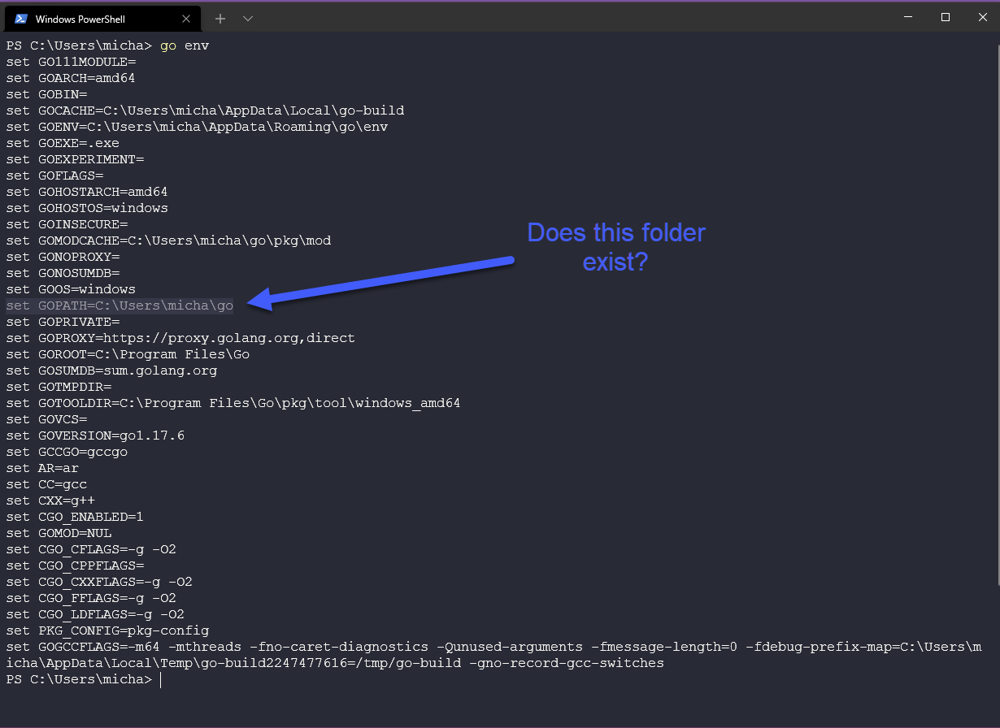
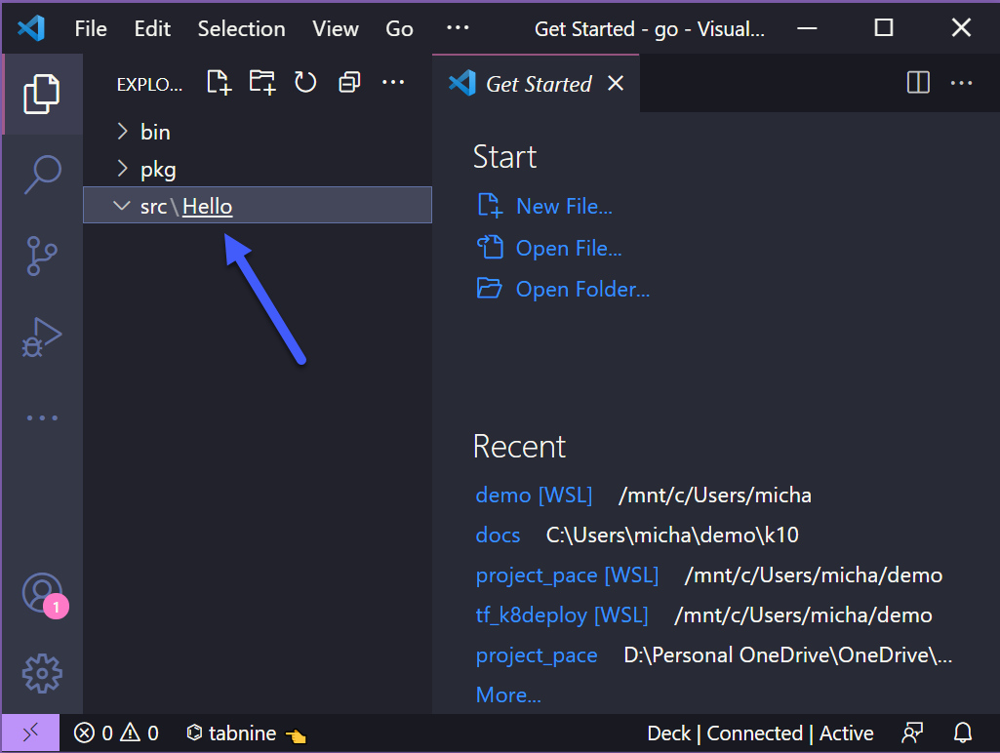
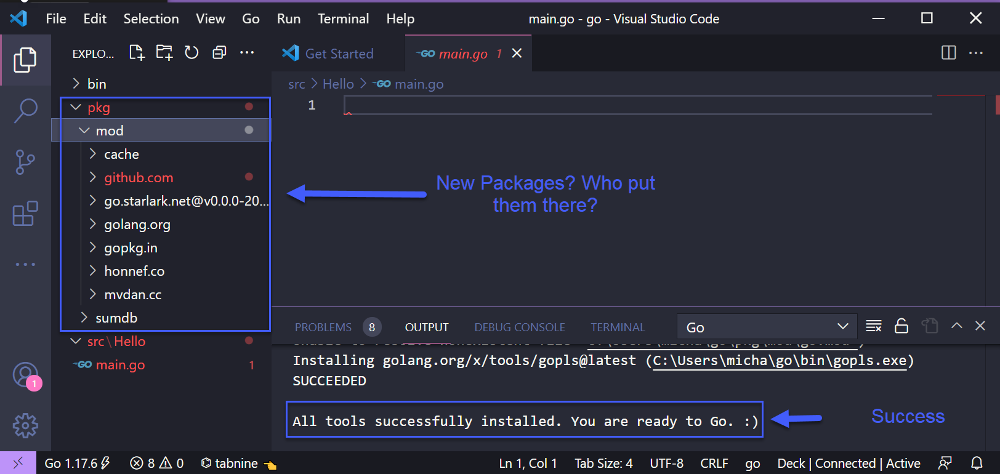

## GoとHello WorldのためのDevOps環境のセットアップ

Goの基本に入る前に、ワークステーションにGoをインストールし、「プログラミングを学ぶ101」モジュールで教えられるように、Hello Worldアプリを作成しましょう。今回は、ワークステーションにGoをインストールする手順を説明するため、その手順を写真で記録し、簡単に追えるようにします。

まず最初に、[go.dev/dl](https://go.dev/dl/) に移動して、ダウンロードのためのいくつかの利用可能なオプションを表示します。


ここまでくれば、どのワークステーションオペレーティングシステムを使用しているかはご存知でしょうから、適切なダウンロードを選択し、インストールを開始しましょう。このチュートリアルではWindowsを使用します。基本的に、次の画面からはデフォルトのままでよいでしょう。***(執筆時点では最新版のため、スクリーンショットが古い可能性があります) *** 


また、古いバージョンのGoがインストールされている場合は、インストールする前に削除する必要があります。

完了したら、コマンドプロンプト/ターミナルを開き、Goがインストールされていることを確認します。以下のような出力が得られない場合は、Goがインストールされていないため、手順をやり直す必要があります。

`go version`


次に、Goの環境をチェックしたいと思います。これは、作業ディレクトリが正しく設定されているかどうかを確認するために常に行うべきことです。以下に示すように、あなたのシステム上に以下のディレクトリがあることを確認する必要があります。



確認しましたか？ついてきていますか？おそらく、そこにナビゲートしようとすると、以下のようなものが表示されると思います。


では、簡単にディレクトリを作成しましょう。powershellのターミナルでmkdirコマンドを使用します。また、Goフォルダの中に3つのフォルダを作成する必要があるので、以下も参照ください。


これでGoがインストールされ、Goの作業ディレクトリが準備されました。統合開発環境(IDE)はたくさんありますが、最も一般的で私が使っているのはVisual Studio CodeまたはCodeです。IDEについては[ここ](https://www.youtube.com/watch?v=vUn5akOlFXQ)で詳しく説明されています。

VSCodeのダウンロードとインストールがまだの場合は、[こちら](https://code.visualstudio.com/download)から行うことができます。以下のように、さまざまなOSのオプションがあります。


Goのインストールと同じように、ダウンロードしてインストールし、デフォルトを維持します。完了したら、VSCodeを開き、Open Fileを選択して、上記で作成したGoのディレクトリに移動します。


信頼についてのポップアップが表示されるかもしれませんが、それを読んでから「はい、作者を信頼します」を押してください。(信頼できないものを開き始めても、私は責任を負いません!)

これで、先ほど作成した3つのフォルダが表示されるはずです。今やりたいことは、srcフォルダを右クリックして、`Hello`という名前の新しいフォルダを作成することです。



ここまで来ると、かなり簡単だと思いませんか？さて、次のフェーズでは何も理解しないまま、最初のGoプログラムを作成することになります。

次に、`Hello` フォルダに `main.go` というファイルを作成します。main.goでエンターキーを押すとすぐにGoエクステンションとパッケージをインストールするかどうか聞かれます。



次のコードを新しいmain.goファイルにコピーして、保存してください。

```
package main

import "fmt"

func main() {
    fmt.Println("Hello #90-Days-of-DevOps-as-a-Learning")
}
```
さて、上記は全く意味がないかもしれませんが、関数やパッケージなどについては、後日詳しく説明します。とりあえず、このアプリを実行してみましょう。ターミナルとHelloフォルダーに戻って、すべてが機能していることを確認できます。以下のコマンドを使用して、一般的な学習プログラムが動作しているかどうかを確認できます。

```
go run main.go
```


しかし、これで終わりではなく、このプログラムを他のWindowsマシンで実行したいとしたらどうでしょう？そのためには、次のコマンドでバイナリをビルドします。

```
go build main.go
``` 


それを実行すると、同じ出力が表示されます。

```bash
$ ./main.exe
Hello #90-Days-of-DevOps-as-a-Learning
```

## リソース

- [StackOverflow 2021 Developer Survey](https://insights.stackoverflow.com/survey/2021)
- [Why we are choosing Golang to learn](https://www.youtube.com/watch?v=7pLqIIAqZD4&t=9s)
- [Jake Wright - Learn Go in 12 minutes](https://www.youtube.com/watch?v=C8LgvuEBraI&t=312s) 
- [Techworld with Nana - Golang full course - 3 hours 24 mins](https://www.youtube.com/watch?v=yyUHQIec83I) 
- [**NOT FREE** Nigel Poulton Pluralsight - Go Fundamentals - 3 hours 26 mins](https://www.pluralsight.com/courses/go-fundamentals) 
- [FreeCodeCamp -  Learn Go Programming - Golang Tutorial for Beginners](https://www.youtube.com/watch?v=YS4e4q9oBaU&t=1025s) 
- [Hitesh Choudhary - Complete playlist](https://www.youtube.com/playlist?list=PLRAV69dS1uWSR89FRQGZ6q9BR2b44Tr9N) 


[9日目](day09.md)でお会いしましょう。


