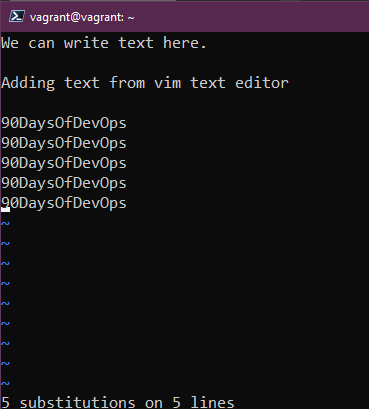

## Metin Editörleri - nano vs vim

Linux sistemlerinin çoğu sunucu olarak kullanılır ve bu sistemlerde genellikle bir grafik arayüzü (GUI) bulunmaz. Linux, temel olarak yapılandırma dosyalarından oluşur ve herhangi bir değişiklik yapabilmek için bu yapılandırma dosyalarını düzenleyebilmek önemlidir.

Birçok seçenek olsa da, muhtemelen en yaygın kullanılan iki terminal metin editörünü kapsamak iyi olur. nano öğrenmesi daha kolaydır, ancak hızlı değişiklikler ve sınırsız olanaklar söz konusu olduğunda, vim ile çalışmak gerekecektir. Ancak vim'in öğrenme eğrisi daha yüksektir çünkü birçok komutu öğrenmeniz gerekecektir.

### nano

- Her sistemde bulunmayabilir.
- Shell tabanlı editörlere başlamak için harikadır.

Şu komutu çalıştırarak:
```shell
nano 90-Days-of-DevOps-as-a-Learning.txt
``` 
Boş bir dosya oluşturacak ve doğrudan editöre gireceksiniz. Buradan metin ekleyebilir ve aşağıda dosya yönetimi için temel komutları bulabilirsiniz.


Şimdi control x + enter tuşlarını kullanarak çıkabilir ve ardından ls komutunu çalıştırarak ilk metin dosyanızı görebilirsiniz.


Dosyayı ekranda görmek için aynı dosya ile cat komutunu kullanabilirsiniz. Daha sonra aynı dosya üzerinde ek metin eklemek veya dosyayı değiştirmek için yine nano 90-Days-of-DevOps-as-a-Learning.txt komutunu kullanabilirsiniz.

nano, yapılandırma dosyalarında küçük değişiklikler yapmak için harika bir seçenektir.

### vim

Muhtemelen en yaygın kullanılan metin editörüdür. UNIX'in 1976 yılındaki vi metin editörünün bir türevidir ve birçok özelliği vardır.

- Tüm Linux dağıtımlarıyla uyumludur.
- İnanılmaz derecede güçlüdür. Vim ile ilgili 7 saatlik tam bir kurs bulmak mümkündür.
- Birçok eklenti mevcuttur.

Vim'e vim komutunu kullanarak girebilirsiniz veya önceki yeni metin dosyanızı düzenlemek için şu komutu çalıştırabilirsiniz:
```shell
vim 90-Days-of-DevOps-as-a-Learning.txt
``` 
vim'e girdiğinizde normal modda olacaksınız, ancak diğer modlar da bulunmaktadır: komut, normal, görsel ve ekleme modları gibi. Metin eklemek için normal moddan ekleme moduna geçmeniz gerekecektir. Bunun için i tuşuna basabilirsiniz. İstediğiniz metni ekledikten sonra, değişiklikleri kaydetmek ve editörden çıkmak için escape tuşuna basarak normal moda dönüp :wq komutunu kullanabilirsiniz. Ayrıca :wq! komutunu kullanarak, örneğin birden fazla kabuk üzerinden düzenleme yapılıyorsa, çıkışı zorlayabilirsiniz.


Eklediğiniz metni cat komutunu kullanarak kontrol edebilirsiniz.

vim'in bazı hızlı ve kullanışlı özellikleri vardır. Örneğin, bir metin dosyasında yinelenen bir kelime grubunu değiştirmek istediğinizi varsayalım. Bu, yapılandırma dosyalarında yaygın bir durumdur. Bir örnekte, "Day" kelimesini "90-Days-of-DevOps-as-a-Learning" ile değiştirmek istediğimizi gösterelim.


Bu durumda, normal modda escape tuşuna basarak normal moda dönüyoruz ve ardından :%s/Day/90-Days-of-DevOps-as-a-Learning komutunu yazıyoruz.


klediğiniz metni cat komutuyla kontrol edebilirsiniz.

Vim'in hızlı ve kullanışlı bazı özellikleri vardır. Örneğin, tekrarlanan bir kelime listesi eklediğimizi ve bunu hızlı bir şekilde değiştirmemiz gerektiğini düşünelim. Belki bir yapılandırma dosyasıdır ve ağ adını tekrar ediyoruz, ancak bu değişti ve hızlıca değiştirmek istiyoruz. Aşağıdaki örnekte, "Day" kelimesini değiştirmek istediğimizi gösterelim.


Şimdi bu kelimeyi "90-Days-of-DevOps-as-a-Learning" ile değiştirmek istiyoruz, bunu yapmak için ESC tuşuna basıp :%s/Day/90-Days-of-DevOps-as-a-Learning komutunu yazabiliriz.


Enter tuşuna bastığımızda büyülük gerçekleşecek. Sonuç olarak, tüm "Day" kelimeleri "90-Days-of-DevOps-as-a-Learning" ile değiştirilecektir.



Kopyalama ve yapıştırma, bu editörün gücünü anlamanın anahtarıdır. Kopyalama işlemi gerçekleşmez, sadece atılır. Normal modda klavyede yy kullanarak kopyalayabiliriz. p aynı satıra yapıştırırken, P yeni bir satıra yapıştırır. Çok kolay, değil mi?

Ayrıca, bir satırı silmek için dd komutunu kullanabilirsiniz.

Dikkat edin, bir sayıyı işaretledikten sonra yy veya dd komutunu kullanırsanız, sırasıyla seçtiğiniz satır sayısı kadar kopyalanır veya silinir. İnanılmaz!

Ayrıca, bir dosyada arama yapmanız gerekebilir. Daha önce bir oturumda bahsettiğimiz gibi grep kullanabilirsiniz, ancak vim'i de /aranacak-kelime kullanarak kullanabilirsiniz. Bu, ilk eşleşmeyi bulur ve sonraki eşleşmelere geçmek için n tuşunu kullanırsınız.

Mümkün olduğunca vim kullanırsanız, yavaş yavaş bir uzman olabilirsiniz.

Linux'taki en sevdiğiniz metin editörü hangisi sorusu röportajlarda sıkça sorulur ve vim ve nano hakkında en azından bilgi sahibi olmanızı sağlamalısınız. Daha fazla seçenek olsa da, bunların yaygın olarak kullanıldığını göreceksiniz.

Basit olduğu için nano demek iyidir. En azından bir metin editörünün ne olduğunu anlama becerisini göstermiş olursunuz. Ancak daha yetkin olmak için her ikisiyle de çalışmak önemlidir.

## Kaynaklar

- [Vim in 100 Seconds](https://www.youtube.com/watch?v=-txKSRn0qeA)
- [Vim tutorial](https://www.youtube.com/watch?v=IiwGbcd8S7I)
- [Learn the Linux Fundamentals - Part 1](https://www.youtube.com/watch?v=kPylihJRG70)
- [Linux for hackers (don't worry you don't need to be a hacker!)](https://www.youtube.com/watch?v=VbEx7B_PTOE)
- [Guía básica de Vim](https://gitea.vergaracarmona.es/man-linux/Guia-VIM)

Gorusmek Uzere [Gun 18](day18.md).
