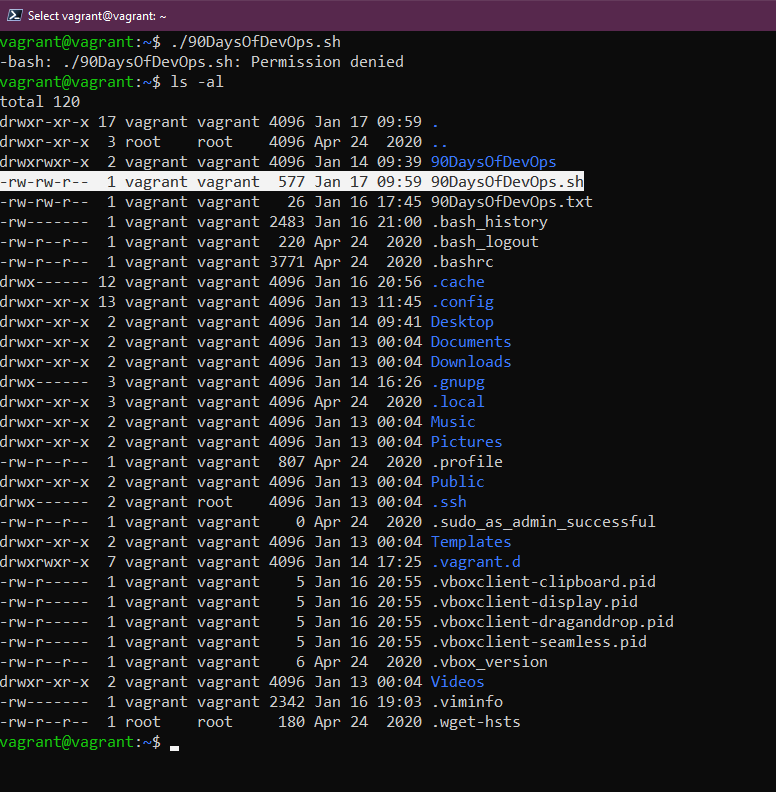
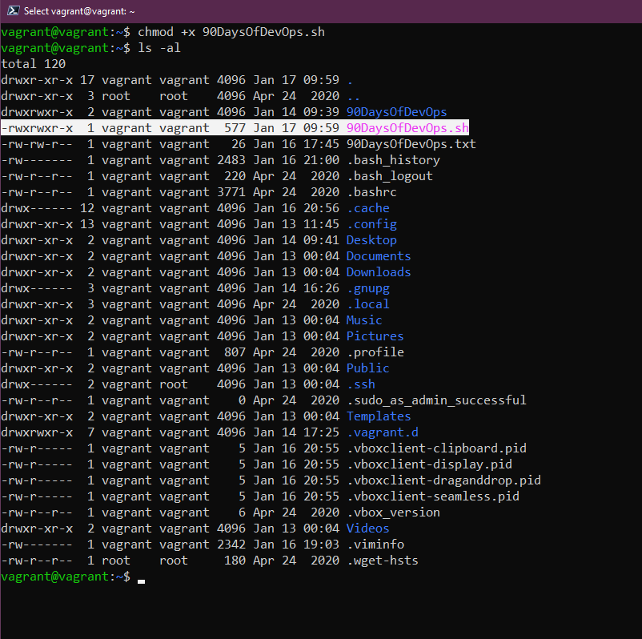

## Bash ile Scriptlerle Görevleri(Jobları) Otomatikleştirme

Bugün, bash kabuğu kullanarak görevleri otomatikleştirme konusunu ele alacağız.

BASH - **B**ourne **A**gain **Sh**ell

Bash betiklerini, programlama dillerinde olduğu gibi, görevlerin gerçekleştirilmesi için kullanabiliriz. Birçok insan, karmaşık bash betikleri oluşturarak işlerini otomatikleştirmiştir. İş dünyasında, önemli görevler genellikle betiklere dayanır. Bu konuda tam bir uzman olmak zorunda olmasak da, temel bash betikleme becerilerini öğrenerek otomatizasyon araçlarıyla birlikte çalışabilir ve acil görevleri yerine getirebiliriz.

Örneğin, sanal makine oluşturmak için kullandığımız VAGRANTFILE'ı içeren bir bash betiği oluşturabiliriz. Bu betik, her pazartesi sabahı sanal makineyi yeniden oluşturarak taze bir kopya elde etmemizi sağlayabilir. Ayrıca, Linux makinesinde ihtiyaç duyduğumuz yazılım yığınını bu betik aracılığıyla otomatik olarak kurabiliriz.

Ayrıca, sistem yönetimi, bulut ortamları ve DevOps gibi alanlarda iş mülakatlarında pratik bash betik soruları da sıkça karşılaşılan konulardır.

Bugün çok fazla çalışacağız çünkü önümüzde birçok konu var.

### Baslayalım

Bu 90 günlük süreçte ele aldığımız diğer konular gibi, gerçek öğrenmenin tek yolu pratik yapmaktır. Sadece bu satırları okuyup bölümü tamamlanmış olarak işaretlemeyin. Pratik deneyim, her şeyi kas hafızanıza yerleştirmenize yardımcı olacaktır. Birkaç gün daha sürebilir, ancak yapabildiğiniz kadar çok pratik yapmak kesinlikle değerlidir.

Başlamak için bir metin düzenleyiciye ihtiyacımız olacak. [Gun 17](day17.md)'de en yaygın iki metin düzenleyiciyi ve onları nasıl kullanacağımız hakkında biraz bilgi vermiştik. (Umarım kendi başınıza daha fazlasını incelediniz ;)

Şimdi işe koyulup ilk shell betiğimizi oluşturacağız. Böylece bir dosya oluşturuyoruz.

```shell
touch 90-Days-of-DevOps-as-a-Learning.sh
```

Ve onu nano düzenleyiciyle açıyoruz.

```shell
nano 90-Days-of-DevOps-as-a-Learning.sh
``` 

Bu, yeni bir shell scriptimizi nano'da boş olarak açacak. Yine de, tercih ettiğiniz metin düzenleyiciyi seçebilirsiniz.

Tüm bash scriptlerinin ilk satırı şuna benzer olmalıdır:

```bash
#!/usr/bin/bash
``` 

Bu, bash binary'nizin yolunu belirtir. Bu satır, `SHEBANG`, `HASHBANG` veya `SHARPBANG` olarak bilinir ve bu scriptin hangi komut yorumlayıcısının veya sistem konsolunun çalıştırılacağını veya yorumlanacağını belirtmek için kullanılır.

Ancak, bunu terminalde aşağıdaki komutu çalıştırarak doğrulamanız önerilir:

```shell
which bash
``` 

Bu komut, binari dosyanın konumunu görüntülemenizi sağlar.

Eğer Ubuntu kullanmıyorsanız ve özel işletim sistemleriyle vakit kaybetmeye devam ediyorsanız, aşağıdaki komutu deneyebilirsiniz.

```shell
whereis bash
``` 

Ancak, mevcut olan bazı shell scriptlerinde aşağıdaki gibi başka yol gösterimleri de bulunabilir:

- `#!/bin/bash`
- `#!/usr/bin/env bash`

Bir sonraki satırda, betiğimizin amacını açıklayan veya en azından arkasından gelenler için bilgi sağlayan bir açıklama eklemek idealdir. Birkaç hafta sonra bile kendiniz olabileceğinizi düşünerek kendinize anlatın. Scriptlerdeki yorumlar almohadilla `#` işaretiyle yapılır. Bu bize kodu etkilemeyen belirli satırlara yorum eklememizi sağlar. Yorumlar, komutların açıklamalarını, kod akışını, yazar bilgilerini, kaynak referanslarını vb. sağlamak için kullanılır. Daha önce bahsettiğim gibi, bunu paylaşıyorsanız vazgeçilmezdir.

Daha önceki günlerde yüklediğimiz figlet programı, sanat eserleri oluşturmak için kullanılır ve scriptleri başlatmak için oldukça görseldir.


Tüm komutlar [Día 15](día15.md)’de gözden geçirildi ve bu komutlar scriptlerde basit bir komut olarak kullanılabilir. Şimdi betiğimize basit bir kod bloğu ekleyelim.

```bash
mkdir 90-Days-of-DevOps-as-a-Learning
cd 90-Days-of-DevOps-as-a-Learning
touch Day19
ls
```

Sonra bunu kaydedebilir ve metin düzenleyiciden çıkabilirsiniz. Scripti aşağıdaki komutla çalıştırırsanız:

```shell
./90-Days-of-DevOps-as-a-Learning.sh
``` 

Aşağıdaki komutla dosyanın izinlerini kontrol edebilirsiniz.

```shell
ls -al
```
dosyaya çalıştırma izinlerini eklemek için aşağıdaki komutu kullanabilirsiniz.



Bu durumu `chmod +x 90-Days-of-DevOps-as-a-Learning.sh` komutunu kullanarak değiştirebilirsiniz ve ardından artık komut dosyasını çalıştırabileceğimizi gösteren `x` işaretini göreceksiniz.



Bu komutu kullanarak scripte çalıştırma izni veriyoruz.

```shell
chmod +x 90-Days-of-DevOps-as-a-Learning.sh
``` 

Ve sonra `x` işaretini göreceksin, bu da artık betiğimizi çalıştırabileceğimiz anlamına gelir.


Oldukça temel, ancak bunu kullanarak hayatınızı kolaylaştırmak ve işleri otomatikleştirmek için diğer araçları çağırmak için nasıl kullanabileceğinizi görmeye başlayabilirsiniz.

### Degiskenler, Kosullar

Bu bölümün büyük bir kısmı, [Golang](day11.md) öğrenirken gördüğümüz şeylerin tekrarıdır, ancak bilgileri pekiştirmek için tekrar gözden geçirmekte fayda vardır.

#### Degiskenler

Değişkenler, bir script boyunca birden çok kez kullanılan belirli bir terimi tanımlamamıza olanak sağlar. Potansiyel olarak karmaşık olabilen kodu basitleştirmek için kullanılır.

Bir değişkeni tanımlamak çok basittir, scripte temiz bir satır ekleyin.

```bash
challenge="90-Days-of-DevOps-as-a-Learning"
```

Bu şekilde, `$challenge` kullanıldığı her yerde değişkenin değerini vermiş oluruz ve değişkenin değerini değiştirirsek, kullandığımız tüm yerlerde yansıtılır.


Şimdi `sh` komutunu kullanarak betiğimizi çalıştırırsak, betiğimize eklediğimiz çıktıyı göreceğiz.


Ayrıca, kullanıcıdan girdi alarak değişkenin değerini ayarlamasını isteyebiliriz. Bunun için aşağıdaki yöntemi kullanabiliriz:

```bash
echo "Enter your name"
read name
```

Bu, `$name` değişkenini tanımlar. Daha sonra bu değeri kullanabiliriz.

#### Kosullar

Repomuzda kimin oldugunu ve kac gunun tamamlandıgını ogrenmek için, kosullu ifadelerden yararlanabiliriz.
- `if`
- `if-else`
- `else-if`, 

Aşağıdaki kodu dikkatlice inceleyin.

```bash
#!/bin/bash
#   ___   ___  ____                   ___   __ ____              ___
#  / _ \ / _ \|  _ \  __ _ _   _ ___ / _ \ / _|  _ \  _____   __/ _ \ _ __  ___
# | (_) | | | | | | |/ _` | | | / __| | | | |_| | | |/ _ \ \ / / | | | '_ \/ __|
#  \__, | |_| | |_| | (_| | |_| \__ \ |_| |  _| |_| |  __/\ V /| |_| | |_) \__ \
#    /_/ \___/|____/ \__,_|\__, |___/\___/|_| |____/ \___| \_/  \___/| .__/|___/
#                           |___/                                    |_|
#
# This script is to demonstrate bash scripting!
#
# Variables to be defined

ChallengeName=#90-Days-of-DevOps-as-a-Learning
TotalDays=90

# User Input

echo "Enter Your Name"
read name
echo "Welcome $name to $ChallengeName"
echo "How Many Days of the $ChallengeName challenge have you completed?"
read DaysCompleted

if [ $DaysCompleted -eq 90 ]
then
  echo "You have finished, well done"
elif [ $DaysCompleted -lt 90 ]
then
  echo "Keep going you are doing great"
else
  echo "You have entered the wrong amount of days"
fi
```

Bu komutları kullanarak birbirleriyle karşılaştırma yapabilir veya değerleri kontrol edebiliriz. İşte vurgulanmaya değer farklı seçenekler:

- `eq` - İki değer birbirine eşitse TRUE döndürür.
- `ne` - İki değer birbirine eşit değilse TRUE döndürür.
- `gt` - İlk değer ikinci değerden büyükse TRUE döndürür.
- `ge` - İlk değer ikinci değerden büyük veya eşitse TRUE döndürür.
- `lt` - İlk değer ikinci değerden küçükse TRUE döndürür.
- `le` - İlk değer ikinci değerden küçük veya eşitse TRUE döndürür.

Ayrıca bash scriptlerini kullanarak dosya ve klasörler hakkında bilgi edinebiliriz, bu dosya koşulları olarak bilinir.

- `-d file` Dosya bir dizin ise TRUE döndürür.
- `-e file` Dosya mevcut ise TRUE döndürür.
- `-f file` Sağlanan dize bir dosya ise TRUE döndürür.
- `-g file` Dosyada grup kimliği ayarlı ise TRUE döndürür.
- `-r file` Dosya okunabilir ise TRUE döndürür.
- `-s file` Dosya çalıştırılabilir ise TRUE döndürür.

Bu, bash scriptlerinde kontrol yapıları gibi şartlara dayalı kararlar almak için bu kontrollerin sonuçlarına dayanarak kullanılabilir.

```bash
FILE="90-Days-of-DevOps-as-a-Learning.txt"
if [ -f "$FILE" ]
then
  echo "$FILE is a file"
else
  echo "$FILE is not a file"
fi
```


Görsellerde gösterilen örneklerde, bir dosya varsa birinci echo komutunu alacağımız, ancak o dosyayı silersek ikinci echo komutunu alacağımız bir script görülmektedir.


Bu tür kontroller, belirli öğeleri sistemde ararken önemli ölçüde zaman kazandırmak için kullanılabilir.

Bu depoda, deneyebileceğiniz görünüşe göre sonsuz miktarda betik bulunmaktadır: [DevOps Bash Aracları](https://github.com/HariSekhon/DevOps-Bash-tools/blob/master/README.md)

#### Ornek

*Seneryo*: 

"90-Days-of-DevOps-as-a-Learning" adında bir şirketimiz var ve bir süredir faaliyet gösteriyoruz. Şimdi tek bir kişilik ekibimizi daha da genişletmek istiyoruz. Şu ana kadar, katılım sürecini bilen tek kişi benim, bu yüzden bazı görevleri otomatikleştirerek bu darboğazı azaltmak istiyoruz.

*Gereksinimler*:

- Bir kullanıcı komut satırı argümanı olarak iletilmelidir.
- Argüman olarak bir şifre geçilebilmelidir.
- Belirtilen kullanıcı adıyla bir kullanıcı oluşturulmalıdır.
- Kullanıcı için belirtilen şifre ayarlanmalıdır.
- Hesap oluşturulduğunda bir başarı mesajı görüntülenmelidir.

İşte shell scriptimizi oluşturmaya başlayalım:

```shell
touch create_user.sh
```

Devam etmeden önce kabuk scriptini çalıştırılabilir hale getirelim. Bunu yapmak için aşağıdaki komutu kullanabilirsiniz.

```shell
chmod +x create_user.sh
```

Senaryo için scriptimizi düzenlemeye başlamak için aşağıdaki gibi bir metin düzenleyici kullanabiliriz.

```shell
nano create_user.sh
```

Evet, elbette. Eğer tercih ettiğiniz bir metin düzenleyici Vim ise, aşağıdaki komutu kullanarak scripti Vim ile düzenleyebilirsiniz.

```shell
vim create_user.sh
```

Tabii, ilk gereksinim olan "Bir kullanıcı komut satırı argümanı olarak iletilmelidir" için aşağıdaki gibi bir kontrol yapısı kullanabiliriz.

```bash
#! /usr/bin/bash

# Bir kullanıcı komut satırı argümanı olarak iletilmiş olmalıdır
echo "$1"
```


Bu scripti kullanmak için aşağıdaki komutu kullanabilirsiniz

```shell
./create_user.sh nholuong
```

`echo` komutuyla yazdırılan değişkenin değerini, ona verdiğimiz argümanla değiştirerek nasıl çalıştığını göreceğiz.


Devam edelim ve ikinci gereksinim olan "Kullanıcı, argüman olarak verilen isimle oluşturulmalıdır" kısmını ele alalım. Bu işlemi `useradd` komutunu kullanarak gerçekleştirebiliriz. `-m` seçeneği ise kullanıcının home dizinini /home/kullanici_adi şeklinde oluşturur.

```bash
#! /usr/bin/bash

# Bir kullanıcı komut satırı argümanı olarak iletilmiş olmalıdır
echo "$1 user account being created."

# Kullanıcı Olusturma
sudo useradd -m "$1"
```

⚠️ *Dikkat: Kullanıcı hesabı adını sağlamazsanız, `$1` değişkeni değer içermeyeceğinden hata alırsınız.*

Bu hesabın başarıyla oluşturulup oluşturulmadığını kontrol etmek için aşağıdaki komutları kullanabilirsiniz.

```shell
awk -F: '{ print $1}' /etc/passwd
```


Sonraki gereksinimlerimiz şunlardır: 'Bir şifre komut satırı argümanı olarak geçilebilir' ve 'Kullanıcı için şifre ayarlanır'.

⚠️ *Dikkat: Asla bunu üretim ortamında yapmayacağız, şifreler asla komut satırı veya bir script üzerinden geçmemeli çünkü açığa çıkarlar ve bir saldırı vektörü olabilirler. Her zaman önce bir kodlama ve şifreleme sürecinden geçeceklerdir. Bu sadece değişkenlerle scripti yöneten argümanları eklemek için bir pratik yapıyoruz.*


```bash
#! /usr/bin/bash

# Bir kullanıcı komut satırı argümanı olarak iletilmiş olmalıdır.
echo "$1 user account being created."

# Kullanıcı olusturma.
sudo useradd -m "$1"

# Şifre komut satırı argümanı olarak geçilebilir.
# Kullanıcı için şifre ayarlanır.
sudo chpasswd <<< "$1":"$2"
```

Eğer bu scripti iki parametreyle çalıştırırsak..

```shell
./create_user.sh 90-Days-of-DevOps-as-a-Learning password
```

Aşağıdaki resimde oluşturulan kullanıcı adı ve şifreyi görebilirsiniz. Ardından bu kullanıcıya giriş yapıp `whoami` komutunu kullanarak etkin kullanıcıyı doğruladık.


Son gereksinim ise 'Hesap oluşturma başarılı bir mesajının gösterilmesi' ve bunu zaten kodun üst satırında gerçekleştirdik. Önceki ekran görüntüsünde `90-Days-of-DevOps-as-a-Learning user account being created` mesajını görebilirsiniz. Bu, `$1` parametresiyle yapılan testlerden kalmıştır.

Şimdi, bu betik hızlı bir şekilde yeni kullanıcıları entegre edip yapılandırmak için kullanılabilir. Ancak daha kullanışlı hale getirmek ve herkesin kullanabilmesini sağlamak için önceki bölümde gördüğümüz kullanıcı ve şifre girişini ekleyebiliriz. İşte güzelce düzenlenmiş kodun nasıl göründüğü.

```bash
#! /usr/bin/bash

echo "What is your intended username?"
read  username
echo "What is your password"
read  password

# Bir kullanıcı komut satırı argümanı olarak geçilebilir
echo "$1 user account being created."

# Argüman adıyla bir kullanıcı oluşturulur.
sudo useradd -m "$1"

# Bir şifre komut satırı argümanı olarak geçilebilir.
# Kullanıcı için şifre ayarlanır.
sudo chpasswd <<< "$1":"$2"

# Hesap oluşturma başarılı bir mesajı gösterilir.
echo "The Account for $username has successfully been created"

```

Bu şekilde adımlar daha etkileşimli hale gelir,


Son olarak, yeni kullanıcı hesabının başarıyla oluşturulduğunu doğrulamak için bir başarı çıktısı verebiliriz.


Bir ayrıntı daha, şifre girişini `-s` bayrağıyla gizlemek olabilir.

```bash
read -s password
```


Ayrıca, oluşturulan kullanıcıyı şu şekilde silebiliriz

```bash
sudo userdel test_user
```


İşte yorumlar ve ekran çıktıları Turkce'ye çevrilen [Script](Linux/create-user.sh) görebilirsiniz.

Tekrar belirtmek gerekirse, bunu günlük kullanımınızda kullanmayacaksınız, ancak ihtiyaç duyduğunuzda kullanabileceğiniz temel bir parçasıdır. Ayrıca, kabuk betiklemesinin sağladığı esnekliği gösterir.

Her gün yaptığınız tekrarlayan görevleri düşünün ve bunları nasıl otomatik hale getirebileceğinizi düşünün, ilk seçenek genellikle bir bash betiği kullanmaktır, ancak karmaşık alanlar da vardır, bu yüzden pratik yapmak önemlidir.

Son bir örnek olarak, yerel bir makinede minikube kullanarak bir Kubernetes kümesi oluşturmayı ve veri hizmetlerini ve Kasten K10'u kullanarak veri yönetimi gereksinimlerini ve ihtiyaçlarını göstermeye yardımcı olan basit bir bash betiğine göz atabilirsiniz: [Project Pace](https://github.com/nholuongCade/project_pace/blob/main/singlecluster_demo.sh) Henüz Kubernetes'i görmedik, ancak betiklemenin olasılıklarını göstermek için yardımcı olabilir.

## Kaynaklar

- [Bash in 100 seconds](https://www.youtube.com/watch?v=I4EWvMFj37g)
- [Bash script with practical examples - Full Course](https://www.youtube.com/watch?v=TPRSJbtfK4M)
- [Client SSH GUI - Remmina](https://remmina.org/)
- [The Beginner's guide to SSH](https://www.youtube.com/watch?v=2QXkrLVsRmk)
- [Vim in 100 Seconds](https://www.youtube.com/watch?v=-txKSRn0qeA)
- [Vim tutorial](https://www.youtube.com/watch?v=IiwGbcd8S7I)
- [Learn the Linux Fundamentals - Part 1](https://www.youtube.com/watch?v=kPylihJRG70)
- [Linux for hackers (don't worry you don't need to be a hacker!)](https://www.youtube.com/watch?v=VbEx7B_PTOE)
- [Webminal](https://www.webminal.org/) 
- [Vim Temel Rehberi](https://gitea.vergaracarmona.es/man-linux/Guia-VIM)

Gorusmek Uzere [Gun 20](day20.md).
