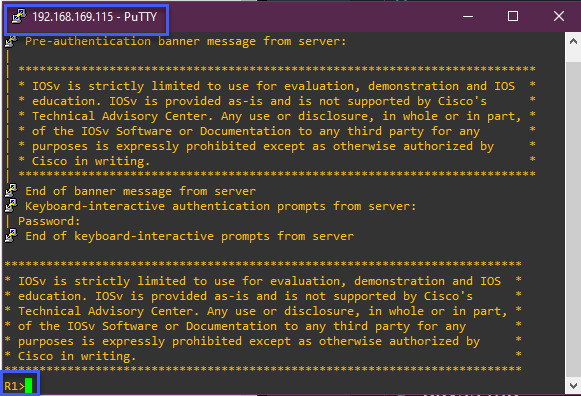

## Python ve Ağlarla Calısma

Ağ Temelleri'nin bu son bölümünde, [26.Gun](day26.md)'de oluşturduğumuz laboratuvar ortamımızı kullanarak bazı otomasyon görevlerini ve araçlarını ele alacağız.

Ağ Temelleri'nin bu son bölümünde, [18.Gun](day18.md)'de oluşturduğumuz laboratuvar ortamımızı kullanarak bazı otomasyon görevlerini ve araçlarını ele alacağız.

## Sanal ortamımıza erişim

Anahtarlarımızla etkileşimde bulunmak için, EVE-NG ağı içinde bir iş istasyonuna ihtiyacımız var veya Python yüklü bir Linux kutusu dağıtabilir ve otomasyonunuzu orada gerçekleştirebilirsiniz ([EVE-NG içinde Linux yapılandırması için kaynak](https://www.youtube.com/watch?v=3Qstk3zngrY)) veya benim yaptığım gibi istasyonunuzdan erişim sağlamak için bir bulut tanımlayabilirsiniz.


Bunu yapmak için, çizim üzerinde sağ tıklayarak ağı seçip ardından "Yönetim (Cloud0)" seçeneğini seçtik, bu ev ağımızla bir köprü görevi görecektir.


Ancak, bu ağ içinde hiçbir şeyimiz yok, bu yüzden yeni ağdan her bir cihaza bağlantılar eklememiz gerekiyor. (Ağ bilgim daha fazla dikkat gerektiriyor ve bunun için sadece üst düzey yönlendiriciye bir sonraki adımda ve ardından bu tek kablolama üzerinden geri kalan ağa bağlantı olacağını düşünüyorum...).

Ardından, her bir cihaza giriş yaparak buluta giren uygun arayüzler için aşağıdaki komutları çalıştırdım.

```
enable
config t
int gi0/0
IP add DHCP
no sh
exit
exit
sh ip int br
```

Son adım bize ev networkumuzun DHCP adresini verir. Cihazımın network listesi aşağıdaki gibi:

| Node    | IP Address   | Home Network IP |
| ------- | ------------ | --------------- |
| Router  | 10.10.88.110 | 192.168.169.115 |
| Switch1 | 10.10.88.111 | 192.168.169.178 |
| Switch2 | 10.10.88.112 | 192.168.169.193 |
| Switch3 | 10.10.88.113 | 192.168.169.125 |
| Switch4 | 10.10.88.114 | 192.168.169.197 |

### Bir network cihazına SSH ile erişmek

Yukarıdakileri uyguladıktan sonra, şimdi çalışma istasyonumuzu kullanarak ev ağımızdaki cihazlara bağlanabiliriz. Ben Putty kullanıyorum, ancak git bash gibi diğer terminal erişimlerine de sahibim, bu sayede cihazlarımıza SSH ile erişme yeteneğine sahibim.

Aşağıda, yönlendirici cihazımıza (R1) bir SSH bağlantısı olduğunu görebilirsiniz.



### Cihazlarımızdan bilgi toplamak için Python kullanma

Python'u nasıl kullanabileceğimize dair ilk örnek, tüm cihazlarımızdan bilgi toplamak ve özellikle her birine bağlanıp arayüz yapılandırması ve ayarlarını sağlayan basit bir komutu çalıştırmak istememdir. Bu script'i [netmiko_con_multi.py](Networking/netmiko_con_multi.py) olarak burada depoladım.

Bu script'i çalıştırdığımda, tüm cihazlarım üzerindeki her bir portun yapılandırmasını görebiliyorum.


Bu, farklı birçok cihazınız varsa faydalı olabilir. Merkezi olarak kontrol edebileceğiniz ve tüm yapılandırmaları tek bir yerde hızlıca anlayabileceğiniz bir script oluşturabilirsiniz.

### Cihazlarımızı yapılandırmak için Python kullanma

Yukarıdaki bilgiler faydalıdır, ancak cihazlarımızı yapılandırmak için Python kullanmanın ne gibi avantajları olduğunu düşünelim. Senaryomuzda `SW1` ve `SW2` arasında bir trunk portu olduğunu varsayalım. Hayal edin, bu yapılandırmayı yapmak istediğimiz birçok aynı anahtardan geçmesi gerekiyorsa ve her anahtara manuel olarak bağlanmak zorunda kalmadan bu yapılandırmayı yapmak isteseydik ne olurdu?

Bu işlemi gerçekleştirmek için [netmiko_sendchange.py](Networking/netmiko_sendchange.py) dosyasını kullanabiliriz. Bu, SSH aracılığıyla bağlantı kuracak ve bu değişikliği `SW1`'e uygulayacak ve aynı zamanda `SW2`'ye de yansıtacaktır.


Şimdi kodu inceleyenler, `sending configuration to device` (yapılandırmayı cihaza gönderme) mesajının göründüğünü fark edecekler, ancak bunun gerçekleştiğine dair bir onay olmadığını görecektir. Bu durumu kontrol etmek ve anahtarımızda bu doğrulamayı yapmak için scriptimize ekstra kod ekleyebiliriz veya daha önceki scriptimizi buna göre düzenleyebiliriz. Bunun için [netmiko_con_multi_vlan.py](Networking/netmiko_con_multi_vlan.py) scriptini kullanabilirsiniz.


### Cihaz Konfigürasyonlarının Yedeklenmesi

Başka bir kullanım senaryosu, ağ yapılandırmalarımızı yakalamak ve bunların yedeklendiğinden emin olmaktır. Ancak yine de ağımızdaki her cihaza bağlanmak istemiyoruz, bu nedenle [backup.txt](Networking/backup.txt) kullanarak bunu da otomatikleştirebiliriz. Ayrıca yedekleme yapmak istediğiniz IP adreslerini içeren [backup.txt](Networking/backup.txt) dosyasını doldurmanız gerekecektir.

Komut dosyanızı çalıştırın ve aşağıdaki gibi bir çıktı görmelisiniz.


Yedek dosyaları.


### Paramiko

Paramiko, SSH için yaygın olarak kullanılan bir Python modülüdür. Resmi GitHub bağlantısında daha fazla bilgi bulabilirsiniz [burdan](https://github.com/paramiko/paramiko).

Bu modülü `pip install paramiko` komutunu kullanarak kurabilirsiniz.


Kurulumu doğrulamak için Python shelline girin ve paramiko modülünü içe aktarın.


### Netmiko

Netmiko modülü, paramiko genelinde SSH bağlantılarını yönetmek için daha geniş bir araç olan paramiko'ya özgü bir ağ cihazlarına yöneliktir.

Yukarıda kullandığımız Netmiko, paramiko ile birlikte `pip install netmiko` komutunu kullanarak yüklenebilir.

Netmiko, birçok sağlayıcı ve ağ cihazını desteklemektedir. Desteklenen cihazların bir listesini [GitHub Sayfası](https://github.com/ktbyers/netmiko#supports) üzerinde bulabilirsiniz.

### Diğer Modüller

Ağ otomasyonuyla ilgili olarak henüz fırsat bulamadığımız bazı diğer modüllerin de bahsedilmesi önemlidir.

`netaddr` , IP adreslerini çalışmak ve manipüle etmek için kullanılır. Yine, kurulumu `pip install netaddr` komutuyla kolayca yapılabilir. 

Anahtarlamalarınızın büyük bir bölümünü bir Excel elektronik tablosunda depolamak isteyebilirsiniz. `xlrd`, scriptlerimizin Excel kitabını okumasına ve satır ve sütunları bir diziye dönüştürmesine olanak tanır. Modülü yüklemek için `pip install xlrd` komutunu kullanabilirsiniz.

Ağ otomasyonunun kullanılabileceği diğer bazı kullanım senaryolarını ve görmek fırsatı bulamadığımız örnekleri [burada](https://github.com/ktbyers/pynet/tree/master/presentations/dfwcug/examples) bulabilirsiniz.

#90-Days-of-DevOps-as-a-Learning'un Network bölümünü burada tamamlıyoruz. Network, çok geniş bir alan olduğundan, bu notlar ve paylaşılan kaynaklar bilgi birikiminizi oluşturmak için faydalı olacağını umuyorum.

## Kaynaklar

- [Free Course: Introduction to EVE-NG](https://www.youtube.com/watch?v=g6B0f_E0NMg)
- [EVE-NG - Creating your first lab](https://www.youtube.com/watch?v=9dPWARirtK8)
- [3 Necessary Skills for Network Automation](https://www.youtube.com/watch?v=KhiJ7Fu9kKA&list=WL&index=122&t=89s)
- [Computer Networking full course](https://www.youtube.com/watch?v=IPvYjXCsTg8)
- [Practical Networking](http://www.practicalnetworking.net/)
- [Python Network Automation](https://www.youtube.com/watch?v=xKPzLplPECU&list=WL&index=126)

Burada kullanılan örneklerin çoğu ücretsiz olmayan bu kapsamlı kitaptan alınmıştır, ancak bazı senaryolar kullanılmıştır.

- [Hands-On Enterprise Automation with Python (Book)](https://www.packtpub.com/product/hands-on-enterprise-automation-with-python/9781788998512)

Görüşmek üzere, [28.Gun](day28.md)'de buluşacağız, burada temel bilgilerin iyi bir anlayışını elde etmek için bulut bilişimini göreceğiz.