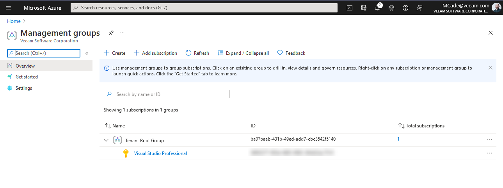
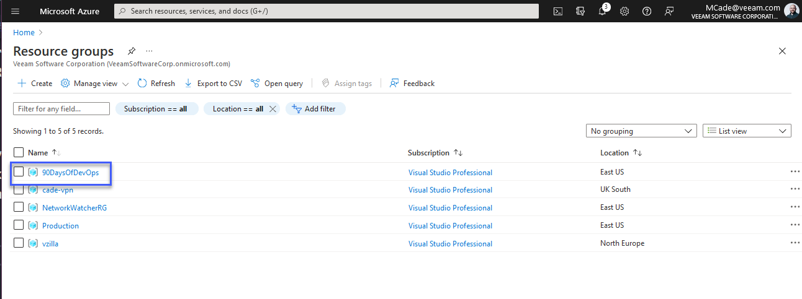

## Microsoft Azure Temelleri

Başlamadan önce, Twitter anketinin galibi Microsoft Azure oldu, bu yüzden sayfanın başlığı da buna dayanıyor. 24 saat boyunca sonuçları görmek çok heyecan vericiydi.

Microsoft Azure'da mevcut olan hizmetler hakkında daha iyi bir anlayış ve güncelleme sağlayacağını düşünüyorum, günlük işlerimde genellikle Amazon AWS'e yöneliyorum. Ancak, üç ana bulut sağlayıcısı için hazırladığım kaynakları da paylaştım.

Biliyorum ki, bu üçü ile sınırlı değil, anket sadece bu üçünü içeriyordu ve özellikle Oracle Cloud hakkında bazı yorumlar yapıldı. Kullandığınız diğer bulut sağlayıcıları hakkında daha fazla bilgi almak isterim, yorum bırakabilirsiniz.

### Temel Bilgiler

- Public bulut hizmetleri sunar.
- Coğrafi olarak dağılmıştır (dünya genelinde 60'tan fazla bölge).
- İnternet üzerinden ve/veya özel bağlantılarla erişilebilir.
- Çok kiracılı model.
- Tüketime dayalı faturalama - İlerledikçe öde (Pay as you go) | Büyüdükçe öde (Pay as you grow).
- Farklı gereksinimlere yönelik birçok hizmet türü ve teklifleri bulunur.

[Microsoft Azure Global Infrastructure](https://infrastructuremap.microsoft.com/explore)

SaaS ve hibrit bulut konularını zaten konuştuk, ancak burada bu konuları ele almayacağız.

Başlamak için aşağıdaki bağlantıya tıklayarak [Microsoft Azure Ücretsiz Hesap](https://azure.microsoft.com/en-gb/free/) oluşturabilirsiniz.

### Bolgeler

Yukarıda etkileşimli haritaya bir bağlantı verdim, ancak aşağıdaki resimde Microsoft Azure platformunda dünya genelinde sunulan bölgelerin genişliğini görebilirsiniz.

_Resim, [Microsoft Docs - 01/05/2021](https://docs.microsoft.com/en-us/azure/networking/microsoft-global-network) adresinden alınmıştır._

Ayrıca, "egemen" bulutlar da göreceksiniz, yani diğer bölgelerle bağlantılı değiller veya onlarla iletişim kuramazlar. Örneğin, bu tür bulutlar `AzureUSGovernment`, `AzureChinaCloud` gibi hükümetlerle ilişkilendirilebilir.

Microsoft Azure içinde hizmetlerimizi dağıtırken neredeyse her şey için bir bölge seçmemiz gerekecek. Ancak, tüm hizmetlerin her bölgede mevcut olmadığını unutmamak önemlidir. Bu yazıyı yazdığımız sırada [Bölgeye Göre Mevcut Ürünler](https://azure.microsoft.com/en-us/global-infrastructure/services/?products=all) bağlantısından West Central US bölgesinde Azure Databricks kullanamadığımızı görebilirsiniz.

Yukarıda da belirtildiği gibi, Azure Bot Services, Bing Speech, Azure Virtual Desktop, Static Web Apps gibi belirli hizmetler bölgeye bağlıdır.

Arka planda, bir bölge birden fazla veri merkezinden oluşabilir. Bunlara "Kullanılabilirlik Bölgeleri" denir.

Aşağıdaki resim, Microsoft'un resmi belgelerinden alınan bir örnekte bir bölgenin nasıl bir "Kullanılabilirlik Bölgesi"nden oluştuğunu açıklar. Ancak, her bölgenin birden fazla Kullanılabilirlik Bölgesi içermediğini unutmayın.

Microsoft'un belgelendirmesi oldukça iyidir ve [Bölge ve Kullanılabilirlik Bölgeleri](https://docs.microsoft.com/en-us/azure/availability-zones/az-overview)hakkında çok daha fazla bilgi edinebilirsiniz.

### Abonelikler

Microsoft Azure'ın bir tüketim modeli bulutu olduğunu ve tüm büyük bulut sağlayıcılarının bu modele uyduğunu hatırlayın.

Bir şirketiniz varsa, özel Azure hizmetlerine izin vermek için Microsoft ile bir kurumsal anlaşma yapmak isteyebilirsiniz.

Eğer benim gibi eğitim için Microsoft Azure kullanıyorsanız, başka seçeneklerimiz var.

Azure'da harcamak için genellikle belli bir süre için size ücretsiz bulut kredileri veren [Microsoft Azure Ücretsiz Hesap](https://azure.microsoft.com/en-gb/free/) seçeneğimiz var.

Ayrıca, her ay ücretsiz krediler sunan Visual Studio aboneliği seçeneği de mevcut. Bu aboneliğe, yıllık Visual Studio aboneliğinizle birlikte gelen kredilerle erişebilirsiniz. Bu, yıllar önce MSDN olarak bilinen bir uygulamaydı. [Visual Studio](https://azure.microsoft.com/en-us/pricing/member-offers/credit-for-visual-studio-subscribers/)

Son olarak, kredi kartıyla ödeme yapma modeli olan ["pay-as-you-go"](https://azure.microsoft.com/en-us/pricing/purchase-options/pay-as-you-go/) seçeneği bulunmaktadır. 

Bir abonelik, potansiyel olarak farklı abonelikler arasında bir sınırlama olarak görülebilir ve farklı maliyet merkezleri veya tamamen farklı ortamlar arasında ayrım yapabilir. Kaynakların oluşturulduğu yer olan bir abonelik bulunmaktadır.

### Yönetim Grupları

Yönetim grupları, Azure Active Directory (AD) veya kiracınızın ortamı üzerinde kontrolü ayırma yeteneği sağlar. Yönetim grupları, politikaları, rol tabanlı erişim kontrolünü (RBAC) ve bütçeleri kontrol etmemizi sağlar.

Abonelikler, bu yönetim gruplarına aittir, bu nedenle Azure AD kiracınızda birçok aboneliğiniz olabilir. Bu aboneliklerde de politikaları, RBAC'yi ve bütçeleri kontrol edebilirsiniz.

### Kaynak Yöneticisi ve Kaynak Grupları

#### Azure Kaynak Yöneticisi

- Kaynak sağlayıcılarına dayanan JSON tabanlı bir API.
- Kaynaklar bir kaynak grubuna aittir ve ortak bir yaşam döngüsünü paylaşırlar.
- Paralellik
- JSON tabanlı dağıtımlar, deklaratiftir, idempotenttir ve kaynaklar arasındaki bağımlılıkları anlamak için kullanılır.

#### Kaynak Grupları

- Her Azure Kaynak Yöneticisi kaynağı yalnızca bir kaynak grubunda bulunur.
- Kaynak grupları, kaynakların dışında da kaynaklar içerebilecek bir bölgede oluşturulur.
- Kaynaklar kaynak grupları arasında taşınabilir.
- Kaynak grupları diğer kaynak gruplarından izole edilmez, kaynak grupları arasında iletişim olabilir.
- Kaynak grupları aynı zamanda politikaları, RBAC'yi ve bütçeleri kontrol edebilir.

### Pratiğe Geçelim

Azure portalına bağlanalım ve mevcut bir **Abonelik** olduğundan emin olalım. Basit bir **Yönetim Grubu** oluşturabiliriz, tercih ettiğimiz **Bölge**de yeni bir **Kaynak Grubu** oluşturabiliriz.

İlk kez [Azure portal](https://portal.azure.com/#home)ına giriş yaptığımızda, üst kısımda kaynaklar, hizmetler ve belgelere arama yapma seçeneğini göreceğiz.

Öncelikle aboneliğimize bakalım, burada her ay bana bir miktar ücretsiz kredi veren Visual Studio Professional aboneliği kullanıyorum.

Bu abonelikle ne olduğuna ve ne yapabileceğimize dair daha geniş bir görünüm elde edebiliriz. Faturalandırma bilgilerini, sol tarafta IAM (Kimlik ve Erişim Yönetimi) gibi kontrol fonksiyonlarıyla tanımlayabileceğiniz bir kontrol paneli vardır ve daha aşağıda başka kaynaklar bulunur.

Bir senaryo düşünelim: Birden fazla aboneliğiniz var ve hepsini tek bir hesap altında yönetmek istiyorsunuz. Bu durumda, sorumluluk gruplarına göre ayrım yapmak için yönetim gruplarını kullanabilirsiniz. Aşağıda, sadece bir kiracın kök grubuyla bir aboneliğin olduğunu görebilirsiniz.

Önceki resimde de göreceğiniz gibi, yönetim grubu ağacının üst düzeyindeki grup, kiracın kök grubunda kullanılan aynı kimlik bilgisini temsil etmektedir.

Aşağıda, kaynaklarımızı bir araya getirerek ve bunları kolayca tek bir yerden yönetebildiğimiz kaynak gruplarını görebilirsiniz. Bazıları başka projeler için oluşturulmuştur.

Önümüzdeki günlerde bir kaynak grubu oluşturacağız. Bunun için yukarıdaki resimdeki "oluştur" seçeneğine basarak kolayca yapabiliriz.

Doğrulama adımı gerçekleştirilir ve ardından oluşturmadan önce oluşturduğunuzun gözden geçirme şansına sahip olursunuz. Aşağıda "Otomasyon için bir şablon indir" seçeneğini göreceksiniz. Bu, ileride otomatikleştirmek için JSON formatında bir şablon alabileceğimiz anlamına gelir. Bunu daha sonra daha detaylı olarak göreceğiz.

"Oluştur" düğmesine basın. Artık kaynak gruplarımızın listesinde "90-Days-of-DevOps-as-a-Learning" adlı grup, önümüzdeki oturumlarda yapacağımız işlemler için hazır durumda olacaktır.

## Kaynaklar

- [Hybrid Cloud and MultiCloud](https://www.youtube.com/watch?v=qkj5W98Xdvw)
- [Microsoft Azure Fundamentals](https://www.youtube.com/watch?v=NKEFWyqJ5XA&list=WL&index=130&t=12s)
- [Google Cloud Digital Leader Certification Course](https://www.youtube.com/watch?v=UGRDM86MBIQ&list=WL&index=131&t=10s)
- [AWS Basics for Beginners - Full Course](https://www.youtube.com/watch?v=ulprqHHWlng&t=5352s)

Gorusmek Uzere [Gun 30](day30.md)
