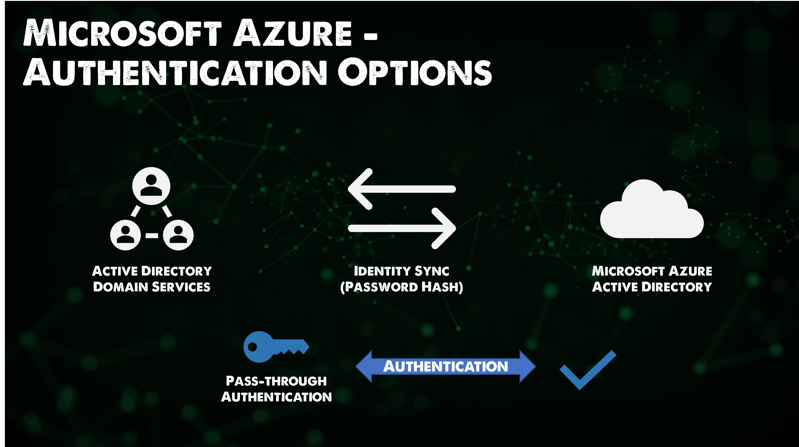
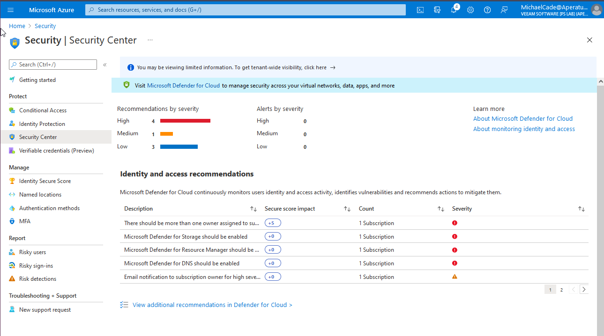

## Microsoft Azure Güvenlik Modelleri

Microsoft Azure'ın genel bakışına devam ederken, Azure Security'ye geçelim ve bunun nasıl yardımcı olabileceğini görelim. Genellikle varsayılan roller yeterli olsa da, kimlik doğrulama ve yapılandırmaların birçok farklı alanıyla çalışabiliriz. Microsoft Azure, diğer halka açık bulut sağlayıcılarına kıyasla Active Directory sayesinde oldukça gelişmiş olabilir.

Bu, Microsoft Azure'ın diğer halka açık bulut sağlayıcılarından farklı çalıştığı bir alandır, Azure'da HER ZAMAN Active Directory bulunur.

### Directory Hizmetleri

- Azure Active Directory, Microsoft Azure ve diğer Microsoft bulut hizmetlerinde kullanılan güvenlik prensiplerini barındırır.
- Kimlik doğrulama, SAML, WS-Federation, OpenID Connect ve OAuth2 gibi protokoller aracılığıyla gerçekleştirilir.
- Sorgular, Microsoft Graph API adlı REST API üzerinden yapılır.
- Kiracılar varsayılan olarak tenant.onmicrosoft.com adını taşırken, özel etki alanı adlarına sahip olabilirler.
- Abonelikler bir Azure Active Directory kiracısıyla ilişkilidir.

AWS için karşılaştırma yapacak olursak, benzer hizmet AWS IAM (Identity & Access Management) olacaktır, ancak bu hizmet oldukça farklıdır.

Azure AD Connect, AD hesaplarını Azure AD'ye replike etme olanağı sağlar. Bu bazen grupları ve nesneleri de içerebilir. Bu işlem granüler ve filtrelenmiş olabilir. Birden fazla orman ve etki alanını destekler.

Microsoft Azure Active Directory (AD) üzerinde bulutta hesaplar oluşturmak mümkündür, ancak çoğu kuruluş zaten kullanıcılarını yerel Active Directory ortamlarında takip etmektedir.

Azure AD Connect, yalnızca Windows AD sunucularını değil, aynı zamanda diğer Azure AD, Google ve diğerlerini de görüntüleme imkanı sunar. Bu aynı zamanda Azure B2B olarak adlandırılan, harici kişiler ve kuruluşlarla işbirliği yapabilme yeteneği sağlar.

Active Directory Domain Services ve Microsoft Azure Active Directory arasındaki kimlik doğrulama seçenekleri, her iki kimliğin de parola karması ile senkronize edildiği durumlarda mümkündür.

Parolanın hash değeri iletimi isteğe bağlıdır; bunun kullanılmaması durumunda geçiş yetkilendirmesi gereklidir.

Aşağıda bağlantılı bir video yer almaktadır ve bu video Azure Active Directory'deki geçiş yetkilendirmesi ile kullanıcı oturumu açma konusunda ayrıntılara girer.

[Azure Active Directory Geçiş Yetkilendirmesiyle Kullanıcı Oturumu Açma](https://docs.microsoft.com/en-us/azure/active-directory/hybrid/how-to-connect-pta)

### Federasyon

Microsoft 365, Microsoft Dynamics ve yerel Active Directory kullanarak Azure AD'yi federasyona entegre etmek oldukça kolay ve anlaşılır. Bununla birlikte, Microsoft ekosistemi dışındaki diğer hizmetleri kullanmak da mümkündür.

Azure AD, Microsoft dışındaki bu uygulamalar ve diğer dizin hizmetleri için federasyon aracısı olarak görev yapabilir.

Bu, Azure Portal'da Kurumsal Uygulamalar olarak görünecek ve birçok seçenek bulunacaktır.

Aşağı kaydırarak, kurumsal uygulamalar sayfasında birçok önemli uygulamanın uzun bir listesini bulabilirsiniz.

Bu seçenek ayrıca kendi entegrasyonunuzu getirmenize, yani geliştirdiğiniz veya galeri dışı bir uygulama entegrasyonuna olanak tanır.

Bunu daha önce incelememiştim, ancak diğer bulut sağlayıcılarına ve yeteneklere kıyasla oldukça kapsamlı bir özellik seti olduğunu görebiliyorum.

### Rol tabanlı erişim kontrolü

[Gun 29](day29.md) ele aldığımız kapsamları burada tartıştık. Rol tabanlı erişim kontrolümüzü aşağıdaki kapsamlardan birine göre ayarlayabiliriz:

- Abonelikler
- Yönetim Grupları
- Kaynak Grupları
- Kaynaklar

Roller üçe ayrılabilir ve Microsoft Azure'da birçok yerleşik rol bulunur. Bu üç rol şunlardır:

- Sahip (Owner)
- Katkıda Bulunan (Contributor)
- Okuyucu (Reader)

Sahip ve Katkıda Bulunan rolleri kapsam açısından çok benzerdir. Bununla birlikte, sahip izinleri değiştirebilir.

Diğer roller belirli Azure Kaynak türleri için özeldir ve özel roller de bulunmaktadır.

Kullanıcılara izin atama konusunda gruplara odaklanmalıyız.

İzinler miras alınır.

Geri dönüp oluşturduğumuz "90-Days-of-DevOps-as-a-Learning" Kaynak Grubuna bakarsak ve içindeki Erişim Kontrolü (IAM) bölümünü kontrol edersek, bir katkıda bulunanlar listesi ve bir Kullanıcı Erişim Yöneticisi (Client Access Administrator) olduğunu görebiliriz ve bir sahipler listesi bulunur (Ancak bunu gösteremem).

Atandığımız rollerin BuiltInRoles olup olmadığını ve hangi kategoriye ait olduklarını buradan kontrol edebiliriz.

Ayrıca, bir hesabı bu kaynak grubuna karşı kontrol etmek ve erişimi vereceğimiz hesabın doğru izinlere sahip olduğundan emin olmak veya bir kullanıcının fazla erişime sahip olup olmadığını kontrol etmek istiyorsak buradan erişimi kontrol edebiliriz.

### Microsoft Defender for Cloud

- Microsoft Defender for Cloud (önceki adıyla Azure Security Center), Azure ortamının güvenliği hakkında bilgi sağlar.

- Tüm Azure ve Azure dışı kaynakların (Azure Arc üzerinden) genel güvenlik durumunun görünürlüğü ve güvenliğin güçlendirilmesi konusunda rehberlik sağlayan tek bir kontrol paneli sunar.

- Ücretsiz seviye, sürekli değerlendirme ve güvenlik önerilerini içerir.

- Korumalı kaynak türleri için ödeme planları mevcuttur (Örneğin, Sunucular, AppService, SQL, Depolama, Konteynerler, KeyVault).

Azure Security Center'ı görüntülemek için başka bir aboneliğe geçtim ve burada birkaç kaynakla birlikte bazı önerilerin tek bir yerde nasıl olduğunu görebilirsiniz.

### Azure Policy

- Azure Policy, örgüt standartlarını uygulamaya ve uygunluğu ölçeklendirmeye yardımcı olan bir Azure hizmetidir.

- Microsoft Defender for Cloud ile entegre edilmiş olan Azure Policy, uyumsuz kaynakları denetler ve düzeltmeler uygular.

- Genellikle kaynak tutarlılığı, düzenleyici uyumluluk, güvenlik, maliyet ve yönetim standartlarını düzenlemek için kullanılır.

- Değerlendirme mantığını depolamak ve bir kaynağın uygun olup olmadığını belirlemek için JSON formatını kullanır. Ayrıca, ihlal durumunda alınması gereken önlemleri (örneğin, Denetim, AuditIfNotExists, Reddetme, Değiştirme, DeployIfNotExists) belirler.

- Ücretsiz kullanım sağlar. Azure Policy Guest Configuration kullanımı için Azure Arc'a bağlı kaynaklar, sunucu/aylık olarak ücretlendirilir.

### Hadi başlayalım

www.90-Days-of-DevOps-as-a-Learning.com alan adını satın aldım ve Azure Active Directory portalına bu alan adını eklemek istiyorum. [Azure Active Directory portalını kullanarak özel bir alan adı](https://docs.microsoft.com/en-us/azure/active-directory/fundamentals/add-custom-domain) ekleyin

Bununla birlikte, yeni Active Directory alanımızda yeni bir kullanıcı oluşturmak istiyoruz.

Şimdi, tüm yeni 90-Days-of-DevOps-as-a-Learning kullanıcıları için bir grup oluşturmak istiyoruz. Aşağıdaki gibi bir grup oluşturabiliriz. "Dinamik kullanıcı" kullanıyorum, bu da Azure AD'nin kullanıcı hesaplarını sorgulayacağı ve bunları dinamik olarak ekleyeceği anlamına gelir. "Atanan" bölümüne kullanıcıyı manuel olarak gruba ekleyebilirsiniz.

Sorguyu oluştururken birçok seçenek vardır, güvenlik etkinliği adını arayabilir ve adın @90-Days-of-DevOps-as-a-Learning.com içermesini sağlayabiliriz.

Artık nholuong.cade@90-Days-of-DevOps-as-a-Learning.com kullanıcı hesabını oluşturduğumuza göre, kuralların çalıştığını doğrulayabiliriz. Karşılaştırma yapmak için başka bir etki alanına bağlı bir hesap ekledik ve bu kural nedeniyle kullanıcımız bu gruba dahil olmayacak.

Yeni bir user1@90-Days-of-DevOps-as-a-Learning.com kullanıcısı ekledikten sonra ve gruba bakarsak, tüm üyeleri görebiliriz.

Bu gereksinimi 100 kez yapmak istemiyorsak, bunu konsolda yapmak istemeyebiliriz. Büyük miktarda kullanıcı oluşturmak, davet etmek ve silmek için PowerShell'ı veya ölçeklendirilebilir bir otomasyon yaklaşımı elde etmek için PowerShell'ı kullanabiliriz.

Şimdi kaynak grubumuza gidip 90-Days-of-DevOps-as-a-Learning kaynak grubunda sahibin olmasını istediğimiz grup olarak yeni oluşturduğumuz grubu belirtebiliriz.

Aynı şekilde, kaynak grubumuza atamaların erişimini de reddedebiliriz.

Yeni kullanıcı hesabıyla Azure Portal'a giriş yaptığımızda, yalnızca önceki resimlerde görülen kaynaklara değil, yalnızca 90-Days-of-DevOps-as-a-Learning kaynak grubuna erişimimizin olduğunu görebiliriz.

Yukarıdaki bilgiler, kullanıcının Azure portalındaki kaynaklara erişimine sahip olduğu durumda geçerlidir. Ancak, tüm kullanıcıların portali bilmeleri gerekmez. Ancak erişimi kontrol etmek için [Apps Portal](https://myapps.microsoft.com/) kullanabiliriz. Bu, tek oturum açma portalıdır ve erişimi test etmek için kullanabiliriz.

Lo anterior está muy bien si se trata de un usuario que tiene acceso a los recursos dentro de su portal de Azure, no todos los usuarios necesitan conocer el portal, pero para comprobar el acceso podemos utilizar el [Apps Portal](https://myapps.microsoft.com/) Es un portal de inicio de sesión único para que podamos probar.

Bu portalı kendi markanızla özelleştirebilirsiniz ve ileride üzerinde durabileceğimiz bir konudur.

## Kaynaklar

- [Hybrid Cloud and MultiCloud](https://www.youtube.com/watch?v=qkj5W98Xdvw)
- [Microsoft Azure Fundamentals](https://www.youtube.com/watch?v=NKEFWyqJ5XA&list=WL&index=130&t=12s)
- [Google Cloud Digital Leader Certification Course](https://www.youtube.com/watch?v=UGRDM86MBIQ&list=WL&index=131&t=10s)
- [AWS Basics for Beginners - Full Course](https://www.youtube.com/watch?v=ulprqHHWlng&t=5352s)

Gorusmek Uzere [Gun 31](day31.md).