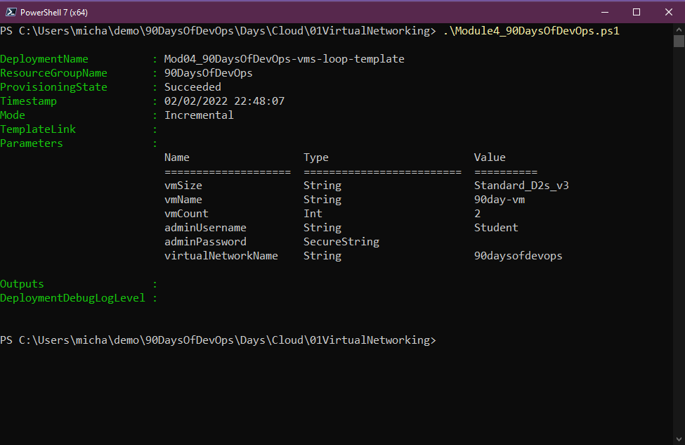
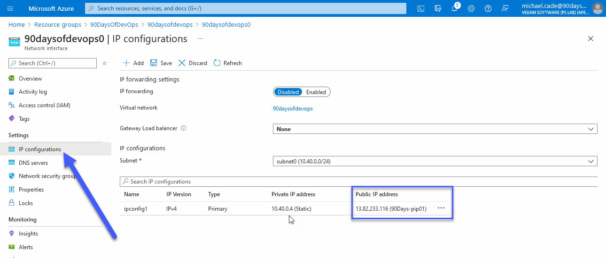
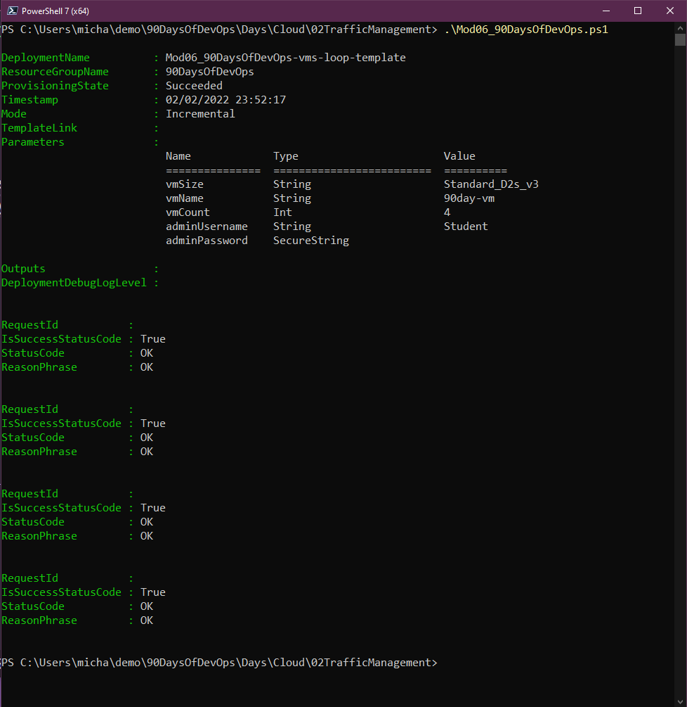
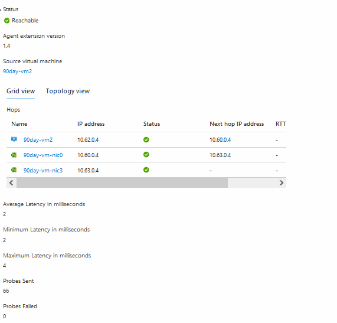
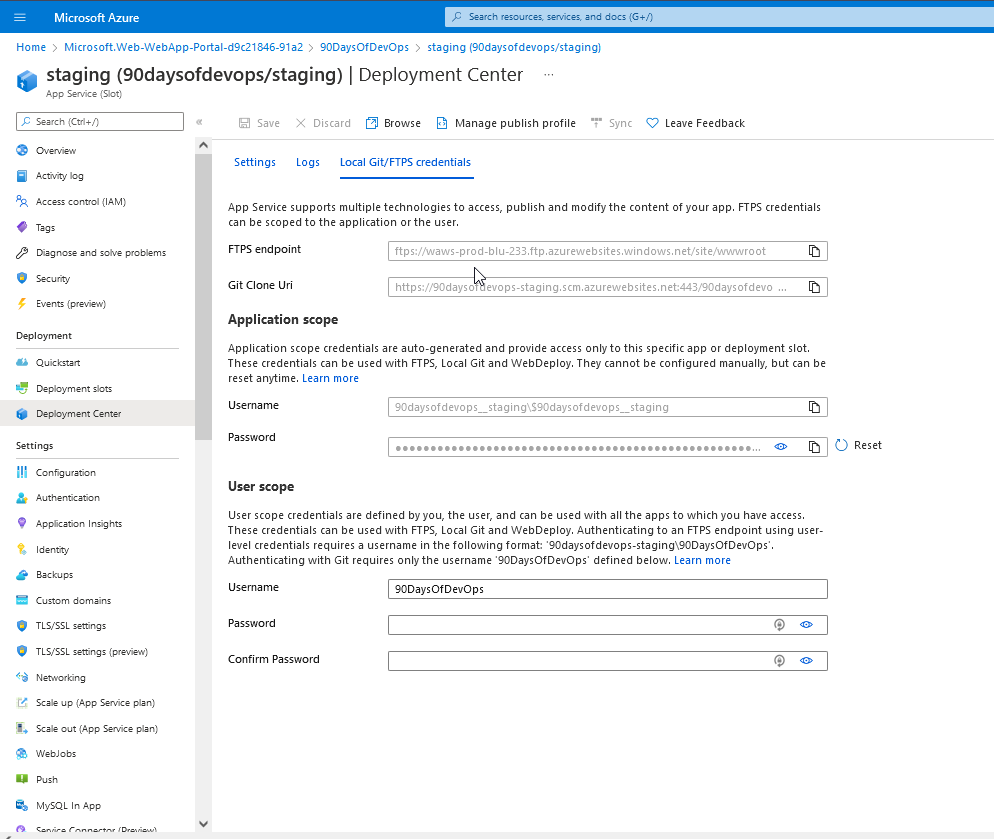
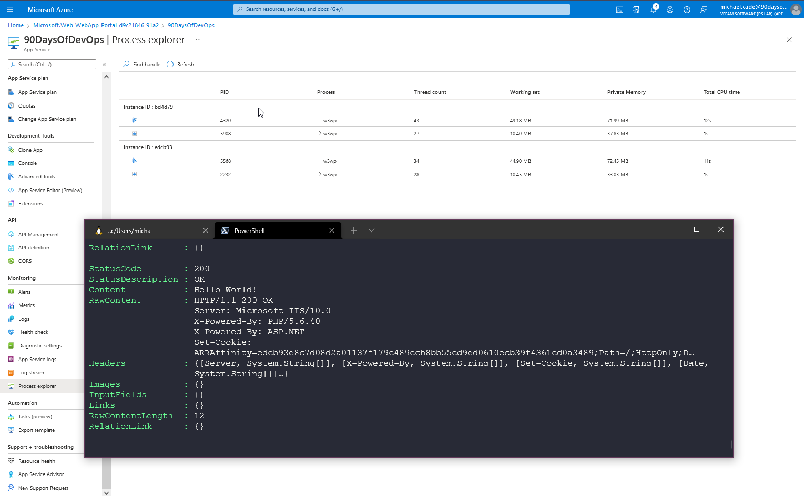

## Microsoft Azure Senaryoları ve Uygulamaları 

Son 6 gün, Microsoft Azure ve genel olarak halka açık buluta odaklandı. Azure'nin temel yapı taşlarını anlamak için bu temelin biraz teorik bilgi içermesi gerekiyordu, ancak bu bilgi, diğer büyük bulut sağlayıcılarında da geçerli olacaktır.

Başlangıçta halka açık bulutun temel bilgisini edinmek ve en azından başlangıçta bir sağlayıcı seçmekten bahsettim. Farklı bulutlar arasında gidip gelirseniz, kolayca kaybolabileceğinizi düşünüyorum. Ancak bir tane seçtiğinizde temelleri anlarsınız ve bu temelleri anladığınızda diğer bulutlara geçmek ve öğrenmeyi hızlandırmak oldukça kolay olur.

Bu final oturumunda, Microsoft tarafından oluşturulan ve[AZ-104 Microsoft Azure Administrator](https://microsoftlearning.github.io/AZ-104-MicrosoftAzureAdministrator/) sınavına hazırlık için kullanılan bir referans olan bu sayfadan kendi uygulamalı senaryolarımı seçeceğim.

Şu anda ayrıntılı olarak ele almadığımız, Konteynerler ve Kubernetes gibi bazı konular burada bulunmaktadır, bu yüzden henüz oraya atlamak istemiyorum.

Daha önceki yazılarda, Modül 1, 2 ve 3'ün çoğunu oluşturduk.

### Sanal Ag(Virtual Networking)

Takip edilerek [Modül 04](https://microsoftlearning.github.io/AZ-104-MicrosoftAzureAdministrator/Instructions/Labs/LAB_04-Implement_Virtual_Networking.html):

Yukarıdakileri geçtim ve bazı adları #90-Days-of-DevOps-as-a-Learning için değiştirdim. Ayrıca, Cloud Shell'i kullanmak yerine Windows makinedeki Azure CLI ile önceki günlerde oluşturduğum yeni kullanıcımla giriş yaptım.

Bunu, tarayıcıyı açacak ve hesabınıza kimlik doğrulama yapmanıza izin verecek `az login` komutunu kullanarak yapabilirsiniz.

Daha sonra PowerShell betiği oluşturdum ve bazı referanslarını bu klasöre yerleştirerek aşağıdaki görevleri oluşturmak için modülden yararlandım.(Cloud\01VirtualNetworking)

Lütfen scriptte dosya konumunu kendi ortamınıza uyacak şekilde değiştirin.

Bu ilk aşamada, ortamımızda sanal ağ veya sanal makine oluşturulmadı. Yalnızca kaynak grubumdaki bir Cloud Shell depolama konumu yapılandırdım.

Öncelikle [PowerShell script](Cloud/01VirtualNetworking/Module4_90-Days-of-DevOps-as-a-Learning.ps1) çalıştırıyorum.

- Task 1: Sanal ağ oluşturma ve yapılandırma

- Task 2: Sanal ağa sanal makinelerin dağıtılması

- Task 3: Azure VM'lerin özel ve genel IP adreslerini yapılandırma

- Task 4: Ağ güvenlik gruplarını yapılandırma

- Task 5: İç isim çözümü için Azure DNS'yi yapılandırma

### Network Trafik Yönetimi

Takip edilerek [Modül 06](https://microsoftlearning.github.io/AZ-104-MicrosoftAzureAdministrator/Instructions/Labs/LAB_06-Implement_Network_Traffic_Management.html):

Sonraki adımda, bir öncekinden başlayarak kaynak grubumuza gittik ve kaynaklarımızı sildik. Kullanıcı hesabınızı yalnızca o kaynak grubuna erişime sahip olacak şekilde ayarlamamışsanız, modülü takip ederek adı `90Days*` olarak değiştirerek tüm kaynakları ve kaynak grubunu silebilirsiniz. Bu, aşağıdaki lablarda her bir işlemim için sürecim olacak.

Bu lab için, ayrıca aşağıdaki görevleri oluşturmak için PowerShell betiği ve modülden bazı referansları kullanarak ilgili dosyaları bu klasörde buldum.
(Cloud\02TrafficManagement)

- Task 1: Laboratuvar ortamının sağlanması

Oncelikle [PowerShell script](Cloud/02TrafficManagement/Mod06_90-Days-of-DevOps-as-a-Learning.ps1) calıstırıyorum.

- Task 2:  Hub ve spoke ağ topolojisinin yapılandırılması

- Task 3: Sanal ağ peering'inin geçirgenliğini test etme

90-Days-of-DevOps-as-a-Learning grubumun Network Watcher'a erişimi olmadığı için bunun nedeni, Network Watcher'ların kaynak grubuna bağlı olmayan kaynaklardan biri olmasıdır. Bu nedenle, bu kullanıcı için RBAC'nin kapsandığı kaynak grubu değildir. 90-Days-of-DevOps-as-a-Learning grubuna East US Network Watcher katkıda bulunan rolünü ekledim.

^  Bu, iki spoke sanal ağı birbirine bağlamadığımız için (sanal ağ peering geçişken değil) beklenen bir durumdur.

- Task 4: Hub ve spoke topolojisinde yönlendirme yapılandırması

Burada, hesabımın 90-Days-of-DevOps-as-a-Learning grubu içindeki kullanıcı olarak komut çalıştıramamasıyla ilgili başka bir sorun yaşadım. Bunun nedenini anlamak için emin değilim, bu yüzden ana yönetici hesabıma geri döndüm. 90-Days-of-DevOps-as-a-Learning grubu, 90-Days-of-DevOps-as-a-Learning Kaynak Grubu'ndaki her şeyin sahibidir, bu yüzden VM içinde bir komut çalıştıramıyor olmamı anlamak isterim.

Daha sonra nholuong.cade@90-Days-of-DevOps-as-a-Learning.com hesabıma geri döndüm ve bu bölümü tamamladım. Burada, aynı testi tekrar çalıştırıyoruz ancak bu kez sonuç ulaşılabilir olacak şekilde.

- Task 5: Azure Load Balancer Uygulama 

- Task 6: Azure Uygulama Gateway Uygulama

### Azure Storage(Depolama)

Takip edilerek [Modül 07](https://microsoftlearning.github.io/AZ-104-MicrosoftAzureAdministrator/Instructions/Labs/LAB_07-Manage_Azure_Storage.html):

Bu lab için, ayrıca aşağıdaki görevleri oluşturmak için PowerShell betiği ve modülden bazı referansları kullanarak ilgili dosyaları bu klasörde buldum.

(Cloud\03Storage)

- Task 1: Laboratuvar ortamının sağlanması

Öncelikle [PowerShell script](Cloud/03Storage/Mod07_90DaysOfDeveOps.ps1)  scriptini çalıştırıyorum. 

- Task 2: Azure Depolama hesaplarının oluşturulması ve yapılandırılması

- Task 3: Blob depolamasını yönetme

- Task 4: Azure Depolama için kimlik doğrulama ve yetkilendirme yönetimi

Buna izin verilmesini beklerken biraz sabırsızdım, ancak sonunda çalıştı.

- Task 5: Azure Dosyalar paylaşımlarının oluşturulması ve yapılandırılması

Komut çalıştırma işleminde, nholuong.cade@90-Days-of-DevOps-as-a-Learning.com ile çalışmıyordu, bu yüzden yönetici hesabımı kullandım.

- Task 6: Azure Depolama için network erişimini yönetme

### Serverless (Web Uygulamaları Uygulama)

Takip ederek [Modül 09a](https://microsoftlearning.github.io/AZ-104-MicrosoftAzureAdministrator/Instructions/Labs/LAB_09a-Implement_Web_Apps.html):

- Task 1: Bir Azure web uygulaması oluşturma

- Task 2: Bir aşama deployment slots oluşturma

- Task 3: Web uygulaması deployment ayarlarını yapılandırma

- Task 4: Kodu aşama deployment slots dağıtma

- Task 5: Aşama slots değiştirme

- Task 6: Azure web uygulamasının otomatik ölçeklendirmesini yapılandırma ve test etme

Bu senaryoda kullandığım scripti (Cloud/04Serverless) dizininde bulunabilir.

Bu, Microsoft Azure ve genel olarak halka açık bulut hakkındaki bölümü sonlandırıyor. Bu senaryolara saldırmak ve üzerlerinde çalışmak gerçekten eğlenceliydi, diyebilirim.

## Kaynaklar

- [Hybrid Cloud and MultiCloud](https://www.youtube.com/watch?v=qkj5W98Xdvw)
- [Microsoft Azure Fundamentals](https://www.youtube.com/watch?v=NKEFWyqJ5XA&list=WL&index=130&t=12s)
- [Google Cloud Digital Leader Certification Course](https://www.youtube.com/watch?v=UGRDM86MBIQ&list=WL&index=131&t=10s)
- [AWS Basics for Beginners - Full Course](https://www.youtube.com/watch?v=ulprqHHWlng&t=5352s)

Sonraki olarak, sürüm kontrol sistemlerine, özellikle de git'e ve kod deposu genel bakışlarına odaklanacağız ve tercih ettiğim seçenek olarak GitHub'ı seçeceğiz.

Gorusmek Uzere [Gun 35](day35.md)
