## Değişiklikleri Görüntüleme, Unstaging, İptal Etme ve Geri Yükleme

Dün kaldığımız yerden git komutlarının bazılarına ve projelerinizde git'i nasıl kullanabileceğinize dair nasıl yapabileceğimize dair konuşmaya devam ediyoruz. Hatırlatmak isterim ki henüz GitHub veya diğer git tabanlı hizmetlere dokunmadık, şu anda projelerinizi yerel olarak kontrol etmenize yardımcı olmak için tüm bunlar, ancak bu araçlarla entegre olmaya başladığımızda hepsi kullanışlı hale gelecek.

### Staged ve Unstaged Değişiklikleri Görüntüleme

Commit etmeden önce staged ve unstaged kodu görüntülemek iyi bir uygulamadır. Bunun için `git diff --staged` komutunu çalıştırabiliriz.

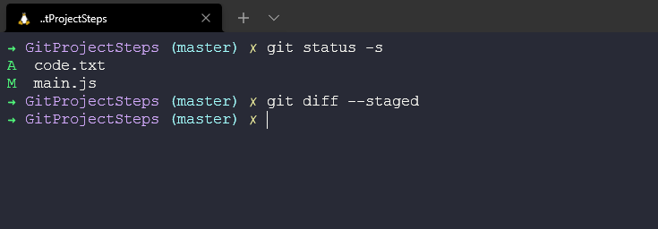

Bu bize yaptığımız tüm değişiklikleri ve eklediğimiz veya sildiğimiz tüm yeni dosyaları gösterir.

Değiştirilen dosyalardaki değişiklikler `---` veya `+++` ile gösterilir, aşağıda yeni satırlar olduklarını belirten +add some text below eklediğimizi görebilirsiniz.

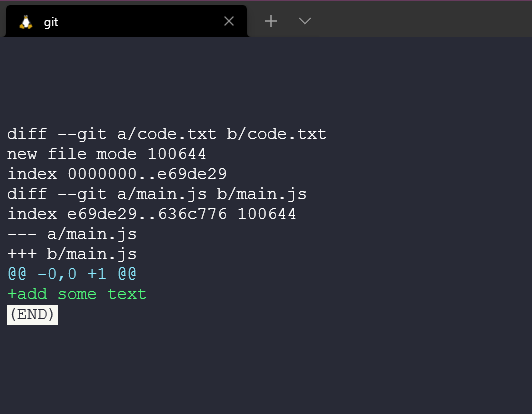

Ayrıca `git diff` komutunu çalıştırarak taahhüt alanımızı çalışma dizinimizle karşılaştırabiliriz. Yeni eklenen code.txt dosyasını değiştiririz ve bazı metin satırları ekleriz.


Daha sonra `git diff` komutunu çalıştırırsak, aşağıdaki çıktıyı karşılaştırır ve görüntüleriz.


### Gorsel Fark(Diff) Aracları

Benim için yukarıdaki yöntem biraz karışık olduğu için daha çok görsel bir araç kullanmayı tercih ederim.

Birkaç görsel fark aracını şöyle sıralayabiliriz:

- KDiff3
- P4Merge
- WinMerge (Windows Only)
- VSCode

Bu aracı git içinde ayarlamak için aşağıdaki komutu çalıştırırız: `git config --global diff.tool vscode`

Yukarıdakini çalıştıracağız ve VScode'u başlattığımızda bazı parametreler belirleyeceğiz.


Ayrıca konfigürasyonumuzu `git config --global -e` komutu ile kontrol edebiliriz.

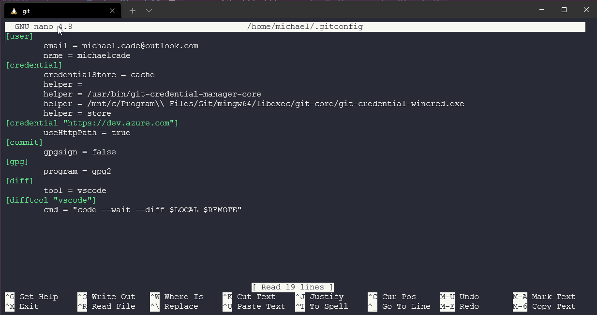

Ardından şimdi farklılık görsel aracımızı açmak için `git difftool` komutunu kullanabiliriz.

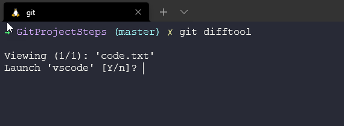

Bu, farklılık sayfasında VScode düzenleyicimizi açar ve ikisini karşılaştırır, sadece bir dosyayı hiçbir şeyden, şimdi sağ tarafta bir kod satırı ekleyerek değiştirdik.

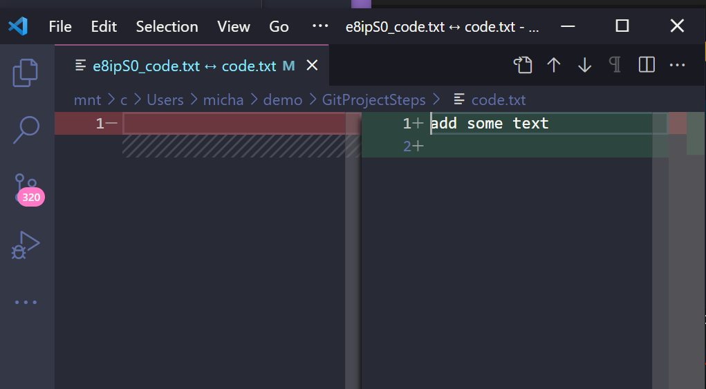

Bu yöntemi değişiklikleri takip etmek için çok daha kolay buluyorum ve bu, GitHub gibi git tabanlı hizmetlere baktığımızda göreceğimiz bir şeye benziyor.

Ayrıca stage edilmiş dosyaları aşama ile karşılaştırmak için `git difftool --staged` komutunu da kullanabiliriz.


Ardından stage etmeden önce değiştirilmiş dosyalarımızı döngü içinde gezebiliriz.

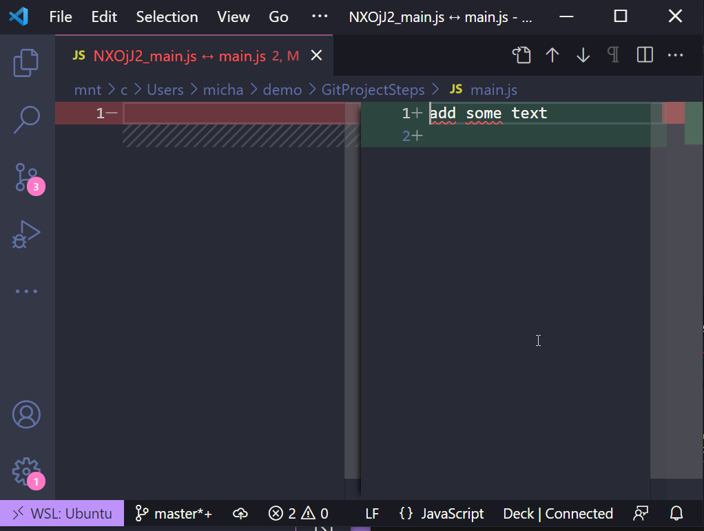

Ben IDE olarak VScode kullanıyorum ve çoğu IDE gibi, bu işlevsellik zaten entegre edilmiş durumda, bu komutları nadiren terminalden çalıştırmanız gerekecektir, ancak herhangi bir nedenle IDE yüklü değilse yardımcı olur.

### History(Gecmiş) Görüntüleme

Daha önce `git log` komutuna değinmiştik, bu komut bize deposundaki yaptığımız tüm commitleri kapsamlı bir şekilde görüntüler.


Her commitin kendine özgü onaltılık bir dizisi vardır ve bu dizide depoya özgüdür. Burada hangi şubede çalıştığımızı ve ayrıca yazarı, tarihi ve commit mesajını görebilirsiniz.

Ayrıca `git log --oneline` komutunu kullanarak daha küçük bir onaltılık dizisinin daha küçük bir sürümünü alabiliriz ve bunu diğer `diff` komutlarında kullanabiliriz. Ayrıca yalnızca tek satırlık açıklamaya veya commit mesajına sahibiz.


Bu komutu tersine çevirerek ilk commitle başlamak için `git log --oneline --reverse` çalıştırabiliriz ve şimdi ilk commitiniz sayfanın en üstünde görüyoruz.


### Bir Commit'i Görüntüleme

Bir taahhüt mesajına bakma yeteneği, en iyi uygulamaları takip etmeye özen gösterdiyseniz ve anlamlı bir taahhüt mesajı eklediyseniz harikadır, ancak ayrıca bir taahhüdü incelememize ve görüntülememize izin veren `git show` komutu da vardır.

g`git log --oneline --reverse` komutunu kullanarak commitlerimizin bir listesini alabiliriz. ve sonra bu taahhütleri alıp `git show <commit ID>` komutunu çalıştırabiliriz.


Bu komutun çıktısı, commitin detayı, yazarı ve neyin değiştiği gibi aşağıdaki gibi görünecektir.


Ayrıca, `git show HEAD~1` kullanarak, 1, mevcut sürümden ne kadar geri gitmek istediğimizi belirtir.

Bu dosyalarınız hakkında bazı detaylar istiyorsanız harikadır, ancak tüm anlık görüntü dizini için ağaçta bulunan tüm dosyaları listelemek istiyorsak. Bunun için `git ls-tree HEAD~1` komutunu kullanarak bunu başarabiliriz, burada en son committen bir anlık görüntü geriye gitmektedir. Aşağıda iki blok olduğunu görebilirsiniz, bunlar dosyaları gösterirken ağaç, bir dizini gösterecektir. Ayrıca bu bilgilerde taahhütleri ve etiketleri görebilirsiniz.


Yukarıdakini kullanarak, dosyanın içeriğini (bloklar) görmek için `git show` komutunu kullanabiliriz.


Ardından belirli bir dosyanın o sürümünün içeriği gösterilecektir.


### Unstaging Files

Belki de `git add .` komutunu kullanmış olabilirsiniz, ancak henüz o anlık görüntüye commit etmek istemediğiniz dosyalarınız olabilir. Aşağıdaki örnekte yeni bir dosya olan newfile.txt'yi commit alanıma ekledim, ancak bu dosyayı taahhüt etmeye hazır değilim, bu nedenle `git add` adımını geri almak için `git restore --staged newfile.txt` komutunu kullanacağım.

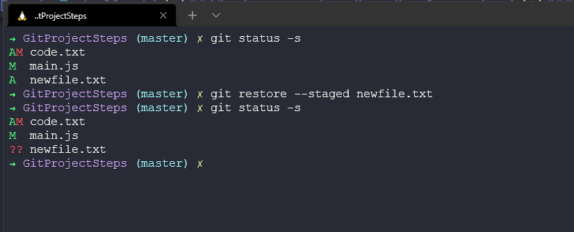

Aynı şekilde main.js gibi değiştirilmiş dosyaları unstaging bırakabiliriz ve commiti geri alabiliriz, yukarıda değiştirilmiş için yeşil bir M işareti var ve aşağıda bu değişiklikleri committen çıkarıyoruz.

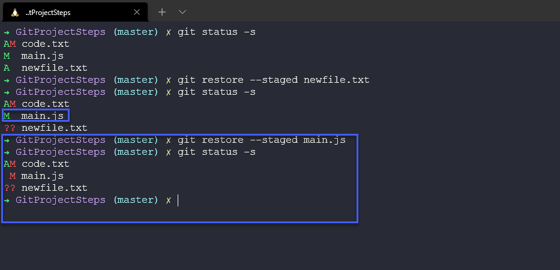

Ben bu komutu 90-Days-of-DevOps-as-a-Learning sırasında oldukça faydalı buldum, bazen ileride çalışıyorum ve bir sonraki gün için notlar almak istediğim günlerde commit ve push işlemlerini genel GitHub deposuna gerçekleştirmek istemiyorum.

### Local Değişiklikleri İptal Etme

Bazen değişiklikler yapabiliriz, ancak bu değişikliklerden memnun değiliz ve onları atmak istiyoruz. Tekrar `git restore` komutunu kullanacağız ve anlık görüntülerden veya önceki sürümlerden dosyaları geri yükleyebileceğiz. `git restore .` komutunu dizinimize karşı çalıştırabilir ve anlık görüntüden her şeyi geri yükleyebiliriz, ancak takip edilmeyen dosyanın hala mevcut olduğuna dikkat edin. newfile.txt adında izlenen önceki bir dosya yok.

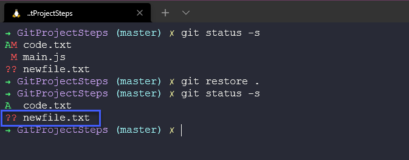

Şimdi newfile.txt veya takip edilmeyen herhangi bir dosyayı kaldırmak için `git clean` komutunu kullanabiliriz, yalnızca bir uyarı alacaksınız.

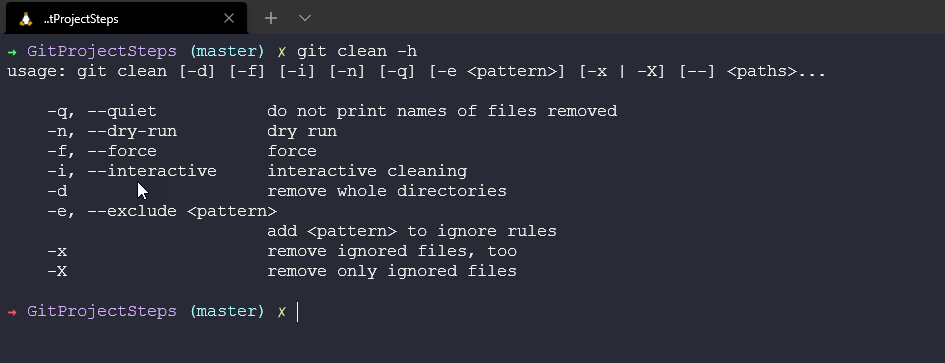

Veya sonuçlarını biliyorsak, tüm dizinleri zorla kaldırmak için `git clean -fd` komutunu çalıştırmak isteyebiliriz.


### Bir Dosyayı Daha Önceki Bir Sürüme Geri Yükleme

Git'in size yardımcı olabileceği büyük bir bölümü, dosyalarınızın anlık görüntülerinizden kopyalarını geri yükleyebilme yeteneğidir (bu bir yedek değil, ancak çok hızlı bir geri yükleme noktasıdır). Benim tavsiyem, ayrıca kodunuzu diğer konumlarda yedek bir çözüm kullanarak kaydetmenizdir.

Bir örnek olarak, dizinimizdeki en önemli dosyamızı silelim, bunu dizinden kaldırmak için Unix tabanlı komutları kullanıyoruz, git komutları değil.

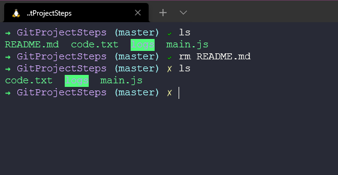

Şimdi çalışma dizinimizde readme.md dosyamız yok. `git rm readme.md` komutunu kullanabilirdik ve bu, git veritabanımızda yansıtılacaktı. Ayrıca, tamamen kaldırıldığını simüle etmek için onu buradan da silelim.

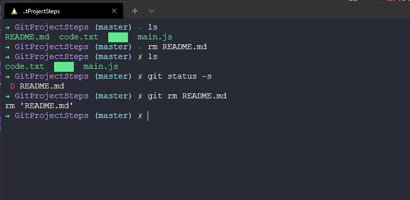

Şimdi bir mesajla bunu commit edelim ve artık çalışma dizinimizde veya taahhüt alanımızda hiçbir şey olmadığını kanıtlayalım.


Hatalar yapıldı ve şimdi bu dosyaya ihtiyacımız var!

Son taahhüdü geri alacak olan `git undo` komutunu kullanabilirdik, ancak bir süre önceyse ne yapmalıyız? Taahhütlerimizi bulmak için `git log` komutunu kullanabiliriz ve ardından dosyamızın son taahhütte olduğunu buluruz, ancak tüm bu taahhütlerin geri alınmasını istemiyoruz, bu nedenle belirli bir komut olan `git restore --source=HEAD~1 README.md` komutunu kullanarak dosyayı belirleyebiliriz ve anlık görüntümüzden geri yükleyebiliriz.

Bu süreci kullanarak dosyanın artık çalışma dizinimizde olduğunu görebilirsiniz.


Artık yeni bir izlenmeyen dosyamız var ve dosyalarımızı ve değişikliklerimizi takip etmek, aşama almak ve commit etmek için önceki olarak bahsedilen komutlarımızı kullanabiliriz.

### Rebase vs Merge

Bu, Git ve ne zaman yeniden taban almak veya birleştirmeyi kullanmak gerektiğinde en büyük baş ağrısına neden olan şey gibi görünüyor.

Bilinmesi gereken ilk şey, `git rebase` ve `git merge` komutlarının aynı sorunu çözdüğüdür. İkisi de bir dalı diğerine entegre etmek içindir. Ancak bunu farklı yollarla yaparlar.

Yeni bir özellikle yeni bir özel dalda başlayalım. Ana dal, yeni taahhütlerle devam eder.


Kolay seçenek, `git merge feature main` kullanmaktır, bu, ana dalı özellik dalına birleştirir.

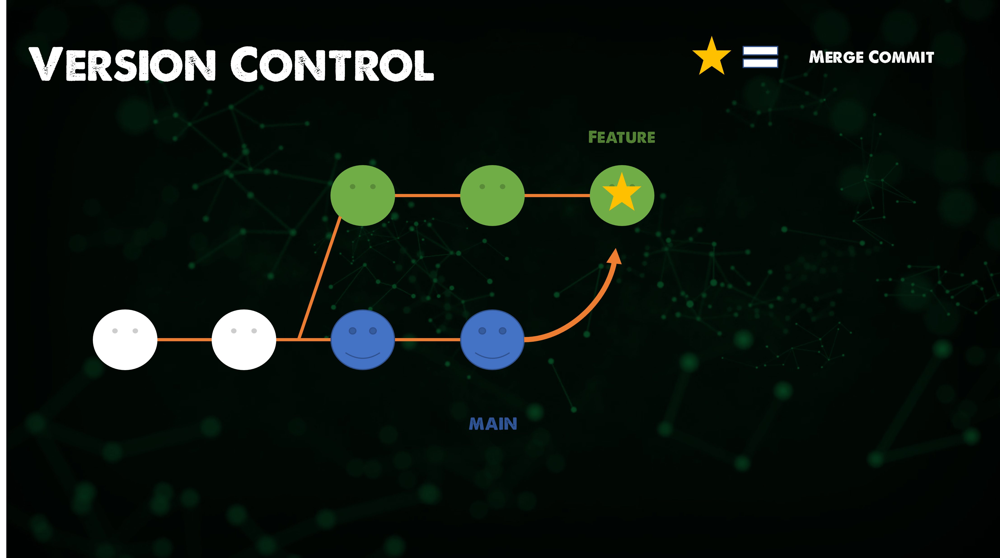

Birleştirme, yıkıcı olmadığı için kolaydır. Mevcut dallar hiçbir şekilde değiştirilmez. Bununla birlikte, bu, özellik dalının her seferinde yukarı akış değişikliklerini içermesi gerektiğinde ilgisiz birleştirme taahhüdüne sahip olacağı anlamına gelir. Ana dal çok yoğun veya aktifse, bu özellik dalının geçmişini kirletebilir.

Alternatif bir seçenek olarak, özellik dalını ana dalın üstüne yeniden taban alabiliriz:

```
git checkout feature
git rebase main
```

Bu, özellik dalını (tüm özellik dalını) ana dala etkin bir şekilde dahil eder. Ancak, birleştirme commiti kullanmak yerine yeniden taban almak, orijinal dalın her commiti için yepyeni taahhütler oluşturarak proje geçmişini yeniden yazarak yapar.


Yeniden taban almanın en büyük faydası, çok daha temiz bir proje geçmişidir. Ayrıca gereksiz birleştirme taahhütlerini ortadan kaldırır. Ve son iki resmi karşılaştırdığınızda, daha temiz ve lineer bir proje geçmişini takip edebilirsiniz.

Yine de kesin bir sonuç olmasa da, daha temiz bir geçmişi seçmek bazı karşılıklılıkları da beraberinde getirir. Eğer [Yeniden Taban Almanın Altın Kuralı](https://www.atlassian.com/git/tutorials/merging-vs-rebasing#the-golden-rule-of-rebasing)nı takip etmezseniz, proje geçmişini yeniden yazmak işbirliği iş akışınız için potansiyel olarak felaket olabilir. Ve daha az önemli olarak, yeniden taban alma birleştirme taahhüdünün sağladığı bağlamı kaybeder - yukarı akış değişikliklerinin özelliğe ne zaman dahil edildiğini göremezsiniz.

## Kaynaklar

- [What is Version Control?](https://www.youtube.com/watch?v=Yc8sCSeMhi4)
- [Types of Version Control System](https://www.youtube.com/watch?v=kr62e_n6QuQ)
- [Git Tutorial for Beginners](https://www.youtube.com/watch?v=8JJ101D3knE&t=52s)
- [Git for Professionals Tutorial](https://www.youtube.com/watch?v=Uszj_k0DGsg)
- [Git and GitHub for Beginners - Crash Course](https://www.youtube.com/watch?v=RGOj5yH7evk&t=8s)
- [Complete Git and GitHub Tutorial](https://www.youtube.com/watch?v=apGV9Kg7ics)
- [Git cheatsheet](https://www.atlassian.com/git/tutorials/atlassian-git-cheatsheet)
- [Exploring the Git command line – A getting started guide](https://veducate.co.uk/exploring-the-git-command-line/)

Gorusmek Uzere [Gun40](day40.md)
