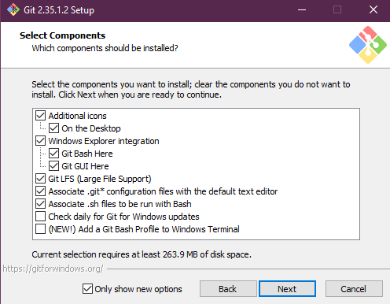
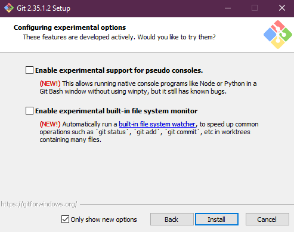
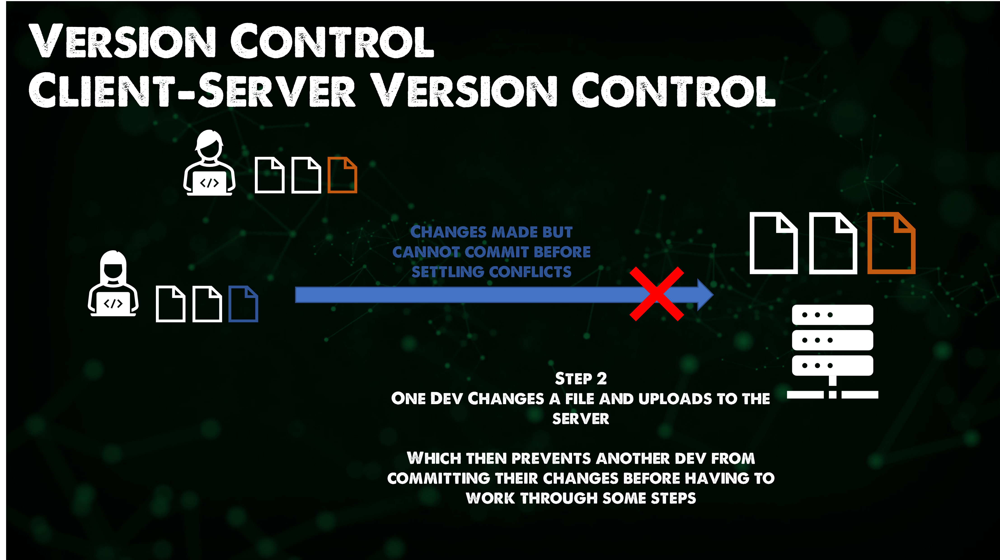

## Cài đặt & Cấu hình Git

GIt là một công cụ quản lý phiên bản ã nguồn mở, đa nền tảng. Nếu bạn giống tôi, sử dụng Ubuntu hoặc các hệ điều hành Linux khác, bạn có thể thấy rằng git đã được cài đặt sẵn, tuy nhiên chúng ta vẫn sẽ đi qua việc cài đặt và cấu hình nó.

Ngay cả khi bạn đã cài đặt git trên hệ thống của mình, bạn cũng nên đảm bảo rằng chúng ta luôn có bản cập nhật mới nhất.

### Cài đặt Git

Như đã đề cập, Git là công cụ đa nền tảng, chúng ta sẽ nhắc tới Windows và Linux và bạn cũng có thể tìm thấy hướng dẫn cho macOS tại [đây](https://git-scm.com/book/en/v2/Getting-Started-Installing-Git)

Đối với [Windows](https://git-scm.com/download/win), chúng ta có thể download trình cài đặt từ trang web chính thức.

Bạn cũng có thể sử dụng `winget` trên máy tính Windows của mình, và sử dụng nó như trình quản lý gói ứng dụng trên máy của bạn.

Trước khi chúng ta cài đặt bất cứ thứ gì, hãy kiểm tra phiên bản hiện tại trên máy của bạn. Mởi cửa sổ PowerShell và chạy `git --version`


Chúng ta cũng có thể kiểm tra phiên bản Git trên WSL Ubuntu của mình.


Tại thời điểm viết bài, bản phát hành mới nhất trên Windows là `2.35.1`, vì vậy tôi sẽ hướng dẫn việc update một vài thứ. Linux cũng có thể tương tự như vậy.

Sau khi tải xuống trình cài đặt phiên bản mới nhất và chạy qua trình hướng dẫn và ghi lại những điều đó tại đây. Lưu ý quan trọng là git sẽ gỡ cài đặt các phiên bản trước đó rồi mới cài đặt phiên bản mới nhất.

Có nghĩ là quy trình bên dưới cũng là quy trình mà chúng ta phải trải qua đối với việc bạn cài git lần đầu tiên.

Đây là một cài đặt khá đơn giản. Sau khi tài xuống, click đúp và bắt đầu. Đọc qua thoả thuận về giấy phép GNU. Nhưng hãy nhớ đây là phần mềm mã nguồn mở và miễn phí.


Bây giờ chúng ta có thể chọn các thành phần bổ sung mà chúng ta muốn cài đặt cũng như liên kết với git. Trên Windows, tôi luôn đảm bảo rằng mình đã cài đặt Git Bash vì điều này cho phép chúng ta chạy các lệnh bash trên Windows.



Sau đó, chúng ta có thể chọn phần mềm SSH mà chúng ta muốn sử dụng. Tôi chọn OpenSSH như bản có thể thấy trong phần tìm hiểu về Linux.


Chúng ta cũng có thể bật các tính năng thử nghiệm, đối với tôi, tôi không cần chúng nên đã không bật chúng, bạn luôn có thể quay lại việc cài đặt để bật các tính năng này.



Cài đặt hoàn tất, bây giờ chúng ta có thể chọn mở Git Bash hoặc đọc bản ghi chú cho bản phát hành mới nhất.


Bước kiểm tra cuối cùng là mở PowerShell và thử lại câu lệnh kiểm tra phiên bản git.


Sau các bước siêu đơn giản ở trên, chúng ta sẽ có phiên bản mới nhất của git. Đối với Linux, quá trình có thể sẽ mất thời gian hơn một chúng nhưng tôi cũng muốn nói qua về nó.

Tôi chỉ cần chạy lệnh `sudo apt-get install git`.


Bạn cũng có thể chạy các câu lệnh dưới dây để add thêm git repository cho các cài đặt phần mềm.

```
sudo add-apt-repository ppa:git-core/ppa -y
sudo apt-get update
sudo apt-get install git -y
git --version
```

### Cấu hình Git

Khi lần đầu tiên sử dụng git, chúng ta phải xác định một số cài đặt sau.

- Tên
- Email
- Editor mặc định
- Ký tự kết thúc dòng

Điều này có thể thực hiện ở ba cấp độ.

- Hệ thống = tất cả người dùng
- Global = tất cả repositories của người dùng hiện tại
- Local = repository hiện tại 

Ví dụ:
`git config --global user.name "nholuong Cade"`
`git config --global user.email nholuong.Cade@90-Days-of-DevOps-as-a-Learning.com"`
Tuỳ thuộc vào hệ điều hành của bạn, text editor mặc định sẽ được tự xác định. Với Ubuntu của tôi, câu lệnh tiếp theo sẽ sử dụng nano. Lệnh dưới đây sẽ thay đổi editor thành Visual Studio Code.

`git config --global core.editor "code --wait"`

bây giờ, nếu chúng ta muốn kiểm tra tất cả các cầu hình git thì có thể sử dụng lệnh sau 

`git config --global -e`


Trên tất cả các máy, tệp này sẽ được đặt tên là `.gitconfig`. Trên máy Windows của tôi, bạn sẽ tìm thấy tệp này trong thư mục người dùng của mình.


### Lý thuyết Git

Tôi đã đề cập trong bài đăng ngày hôm qua rằng có các loại quản lý phiên bản khác nhau và chúng ta có thể chia thành hai loại chính. Một là Client-Server và loại còn lại là hệ phân tán.

### Quản lý phiên bản Client-Server 

Trước khi git xuất hiện, Client-Server là phương thức chính để quản lý phiên bản. Ví dụ cho điều này sẽ là [Apache Subversion](https://subversion.apache.org/) là một một hệ thống kiểm soát phiên bản mã nguồn mở được ra mắt vào năm 2000.

Trong mô hình quản lý phiên bản Client-Server này, bước đầu tiên nhà phát triểu cần làm là tải xuống mã nguồn và các tệp từ máy chủ. Điều này không giải quyết các xung đột nhưng nó loại bỏ sự phức tạp của các xung đột và cách giải quyết chúng.


Bây giờ, giả sử chúng ta có hai nhà phát triển làm việc trên cùng một tệp và một người xong trước, upload file của họ lên server trước với những thay đổi của họ. Khi người thứ hai cập nhật file đó, xung đột sẽ xảy ra.



Vì vậy, bây giờ người thứ hai cần kéo thay đổi mã của người đầu tiên xuống và giải quyết các xung đột trong mã nguồn rồi sau đó mới commit lên máy chủ.


### Distributed Version Control

Git không phải là hệ thống quản lý phiên bản phân tán duy nhất. Nhưng nó rất thông dụng.

Một số lợi ích chính của Git là:

- Nhanh
- Thông minh
- Linh hoạt
- An toàn & Bảo mật

Khác với mô hình kiểm soát phiên bản Client-Server, mỗi nhà phát triển tải xuống một repository thì nó sẽ bao gồm tất cả mọi thứ. Lịch sử các commit, tất cả các nhánh,...


## Tài liệu tham khảo

- [What is Version Control?](https://www.youtube.com/watch?v=Yc8sCSeMhi4)
- [Types of Version Control System](https://www.youtube.com/watch?v=kr62e_n6QuQ)
- [Git Tutorial for Beginners](https://www.youtube.com/watch?v=8JJ101D3knE&t=52s)
- [Git for Professionals Tutorial](https://www.youtube.com/watch?v=Uszj_k0DGsg)
- [Git and GitHub for Beginners - Crash Course](https://www.youtube.com/watch?v=RGOj5yH7evk&t=8s)
- [Complete Git and GitHub Tutorial](https://www.youtube.com/watch?v=apGV9Kg7ics)

Hẹn gặp lại vào [ngày 37](day37.md)
