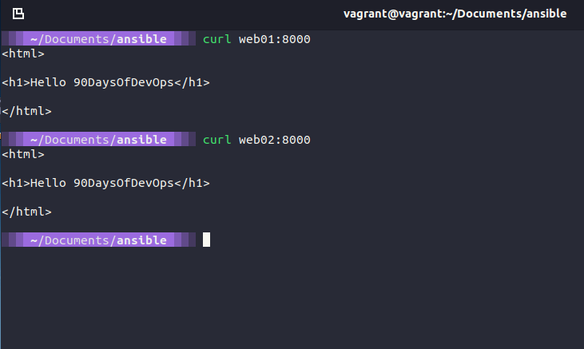
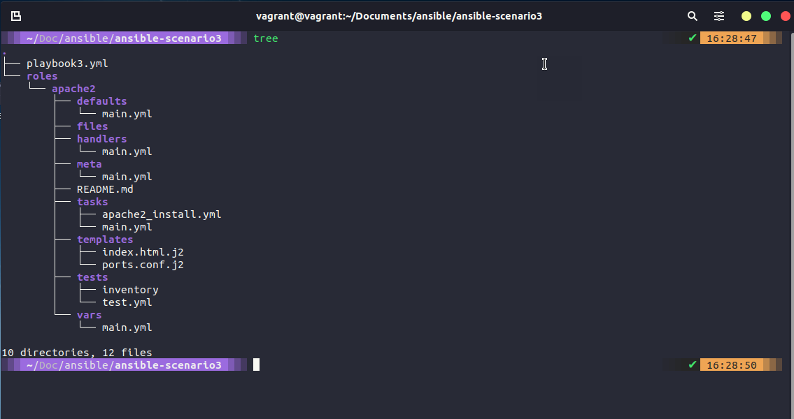
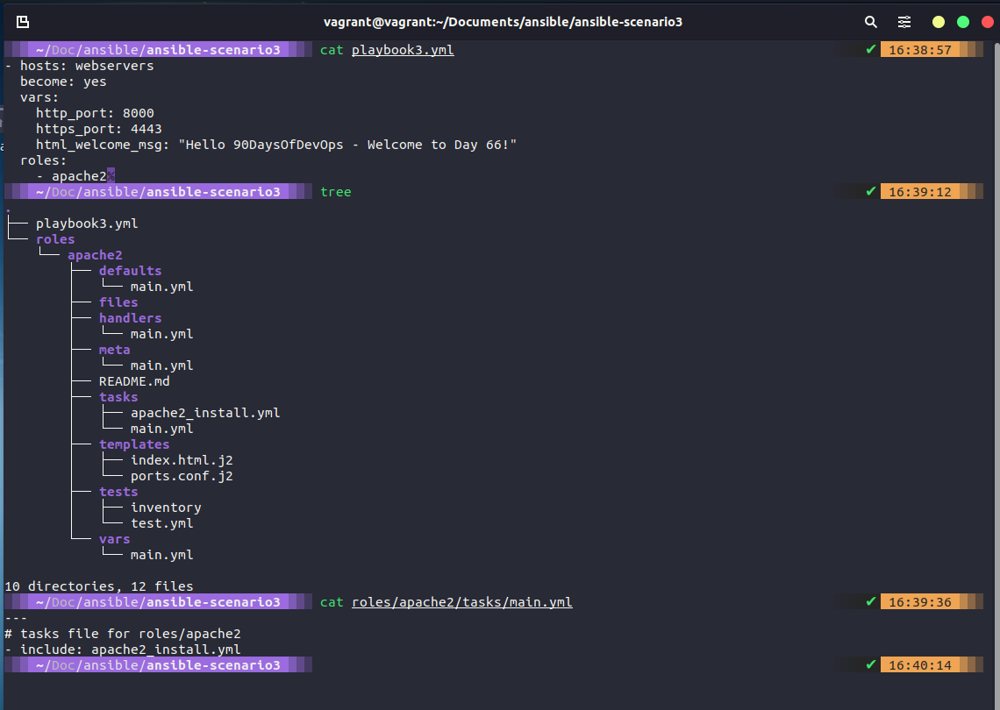
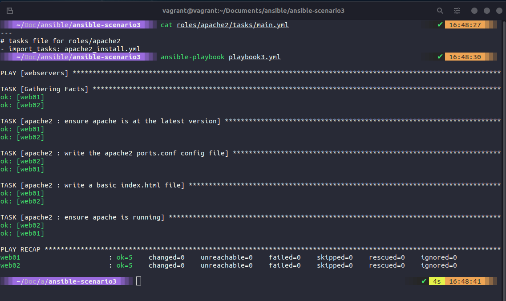

## Ansible Playbooks (Tiếp tục)

Trong bài viết trước, chúng ta đã bắt đầu với việc tạo bài lab nhỏ bằng cách sử dụng Vagrantfile để triển khai 4 máy ảo và chúng ta đã sử dụng máy chủ Linux đã được tạo trong bài viết liên quan tới chính chủ đề đó làm hệ thống điều khiển ansible của mình.

Chúng ta cũng đã đi qua một số trường hợp sử dụng playbooks và cuối cùng, chúng ta đã có một playbooks giúp các máy chủ web01 và web02 trở thành các máy chủ riêng biệt.



### Giữ mọi thứ ngăn nắp

Trước khi bắt đầu triển khai và tiếp tục tự động hoá quy trình, chúng ta sẽ đề cập tới việc giữ các playbooks của mình gọn gàng và ngăn nắp cũng như cách chúng ta có thể tách các tasks và handlers của mình thành các thư mục con.

Chúng ta sẽ sao chép các nhiệm vụ của mình vào các tệp của chúng trong một thư mục riêng.

```Yaml
- name: ensure apache is at the latest version
  apt: name=apache2 state=latest

- name: write the apache2 ports.conf config file
  template:
    src=templates/ports.conf.j2
    dest=/etc/apache2/ports.conf
  notify: restart apache

- name: write a basic index.html file
  template:
    src: templates/index.html.j2
    dest: /var/www/html/index.html
  notify:
  - restart apache

- name: ensure apache is running
  service:
    name: apache2
    state: started
```

và làm điều tương tự với handlers

```Yaml
- name: restart apache
  service:
    name: apache2
    state: restarted
```

sau đó, trong playbook mà hiện tại có tên là `playbook2.yml`, chúng ta trỏ đến các tệp này. Tất cả đều có thể được tìm thấy tại [ansible-scenario2](../../Days/Configmgmt/ansible-scenario2/)

Bạn có thể kiểm tra điều này trong máy chủ điều khiển của mình. Nếu bạn đã sao chép các tệp từ repository, bạn sẽ nhận thấy điều gì đó đã thay đổi trong phần "write a basic index.html file"


Hãy tìm hiểu xem tôi đã thực hiện thay đổi đơn giản nào. Sử dụng lệnh `curl web01:8000`


Chúng ta vừa dọn dẹp lại playbook và bắt đầu phân tách các khu vực có thể khiến playbook trở nên phức tạp khi mở rộng quy mô.

### Roles và Ansible Galaxy

Hiện tại, chúng ta đã triển khai 4 máy ảo và chúng ta đã định cấu hình 2 trong số các máy ảo này làm máy chủ web, chúng ta cũng có một số các chứng năng khác, cụ thể là một cơ sở dữ liệu và bộ cân bằng tải hoặc proxy. Để chúng ta có thể làm điều này và dọn dẹp lại repository của mình, chúng ta có thể sử dụng roles trong Ansible.

Để làm điều này, chúng ta sẽ sử dụng lệnh `ansible-galaxy` để quản lý các roles trong các kho repository được chia sẻ.


Chúng ta sẽ sử dụng `ansible-galaxy` để tạo một role cho apache2, đây là nơi chúng ta sẽ đặt các chi tiết cụ thể cho máy của web của mình.


Câu lệnh trên `ansible-galaxy init roles/apache2` sẽ tạo cấu trúc thư mục như ở trên. Bước tiếp theo là chúng ta cần chuyển các tác vụ mà templates hiện có của mình sang các thư mục có liên quan trong cấu trúc mới.



Copy và paste là cách dễ dàng để chuyển các tệp đó, nhưng chúng ta cũng cần thực hiện thay đổi với tasks/main.yml để trỏ tệp này tới apache2_install.yml.

Chúng ta cũng cần thay đổi playbook để có thể sử dụng role mới được tạo. Trong playbook1.yml và playbook2.yml, chúng ta xác định các tasks và handlers theo các cách khác nhau khi chúng ta thay đổi giữa hai phiên bản. Chúng ta cần thay đổi playbook của mình để sử dụng role này như bên dưới:

```Yaml
- hosts: webservers
  become: yes
  vars:
    http_port: 8000
    https_port: 4443
    html_welcome_msg: "Hello 90-Days-of-DevOps-as-a-Learning - Welcome to Day 66!"
  roles:
    - apache2
```



Bây giờ, chúng ta có thể chạy lại playbook của mình lần này với tên playbook mới `ansible-playbook playbook3.yml`, bạn sẽ nhận thấy một cảnh báo về việc deprecation, chúng ta có thể khắc phục ngay sau đây.


Ok, dù playbook của chúng ta đã hoạt động nhưng chúng ta cần sử deprecation warning ngay, để làm điều đó, tôi đã thay đổi tuỳ chọn trong tasks/main.yml thành import_tasks như bên dưới.



Bạn có thể tìm thấy các tệp này trong[ansible-scenario3](../../Days/Configmgmt/ansible-scenario3)

Chúng ta cũng sẽ tạo thêm một vài roles trong khi sử dụng `ansible-galaxy`, bao gồm:

- common = cho tất cả các máy chủ (`ansible-galaxy init roles/common`)
- nginx = cho load balancer (`ansible-galaxy init roles/nginx`)


Tôi sẽ dừng phần này tại đây và trong phần tiếp theo, chúng ta sẽ bắt đầu làm việc trên các nodes khác mà chúng ta đã triển khai nhưng chưa thực hiện bất cứ điều gì.

## Tài liệu tham khảo

- [What is Ansible](https://www.youtube.com/watch?v=1id6ERvfozo)
- [Ansible 101 - Episode 1 - Introduction to Ansible](https://www.youtube.com/watch?v=goclfp6a2IQ)
- [NetworkChuck - You need to learn Ansible right now!](https://www.youtube.com/watch?v=5hycyr-8EKs&t=955s)
- [Your complete guide to Ansible](https://www.youtube.com/playlist?list=PLnFWJCugpwfzTlIJ-JtuATD2MBBD7_m3u)

Playlist cuối cùng được liệt kê ở trên có rất nhiều đoạn mã và ý tưởng cho bài viết này, nó là một video hướng dẫn tuyệt vời.

Hẹn gặp lại vào [ngày 67](day67.md)
