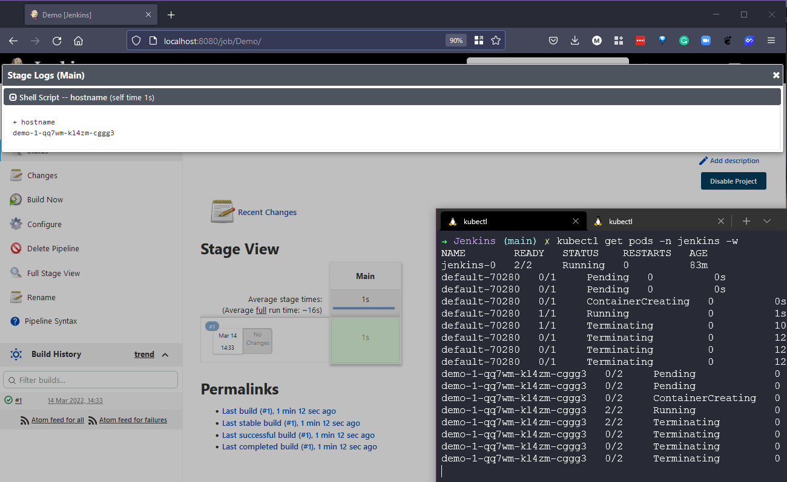
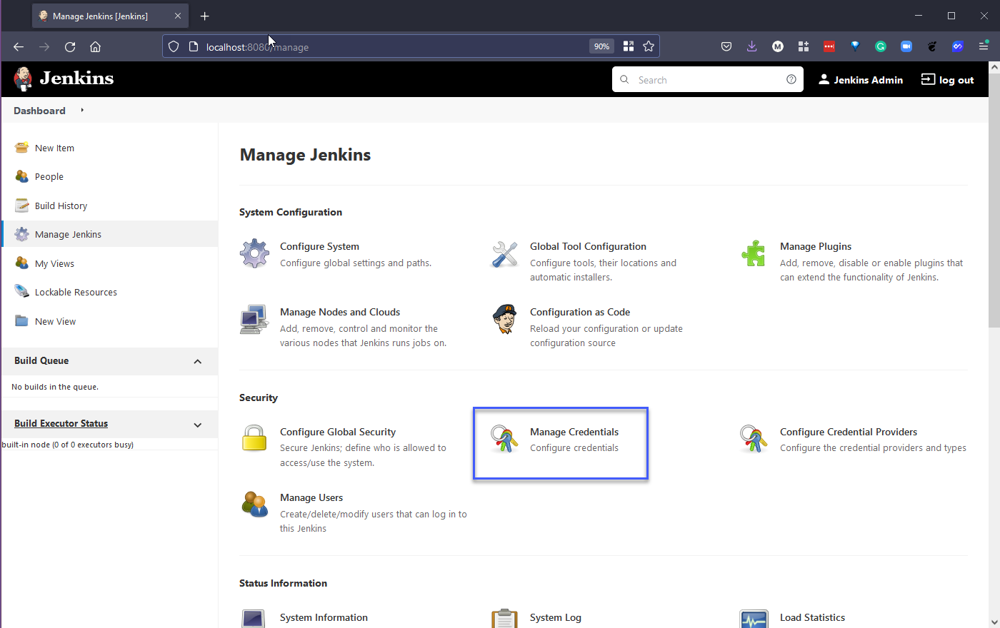
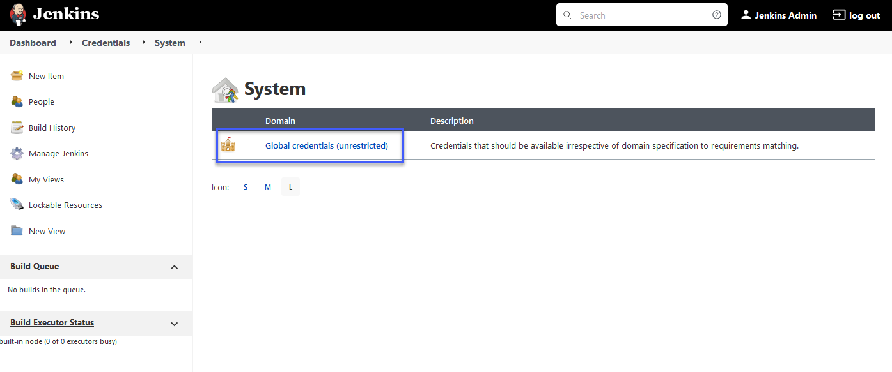
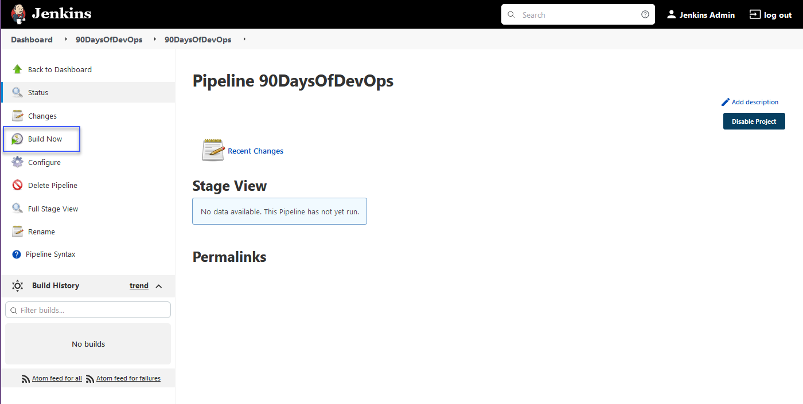
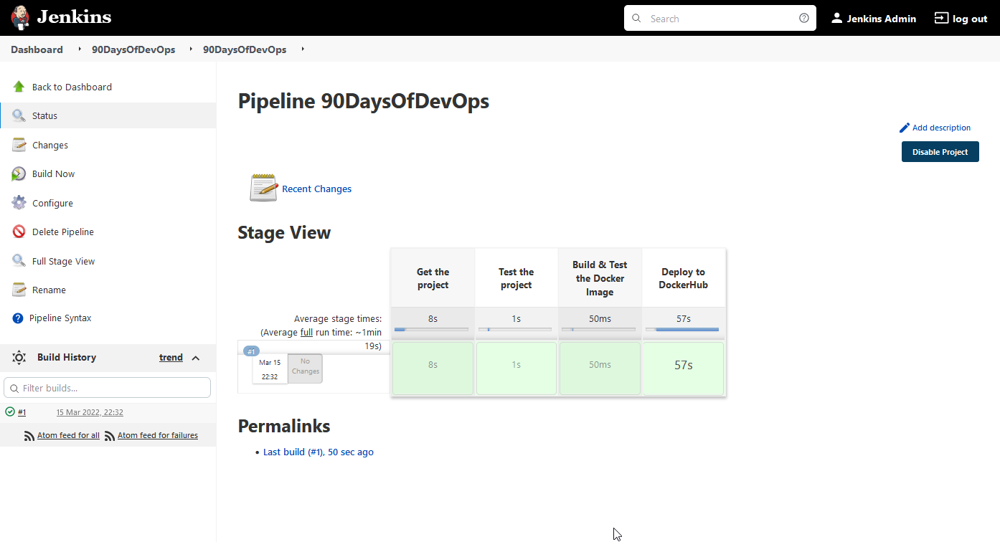
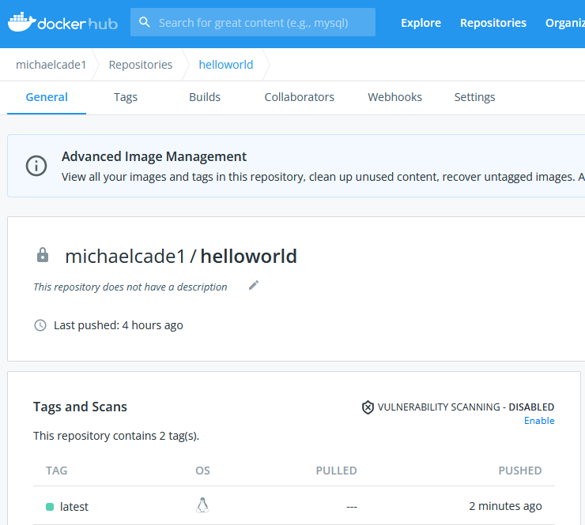

## Xây dựng Jenkins pipeline

Ở bài trước, chúng ta đã triển khai Jenkins tới cụm Minikube và đã thiết lập một Jenkins Pipeline cơ bản in ra các giai đoạn của nó.

Bạn cũng có thể thấy rằng có một số kịch bản mẫu cho chúng ta chạy trong quá trình tạo Jenkins Pipeline.


Kịch bản demo đầu tiên là "Declarative (Kubernetes)" và bạn có thể thấy các giai đoạn bên dưới.
  
```Yaml
// Sử dụng cú pháp Declarative để chạy câu lệnh bên trong một container
pipeline {
    agent {
        kubernetes {
            // Rather than inline YAML, in a multibranch Pipeline you could use: yamlFile 'jenkins-pod.yaml'
            // Or, to avoid YAML:
            // containerTemplate {
            //     name 'shell'
            //     image 'ubuntu'
            //     command 'sleep'
            //     args 'infinity'
            // }
            yaml '''
apiVersion: v1
kind: Pod
spec:
  containers:
  - name: shell
    image: ubuntu
    command:
    - sleep
    args:
    - infinity
'''
            // Can also wrap individual steps:
            // container('shell') {
            //     sh 'hostname'
            // }
            defaultContainer 'shell'
        }
    }
    stages {
        stage('Main') {
            steps {
                sh 'hostname'
            }
        }
    }
}
```
Bạn có thể thấy kết quả của những gì đã xảy ra khi Pipeline này chạy ở bên dưới.



### Tạo Job

#### Mục tiêu

- Tạo một ứng dụng đơn giản và lưu trên kho lưu trữ công khai Github [https://github.com/scriptcamp/kubernetes-kaniko.git](https://github.com/scriptcamp/kubernetes-kaniko.git)

- Sử dụng Jenkins xây dựng docker Container image và đẩy lên docker hub. (Chúng ta sẽ sử dụng kho lưu riêng tư cho việc này)

- Để đạt được điều này trong cụm Kubernetes đang chạy hoặc sử dụng Minikube chúng ta cần sử dụng một thứ gọi là [Kaniko](https://github.com/GoogleContainerTools/kaniko#running-kaniko-in-a-kubernetes-cluster) . Công cụ này cũng có thể sử dụng nếu bạn đang sử dụng Jenkins trong một cụm Kubernetes thực sự hoặc bạn đang chạy nó trên một máy chủ sau đó bạn có thể chỉ định một agent cung cấp cho bạn khả năng thực hiện các lệnh xây dựng Docker và tải lên DockerHub.

Với thông tin trên, chúng ta cũng sẽ triển khai một secret vào Kubernetes với thông tin đăng nhập GitHub của chúng ta.

```Shell
kubectl create secret docker-registry dockercred \
    --docker-server=https://index.docker.io/v1/ \
    --docker-username=<dockerhub-username> \
    --docker-password=<dockerhub-password>\
    --docker-email=<dockerhub-email>
```

Tôi muốn chia sẻ một nguồn tài nguyên tuyệt vời khác từ [DevOpsCube.com](https://devopscube.com/build-docker-image-kubernetes-pod/), giúp bạn tiếp cận nhiều thông tin mà chúng ta sẽ bàn luận ở đây.

### Thêm thông tin xác thực vào Jenkins

Tuy nhiên, nếu bạn đang sử dụng một hệ thống Jenkins khác với hệ thống của chúng ta, thì bạn có thể muốn định nghĩa thông tin xác thực trong Jenkins và sau đó có thể tái sử dụng trong các Pipelines và cấu hình của bạn. Chúng ta có thể tham chiếu đến các thông tin xác thực này trong Pipelines bằng cách sử dụng ID mà chúng ta quy định khi tạo chúng. Tôi đã tiến hành và tạo một mục người dùng cho DockerHub và GitHub.

Đầu tiên chọn "Manage Jenkins" sau đó chọn "Manage Credentials"



Bạn sẽ thấy ở trung tâm của trang là "Stores scoped to Jenkins", hãy bấm chọn Jenkins.


Tiếp theo chọn Global Credentials (Unrestricted)



Sau đó ở phía trên bên trái, lựa chọn Add Credentials.


Điền thông tin chi tiết tài khoản của bạn và chọn OK, nhớ rằng ID sẽ được dùng để tham chiếu khi bạn muốn gọi thông tin xác thực này. Lời khuyên của tôi ở đây là bạn nên sử dụng mã thông báo truy cập cụ thể thay vì mật khẩu.


Đối với GitHub, bạn nên sử dụng [Personal Access Token](https://vzilla.co.uk/vzilla-blog/creating-updating-your-github-personal-access-token)

Tôi thấy quy trình này khá khó hiểu để tạo các tài khoản này, vì vậy ngay cả khi chúng ta không sử dụng, tôi muốn chia sẻ quy trình vì nó không rõ ràng từ giao diện người dùng.

### Xây dựng Pipeline

Chúng ta đã có thông tin xác thực với Dockerhub được triển khai như một secret vào trong cụm Kubernetes, và chúng ta sẽ gọi nó trong giai đoạn triển khai docker đến DockerHub trong pipeline của chúng ta.

Bạn có thể thấy kịch bản pipeline bên dưới, nó có thể trở thành Jenkinsfile của chúng ta nằm trong kho lưu trữ GitHub, bạn cũng có thể thấy nó được liệt kê trong giai đoạn "Get the project" của pipeline.

```Yaml
podTemplate(yaml: '''
    apiVersion: v1
    kind: Pod
    spec:
      containers:
      - name: maven
        image: maven:3.8.1-jdk-8
        command:
        - sleep
        args:
        - 99d
      - name: kaniko
        image: gcr.io/kaniko-project/executor:debug
        command:
        - sleep
        args:
        - 9999999
        volumeMounts:
        - name: kaniko-secret
          mountPath: /kaniko/.docker
      restartPolicy: Never
      volumes:
      - name: kaniko-secret
        secret:
            secretName: dockercred
            items:
            - key: .dockerconfigjson
              path: config.json
''') {
  node(POD_LABEL) {
    stage('Get the project') {
      git url: 'https://github.com/scriptcamp/kubernetes-kaniko.git', branch: 'main'
      container('maven') {
        stage('Test the project') {
          sh '''
          echo pwd
          '''
        }
      }
    }

    stage('Build & Test the Docker Image') {
      container('kaniko') {
        stage('Deploy to DockerHub') {
          sh '''
            /kaniko/executor --context `pwd` --destination nholuong/helloworld:latest
          '''
        }
      }
    }

  }
}
```

Để bắt đầu dùng bảng điều khiển Jenkins chúng ta cần chọn "New Item"


Chúng ta sau đó sẽ đặt tên cho item, chọn Pipeline và bấm ok.


Chúng ta sẽ không chọn thẻ "general" hoặc "build triggers" nhưng hãy thử nghiệm chúng vì có một số cấu hình đặt lịch và cấu hình thú vị khác có thể hữu ích.


Chúng ta chỉ quan tâm đến thẻ Pipeline ở cuối.


Trong phần Pipeline definition, chúng ta sẽ sao chép và dán kịch bản pipeline mà chúng ta có ở phía trên vào  phần Script và bấm lưu.


Tiếp theo, chúng ta sẽ chọn "Build Now" ở bên trái của trang.



Hãy chờ một chút, và bạn sẽ thấy phía dưới status là các giai đoạn mà chúng ta đã định nghĩa phía trên ở kịch bản của chúng ta. 



Quan trọng hơn, bây giờ hãy xem thử DockerHub của chúng ta đã có bản build mới hay chưa.



Nhìn chung, việc tìm hiểu sẽ mất chút thời gian nhưng tôi muốn tiếp tục thực hành và làm việc thông qua một kịch bản bất kỳ ai cũng có thể thực hiện thông qua minikube và truy cập tới Github và dockerhub.

Kho lưu trữ DockerHub mà tôi sử dụng cho bản demo này là kho lưu trữ riêng tư. Nhưng trong phần tới, tôi muốn mở rộng một số giai đoạn này và cho chúng thực hiện một số công việc thay vì chỉ in ra `pwd` và chạy một số kiểm thử và xây dựng.

## Tài liệu tham khảo

- [Jenkins là một cách để xây dựng, kiểm thử, triển khai](https://www.youtube.com/watch?v=_MXtbjwsz3A)
- [Jenkins.io](https://www.jenkins.io/)
- [ArgoCD](https://argo-cd.readthedocs.io/en/stable/)
- [Hướng dẫn ArgoCD cho người mới bắt đầu](https://www.youtube.com/watch?v=MeU5_k9ssrs)
- [Jenkins là gì](https://www.youtube.com/watch?v=LFDrDnKPOTg)
- [Hướng dẫn Jenkins đầy đủ](https://www.youtube.com/watch?v=nCKxl7Q_20I&t=3s)
- [GitHub Actions](https://www.youtube.com/watch?v=R8_veQiYBjI)
- [GitHub Actions CI/CD](https://www.youtube.com/watch?v=mFFXuXjVgkU)

Hẹn gặp lại vào [Ngày 74](day74.md)
