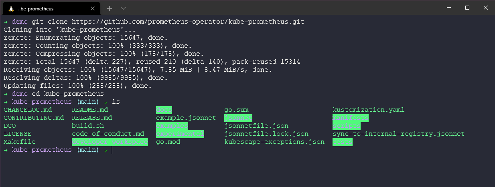
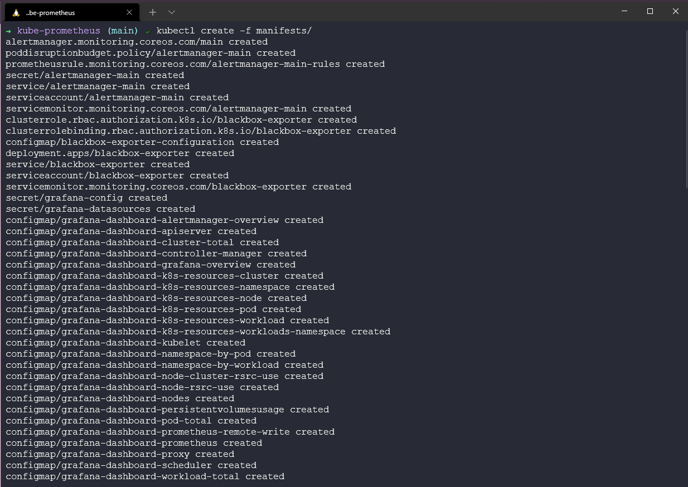
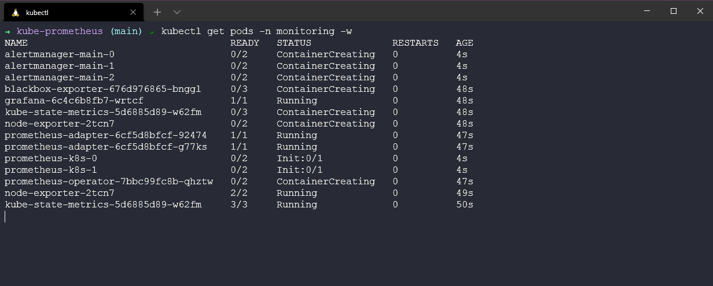
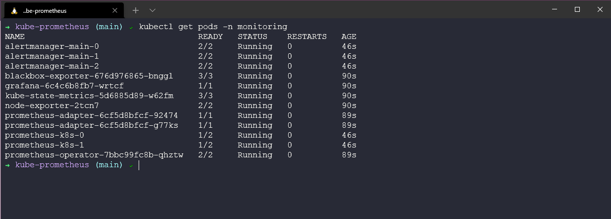
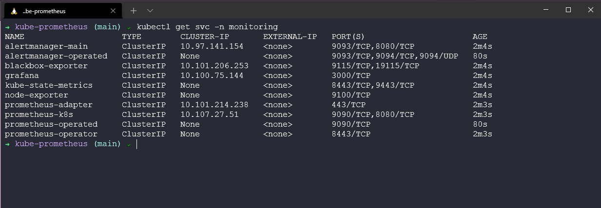

## Trực quan hóa dữ liệu - Grafana

Chúng ta đã thấy nói đến Kibana khá nhiều trong phần liên quan tới khả năng quan sát (Observability). Nhưng chúng ta cũng phải dành chút thời gian để tìm hiểu về Grafana. Chúng là hai thức khác biệt và cũng không hoàn toàn cạnh tranh cụ thể với nhau.

Tính năng cốt lõi của Kibana là truy vấn và phân tích dữ liệu. Bằng nhiều phương pháp khác nhau, người dùng có thể tìm kiếm dữ liệu được lập chỉ mục trong Elasticsearch cho các các sự kiện hoặc chuỗi cụ thể trong dữ liệu của họ để phân tích, phán đoán nguyên nhân gốc rễ. Dựa trên những truy vấn này, người dùng có thể sử dụng các tính năng trực quan hoá của Kibana, cho phép người dùng trực quan hoá dữ liệu theo nhiều các khách nhau, sử dụng biểu đồ, bảng, bản đồ địa lý và các loại trực quan hoá khác.

Grafana bắt đầu như một bản fork của Kibana, Grafana có mục đích cung cấp hỗ trợ cho các metrics aka monitoring, điều mà vào thời điểm đó Kibana không cung cấp. 

Grafana là một công cụ trực quan hoá dữ liệu nguồn mở và miễn phí. Chúng ta thường thấy Prometheus và Grafana cùng nhau trong thực tế nhưng cũng có thể thấy nó hoạt động với ElasticSearch và Graphite.

Sự khác biệt chính giữa hai công cụ là Logging và Monitoring, chúng ta đã bắt đầu tuần này bằng việc giám sát bằng Nagios, sau đó là Prometheus trước khi chuyển sang Logging, nơi chúng ta đề cập tới ELK và EFK stack.

Grafana phục vụ cho việc phân tích và trực quan hoá các số liệu như CPU hệ thống, bộ nhớ, đĩa và mức sử dụng I/O. Nền tảng không cho phép truy vấn dữ liệu toàn văn (full-text data querying). Kibana chạy trên Elasticsearch và nó được sử dụng chủ yếu cho việc phân tích log message.

Như chúng ta đã tìm hiểu với Kibana, việc triển khai và lựa chọn nơi triển khai khá dễ dàng, điều này cũng tương tự với Grafana.

Cả hai đều hỗ trợ cài đặt trên Linux, Mac, Windows, Docker hoặc build từ nguồn.

Không còn nghi ngờ gì nữa, Grafana là một công cụ và tôi đã gặp trên cả các nền tảng ảo hoá, đám mây và các nền tảng cloud-native, chính vì vậy, tôi muốn đề cập tới nó trong phần này.

### Prometheus Operator + Grafana Deployment

Chúng ta đã đề cập tới Prometheus trong phần này nhưng vì muốn đảm bảo tính liên tục, tôi muốn tạo ra một môi trường cho phép chúng ta có thể xem được những metrics một cách trực quan. Chúng ta hiểu được tầm quan trọng của việc giám sát môi trường nhưng việc chỉ đọc các metrics đó trong Prometheus hoặc bất kỳ công cụ quản lý metrics nào sẽ trở nên cồng kềnh và không có tính mở rộng. Đây là lúc Grafana xuất hiện và cung cấp cho chúng ta hình ảnh trực quan có thể tương tác được về các metrics được thu thập và lưu trữ ở Prometheus database.

Với sự trực quan đó, chúng ta có thể tạo biểu đồ, đồ thị và cảnh báo tuỳ chỉnh cho môi trường của mình. Trong hướng dẫn này, chúng ta sẽ sử dụng minikube cluster của mình.

Chúng ta sẽ bắt đầu bằng cách sao chép nó vào hệ thống cục bộ của mình. Sử dụng lệnh `git clone https://github.com/prometheus-operator/kube-prometheus.git` và `cd kube-prometheus`



Việc đầu tiên là tạo namespace trong minikube cluster `kubectl create -f manifests/setup`. Nếu bạn chưa theo dõi các phần trước, chúng ta có thể sử dụng lệnh `minikube start` để tạo một cluster mới.


Tiếp theo, chúng ta sẽ triển khai mọi thứ chúng ta cần cho bản demo bằng lệnh `kubectl create -f manifests/`, bạn có thể thấy lệnh này sẽ triển khai rất nhiều tài nguyên khác trong cluster của chúng ta.



Sau đó, chúng ta cần đợi các pods của mình được khởi tạo và ở trạng thái sẵn sàng, chúng ta có thể sử dụng lệnh `kubectl get pods -n monitoring -w` để theo dõi các pods.



Khi mọi thứ đang chạy, chúng ta có thể kiểm tra tất cả các pods đang ở trạng thái hoạt động và hoạt động tốt bằng cách sử dụng lệnh `kubectl get pods -n monitoring`.



Chúng ta đã triển khai một số dịch vụ sẽ được sử dụng sau này trong demo, có thể kiểm tra bằng lệnh `kubectl get svc -n monitoring`.



Cuối cùng, hãy kiểm tra tất cả các tài nguyên được triển khai trong namespace monitoring mới dùng cho bằng câu lệnh `kubectl get all -n monitoring`.


Mở một terminal mới, chúng ta hiện đã sẵn sàng cho sử dụng công cụ Grafana của mình và bắt đầu thu thập, trực quan hoá một số metrics, câu lệnh cần sử dụng là `kubectl --namespace monitoring port-forward svc/grafana 3000`


Mở trình duyệt và đi tới http://localhost:3000, bạn sẽ cần nhập tên người dùng và mật khẩu.


Tên người dùng và mật khẩu mặc định sẽ là

```
Username: admin
Password: admin
```

Tuy nhiên, bạn sẽ được yêu cầu cung cấp mật khẩu mới ở lần đăng nhập đầu tiên. Màn hình hoặc trang chủ mà bạn thấy sẽ có một số phần để khám phá cũng như một số tài nguyên hữu ích để có thể sử dụng Grafana và các chức năng của nó. Hãy lưu ý phần "Add your first data source" và "create your first dashboard" widgets sẽ được sử dụng ở phần sau.


Bạn sẽ thấy rằng đã có nguồn dữ liệu Prometheus được thêm vào nguồn dữ liệu Grafana của chúng ta, tuy nhiên, vì chúng ta đang sử dụng minikube nên chúng ta cũng cần chuyển tiếp cổng cho Prometheus để nó có thể truy cập bằng localhost. Mở một terminal mới, chúng ta có thể chạy lệnh sau  `kubectl --namespace monitoring port-forward svc/prometheus-k8s 9090` nếu trên trang chủ của Grafana, chúng ta bắt đầu sử dụng widget "Add your first data source" và tại đây, chúng ta chon Prometheus.


Đối với nguồn dữ liệu mới, chúng ta có thể sử dụng địa chỉ http://localhost:9090 và chúng ta cũng sẽ cần lựa chọn "Browser" như ảnh bên dưới.


Ở cuối trang, chúng ta có thể nhấn "Save & test". Nếu chuyển tiếp cổng của Prometheus hoạt động chính xác, bạn có thể thấy kết quả như dưới đây.


Quay lại trang chủ và tìm tuỳ chọn "Create your first dashboard" chọn mục "Add a new panel"


Bạn sẽ thấy 
You will see from below that we are already gathering from our Grafana data source, but we would like to gather metrics from our Prometheus data source, select the data source drop down and select our newly created "Prometheus-1"


If you then select the Metrics browser you will have a long list of metrics being gathered from Prometheus related to our minikube cluster.


For the demo I am going to find a metric that gives us some output around our system resources, `cluster:node_cpu:ratio{}` gives us some detail on the nodes in our cluster and proves that this integration is working.


Once you are happy with this as your visualisation then you can hit the apply button in the top right and you will then add this graph to your dashboard. You can go ahead and add additional graphs and other charts to give you the visuals that you need.


We can however take advantage of thousands of previously created dashboards that we can use so that we do not need to reinvent the wheel.


If we search Kubernetes we will see a long list of pre-built dashboards that we can choose from.


We have chosen the Kubernetes API Server dashboard and changed the data source to suit our newly added Prometheus-1 data source and we get to see some of the metrics displayed below.


### Cảnh báo - Alerting

Bạn cũng có thể tận dùng alertmanager mà chúng ta đã triển khai để gửi cảnh báo tới slack hoặc các tích hợp khác. Để thực hiện việc này, bạn cần port forward alertmanager bằng các sử dụng các thông tin bên dưới.

`kubectl --namespace monitoring port-forward svc/alertmanager-main 9093`
`http://localhost:9093`

Điều này đã khép lại phần về khả năng quan sát - observability, cá nhân tôi nhận thấy rằng phần này đã nêu bật mức độ rộng của chủ đề này và tầm quan trọng của chúng với vai trò của chúng ta. Metrics, logging hay tracing là thứ chúng ta sẽ cần phải theo dõi và nắm chắc khi môi trường được mở rộng và thay đổi liên tục, đặc biệt là chúng có thể thay đổi đáng kể nhờ tất cả quá trình tự động hoá mà chúng ta đã đề cập trong các phần khác.

Tiếp theo, chúng ta sẽ xem xét quản lý dữ liệu và cách xem xét các nguyên tắc DevOps khi nói đến quản lý dữ liệu.

## Tài liệu tham khảo

- [Understanding Logging: Containers & Microservices](https://www.youtube.com/watch?v=MMVdkzeQ848)
- [The Importance of Monitoring in DevOps](https://www.devopsonline.co.uk/the-importance-of-monitoring-in-devops/)
- [Understanding Continuous Monitoring in DevOps?](https://medium.com/devopscurry/understanding-continuous-monitoring-in-devops-f6695b004e3b)
- [DevOps Monitoring Tools](https://www.youtube.com/watch?v=Zu53QQuYqJ0)
- [Top 5 - DevOps Monitoring Tools](https://www.youtube.com/watch?v=4t71iv_9t_4)
- [How Prometheus Monitoring works](https://www.youtube.com/watch?v=h4Sl21AKiDg)
- [Introduction to Prometheus monitoring](https://www.youtube.com/watch?v=5o37CGlNLr8)
- [Promql cheat sheet with examples](https://www.containiq.com/post/promql-cheat-sheet-with-examples)
- [Log Management for DevOps | Manage application, server, and cloud logs with Site24x7](https://www.youtube.com/watch?v=J0csO_Shsj0)
- [Log Management what DevOps need to know](https://devops.com/log-management-what-devops-teams-need-to-know/)
- [What is ELK Stack?](https://www.youtube.com/watch?v=4X0WLg05ASw)
- [Fluentd simply explained](https://www.youtube.com/watch?v=5ofsNyHZwWE&t=14s)

Hẹn gặp lại vào [ngày 84](day84.md)
