## Khôi phục thảm họa (DR)

Chúng ta đã đề cập đến các kịch bản sự cố khác nhau sẽ đòi hỏi các yêu cầu khôi phục khác nhau. Khi nói đến các kịch bản Lửa, Lũ lụt và Máu, chúng ta có thể xem đây là các tình huống thảm họa mà chúng ta cần phải có các ứng dụng của mình hoạt động ở một vị trí hoàn toàn khác càng nhanh càng tốt hoặc ít nhất với mục tiêu thời gian khôi phục gần như bằng không (RTO).

Điều này chỉ có thể đạt được ở quy mô lớn khi bạn tự động hóa việc sao chép toàn bộ stack ứng dụng sang một môi trường dự phòng.

Điều này cho phép việc chuyển đổi nhanh chóng giữa các cloud regions, nhà cung cấp cloud hoặc giữa on-premise và cloud.

Tiếp tục với chủ đề này, chúng ta sẽ tập trung vào việc làm sao có thể đạt được điều này bằng cách sử dụng Kasten K10 với cụm minikube mà chúng ta đã triển khai và cấu hình trong các bài viết trước.

Chúng ta sẽ sau đó tạo một cụm minikube khác với Kasten K10 cũng được cài đặt để đóng vai trò là cụm dự phòng của chúng ta, mà về lý thuyết có thế đặt tại bất cứ đâu.

Kasten K10 cũng có chức năng tích hợp để đảm bảo rằng nếu có gì đó xảy ra với cụm Kubernetes mà nó đang chạy, dữ liệu danh mục sẽ được sao chép và có sẵn trong một cụm mới [K10 Khôi phục Thảm họa](https://docs.kasten.io/latest/operating/dr.html).

### Thêm object storage vào K10

Điều đầu tiên chúng ta cần làm là thêm một object storage bucket làm target location để các bản sao lưu của chúng ta đến. Điều này không chỉ đóng vai trò như một vị trí ngoài site mà chúng ta còn có thể tận dụng nó làm nguồn dữ liệu khôi phục thảm họa.

Tôi đã dọn sạch bucket S3 mà chúng ta đã tạo cho bản demo Kanister trong phiên trước.


Chuyển tiếp cổng để truy cập bảng điều khiển K10, mở một terminal mới để chạy lệnh dưới đây:

`kubectl --namespace kasten-io port-forward service/gateway 8080:8000`

Bảng điều khiển Kasten sẽ khả dụng tại `http://127.0.0.1:8080/k10/#/`


Để xác thực với bảng điều khiển, chúng ta cần token mà chúng ta có thể lấy bằng các lệnh sau.

```Shell
TOKEN_NAME=$(kubectl get secret --namespace kasten-io|grep k10-k10-token | cut -d " " -f 1)
TOKEN=$(kubectl get secret --namespace kasten-io $TOKEN_NAME -o jsonpath="{.data.token}" | base64 --decode)

echo "Token value: "
echo $TOKEN
```


Bây giờ chúng ta lấy token này và nhập vào trình duyệt, sau đó bạn sẽ được yêu cầu nhập email và tên công ty.


Sau đó, chúng ta sẽ truy cập được vào bảng điều khiển Kasten K10.


Bây giờ khi chúng ta đã quay lại bảng điều khiển Kasten K10, chúng ta có thể thêm hồ sơ vị trí của mình, chọn "Settings" ở đầu trang và "New Profile".


Bạn có thể thấy như hình dưới rằng chúng ta có nhiều lựa chọn về vị trí của hồ sơ này, chúng ta sẽ chọn Amazon S3 và thêm vào thông tin đăng nhập, region và tên bucket.

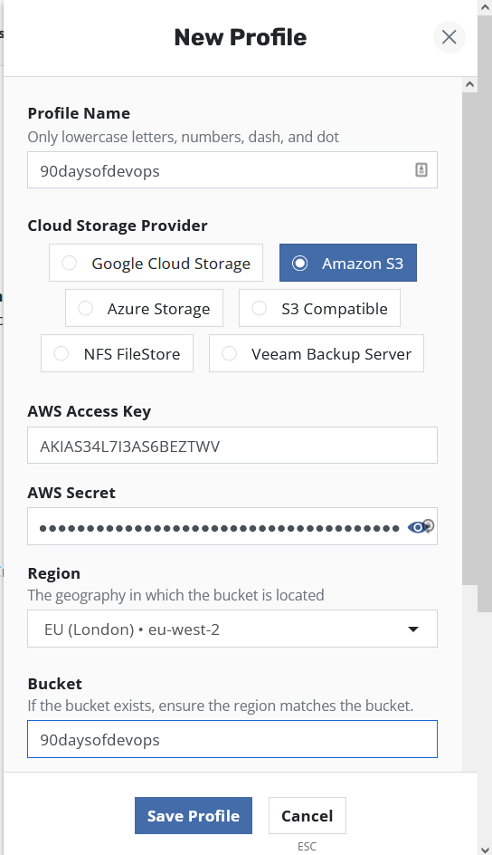

Nếu chúng ta cuộn xuống trong cửa sổ tạo New Profile, bạn sẽ thấy rằng chúng ta cũng có thể bật các bản sao lưu không thể thay đổi bằng cách sử dụng API Object Lock của S3. Trong bản demo này, chúng ta sẽ không sử dụng tính năng đó.

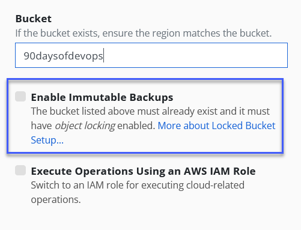

Nhấn "Save Profile" và bạn sẽ thấy hồ sơ vị trí vừa được tạo hoặc thêm của chúng ta như bên dưới.


### Tạo policy để bảo vệ ứng dụng Pac-Man trong object storage

Trong phiên trước, chúng ta chỉ tạo một bản snapshot ngẫu nhiên của ứng dụng Pac-Man, vì vậy chúng ta cần tạo một chính sách sao lưu sẽ gửi các bản sao lưu ứng dụng của chúng ta đến vị trí obeject strorage mới tạo của chúng ta.

Nếu bạn quay lại bảng điều khiển và chọn thẻ Chính sách, bạn sẽ thấy một màn hình như bên dưới. Chọn "Create New Policy".


Đầu tiên, chúng ta có thể đặt tên và mô tả hữu ích cho chính sách của mình. Chúng ta cũng có thể xác định tần suất sao lưu của mình cho mục đích demo, tôi đang sử dụng theo yêu cầu.


Tiếp theo, chúng ta muốn bật sao lưu qua xuất Snapshot có nghĩa là chúng ta muốn gửi dữ liệu của mình đến location profile. Nếu bạn có nhiều profile, bạn có thể chọn profile nào bạn muốn gửi các bản sao lưu của mình đến.


Tiếp theo, chúng ta chọn ứng dụng theo tên hoặc nhãn, tôi sẽ chọn theo tên và tất cả các tài nguyên.


Dưới Advanced settings, chúng ta sẽ không sử dụng bất kỳ cài đặt nào trong số này nhưng dựa trên [hướng dẫn của Kanister trong bài viết trước](day88.md), chúng ta có thể tận dụng Kanister như một phần của Kasten K10 để lấy các bản sao nhất quán của dữ liệu của chúng ta.


Cuối cùng, chọn "Create Policy" và bạn sẽ thấy chính sách trong cửa sổ Policy.

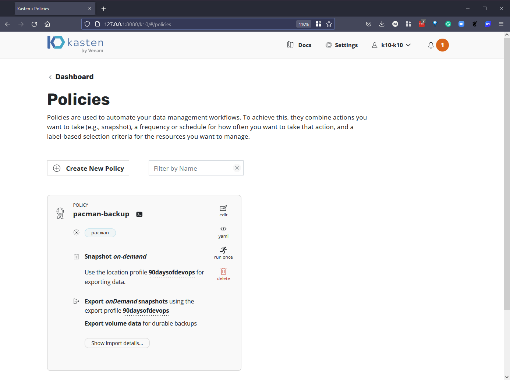

Ở cuối chính sách được tạo, bạn sẽ thấy "Show import details", chúng ta cần chuỗi này để có thể nhập vào cụm dự phòng của mình. Sao chép nó vào nơi an toàn ngay bây giờ.

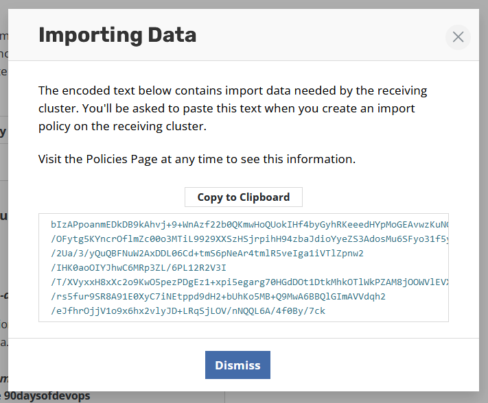

Trước khi tiếp tục, chúng ta chỉ cần chọn "run once" để gửi một bản sao lưu đến object storage bucket.


Dưới đây là ảnh chụp màn hình để hiển thị bản sao lưu thành công và xuất dữ liệu của chúng ta.


### Tạo cụm MiniKube mới & triển khai K10

Sau đó, chúng ta cần triển khai một cụm Kubernetes thứ hai dùng bất kỳ phiên bản Kubernetes nào được hỗ trợ, bao gồm cả OpenShift, cho mục đích học tập, chúng ta sẽ sử dụng phiên bản MiniKube miễn phí với một tên khác.

Sử dụng `minikube start --addons volumesnapshots,csi-hostpath-driver --apiserver-port=6443 --container-runtime=containerd -p standby --kubernetes-version=1.21.2`, chúng ta có thể tạo cụm mới của mình.


Sau đó, chúng ta có thể triển khai Kasten K10 trong cụm này bằng cách sử dụng:

`helm install k10 kasten/k10 --namespace=kasten-io --set auth.tokenAuth.enabled=true --set injectKanisterSidecar.enabled=true --set-string injectKanisterSidecar.namespaceSelector.matchLabels.k10/injectKanisterSidecar=true --create-namespace`

Điều này sẽ mất một thời gian nhưng trong khi chờ đợi, chúng ta có thể sử dụng `kubectl get pods -n kasten-io -w` để theo dõi tiến trình của các pod đến khi hoàn tất.

Đáng lưu ý rằng vì chúng ta đang sử dụng MiniKube, ứng dụng của chúng ta sẽ chỉ chạy khi chúng ta chạy chính sách nhập của mình, storageclass của chúng ta là như nhau trên cụm dự phòng này. Tuy nhiên, một điều chúng ta sẽ đề cập trong phiên cuối là tính di động và biến đổi.

Khi các pod đã chạy, chúng ta có thể theo dõi các bước mà chúng ta đã thực hiện trong các bước trước đó trong cụm khác.

Chuyển tiếp cổng để truy cập bảng điều khiển K10, mở một terminal mới để chạy lệnh dưới đây

`kubectl --namespace kasten-io port-forward service/gateway 8080:8000`

Bảng điều khiển Kasten sẽ khả dụng tại `http://127.0.0.1:8080/k10/#/`


Để xác thực với bảng điều khiển, chúng ta cần token mà chúng ta có thể lấy bằng các lệnh sau.

```Shell
TOKEN_NAME=$(kubectl get secret --namespace kasten-io|grep k10-k10-token | cut -d " " -f 1)
TOKEN=$(kubectl get secret --namespace kasten-io $TOKEN_NAME -o jsonpath="{.data.token}" | base64 --decode)

echo "Token value: "
echo $TOKEN
```


Bây giờ chúng ta lấy token này và nhập vào trình duyệt, sau đó bạn sẽ được yêu cầu nhập email và tên công ty.


Sau đó, chúng ta sẽ truy cập được vào bảng điều khiển Kasten K10.


### Import Pac-Man vào cụm MiniKube mới

Tại thời điểm này, chúng ta có thể tạo một chính sách import vào cụm dự phòng đó và kết nối với các bản sao lưu trên object storage bucket và xác định những gì và cách chúng ta muốn điều này trông như thế nào.

Đầu tiên, chúng ta thêm Location Profile mà chúng ta đã thực hiện trong cụm khác, dark mode ở đây để hiển thị sự khác biệt giữa hệ thống sản xuất của chúng ta và vị trí dự phòng DR của chúng ta.

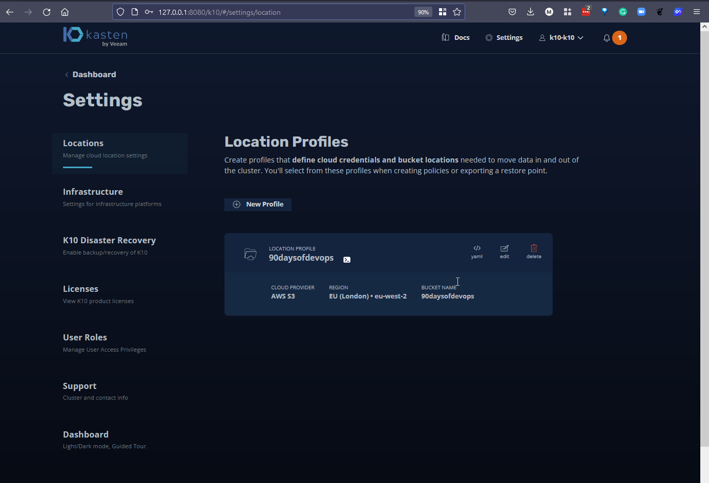

Bây giờ chúng ta quay lại bảng điều khiển và vào tab policy để tạo một policy mới.


Tạo import policy như hình dưới. Khi hoàn tất, chúng ta có thể tạo một policy. Có các tùy chọn ở đây để khôi phục sau khi import và một số người có thể muốn tùy chọn này, điều này sẽ được khôi phục vào cụm dự phòng của chúng ta sau khi hoàn tất. Chúng ta cũng có thể thay đổi cấu hình của ứng dụng khi nó được khôi phục và đây là những gì tôi đã ghi lại trong [Ngày 90](day90.md).

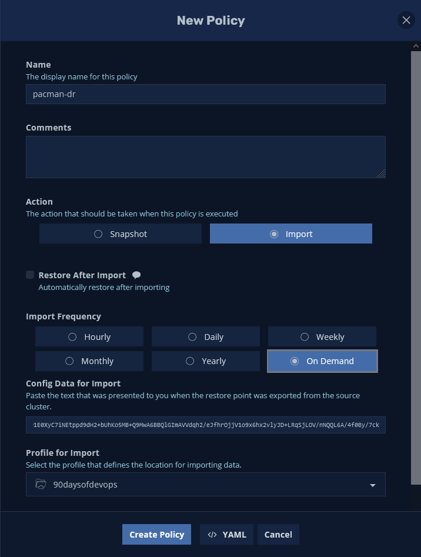

Tôi đã chọn import theo yêu cầu, nhưng bạn có thể đặt lịch khi bạn muốn nhập này diễn ra. Vì điều này, tôi sẽ chạy một lần.

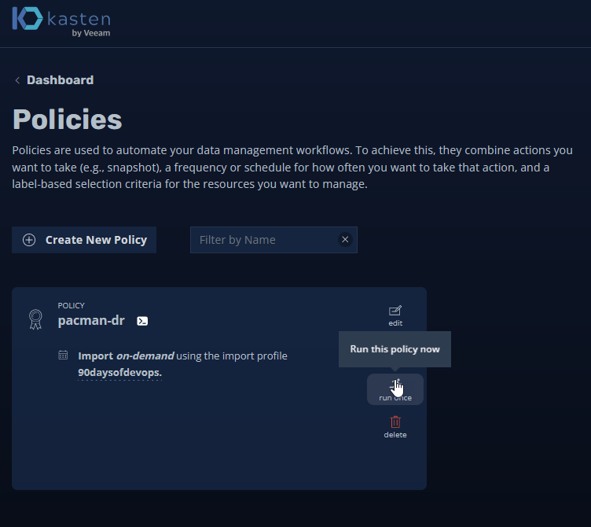

Bạn có thể thấy bên dưới import policy job thành công.

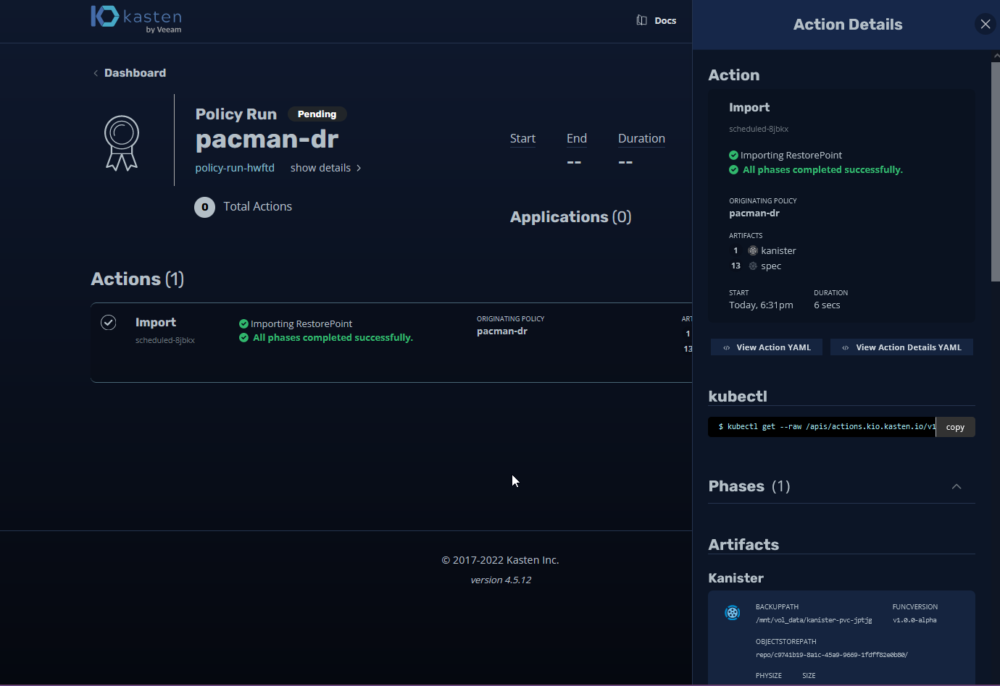

Nếu chúng ta quay lại bảng điều khiển và vào thẻ Applications, chúng ta có thể chọn thả xuống nơi bạn thấy bên dưới "Removed" bạn sẽ thấy ứng dụng của chúng ta ở đây. Chọn Restore

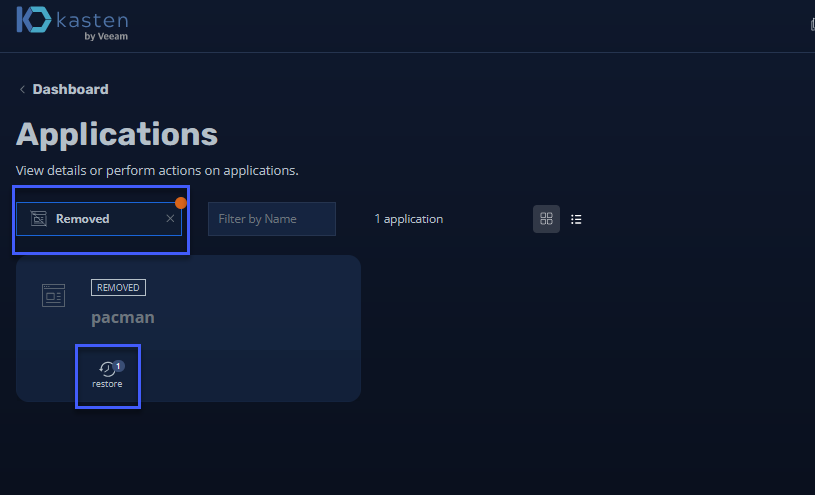

Tại đây, chúng ta có thể thấy các điểm khôi phục mà chúng ta có sẵn; đây là công việc sao lưu mà chúng ta đã chạy trên cụm chính đối với ứng dụng Pac-Man của chúng ta.


Tôi sẽ không thay đổi bất kỳ mặc định nào vì tôi muốn trình bày chi tiết hơn về điều này trong bài viết tiếp theo.

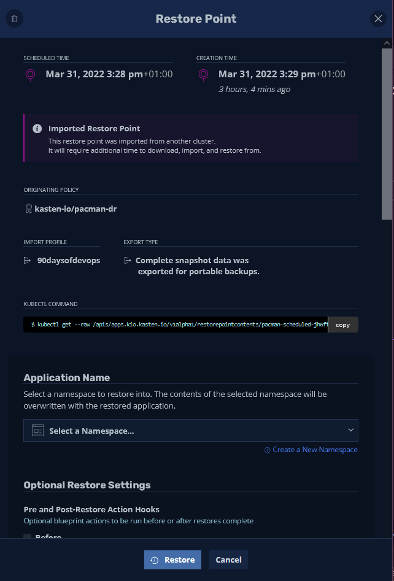

Khi bạn nhấn "Restore" nó sẽ yêu cầu bạn xác nhận.

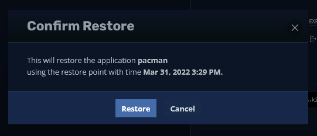

Chúng ta có thể thấy bên dưới rằng chúng ta đang ở trong cụm dự phòng và nếu chúng ta kiểm tra các pod của mình, chúng ta có thể thấy rằng chúng ta đã có ứng dụng đang chạy.

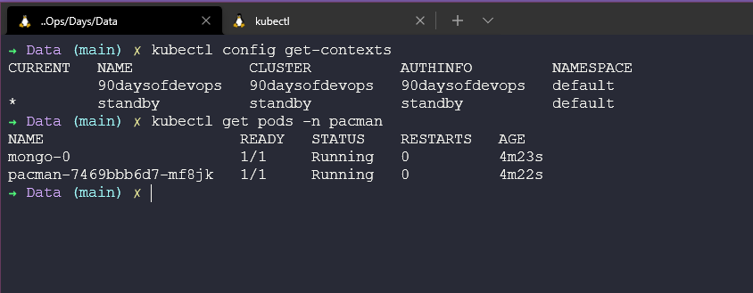

Chúng ta có thể sau đó chuyển tiếp cổng (trong các môi trường thực tế / sản xuất, bạn sẽ không cần bước này để truy cập ứng dụng, bạn sẽ sử dụng ingress)


Tiếp theo, chúng ta sẽ xem xét tính di động và biến đổi của ưng dụng.

## Tài liệu tham khảo

- [Kubernetes Backup and Restore made easy!](https://www.youtube.com/watch?v=01qcYSck1c4&t=217s)
- [Kubernetes Backups, Upgrades, Migrations - with Velero](https://www.youtube.com/watch?v=zybLTQER0yY)
- [7 Database Paradigms](https://www.youtube.com/watch?v=W2Z7fbCLSTw&t=520s)
- [Disaster Recovery vs. Backup: What's the difference?](https://www.youtube.com/watch?v=07EHsPuKXc0)
- [Veeam Portability & Cloud Mobility](https://www.youtube.com/watch?v=hDBlTdzE6Us&t=3s)

Hẹn gặp lại vào [ngày 90](day90.md)
