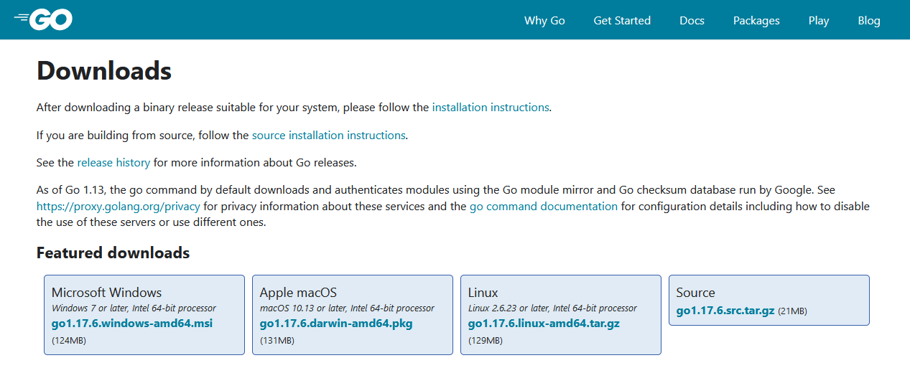
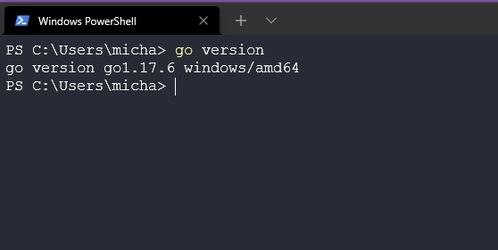
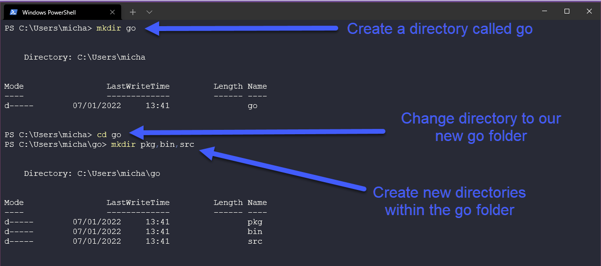
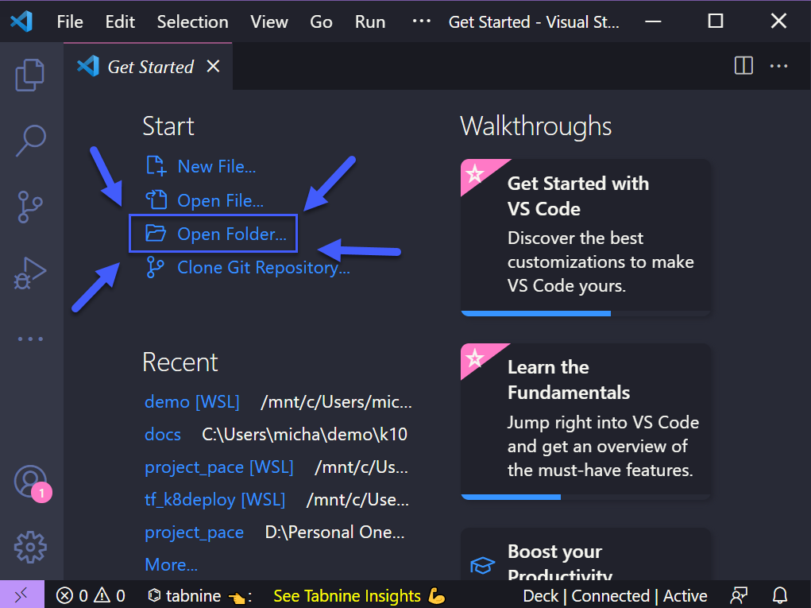

## 配置Go语言的DevOps环境 & Hello World

在我们开始学习Go的基础知识之前，我们要在我们的工作设备上安装Go，并按照“学习编程101”的教程来创建Hello World程序。这一小节将一步步在你的机器上完成Go的安装，我们会使用截图来记录整个过程，从而让大家能更好地跟进。

首先，前往[go.dev/dl](https://go.dev/dl/)，你会看到一些可供下载的选项。



如果你已经知道了你的工作设备运行的是哪个操作系统，选择对应的下载选项然后我们就可以开始安装了。在这个演示中，我使用的是Windows。基本的，从下面的截屏开始，我们可以保留所有默认设置。***我在撰写这里的时候这是最新版本，所以截图可能已经过时***


另外需要注意，如果你安装了较旧版本的Go，你应该在安装新版前将它卸载掉。Windows已将它内置到安装程序中，并会作为一个整体来删除和安装。

完成后，你现在应该打开命令提示符/终端，我们检查一下是否已安装Go。如果你没有下图的输出，那么Go没有安装成功，你需要重新进行刚才的步骤。

`go version`



接下来，我们检查一下Go的环境。这样的检查可以很好地确认你的工作目录配置是正确的，你可以看到下图的信息，我们需要确保这些地址存在于你的系统中。


已经检查完了吗？有跟着去操作嘛？如果你尝试去到那里，你很可能会得到类似下图的内容。


OK，为了方便起见，我们创建新的目录，我将在powershell终端中输入mkdir命令。我们还需要在Go文件夹中新建三个文件夹，如下图所示。



现在我们已经安装好Go，并且准备好了我们的Go工作目录。下一步我们需要一个集成开发环境(IDE)。如今已有许多的选择，其中一个最常见的也是我使用的是Visual Studio Code或被称为Code。你可以在[这里](https://www.youtube.com/watch?v=vUn5akOlFXQ)了解更多有关IDEs的信息。

如果你还没有在工作设备上下载并安装VSCode，那么你可以访问[这里](https://code.visualstudio.com/download)。你会看到如下图中提供了不同操作系统的选项。


与Go的安装类似的，我们会下载并按照默认设置进行安装。完成后，你可以打开VSCode，然后选择Open File，定位到我们之前创建的Go目录。



你会看到一个关于信任(trust)的弹窗，如果你感兴趣，可以阅读一下，然后点击Yes, trust the authors。(如果你打开了自己不信任的东西，我将不负责！)

现在，你应该会看到之前创建的三个文件夹，右键单击sr文件夹并创建一个名为`Hello`的文件夹。


到目前为止的操作应该还是很简单的吧？然后哦我们要新建我们的第一个Go程序，虽然我们还不理解在下一步里边写的是什么。

下一步，在`Hello`文件夹中新建名为`main.go`的文件。一旦你在main.go上按下Enter键，你将会被询问是否要安装Go的拓展程序和库。你也可以检查前几步中的空文件夹pkg，并发现我们已经添加了一些库在里边？


将下边的代码复制到main.go中并保存，然后运行这个Hello World。

```
package main

import "fmt"

func main() {
    fmt.Println("Hello #90-Days-of-DevOps-as-a-Learning")
}
```
我承认上边的内容好像并没有什么意义，但我们将在未来介绍更多关于函数(functions)、库(packages)等等的内容。先把我们的程序运行起来。回到终端，在Hello文件夹中，我们可以检查一切是否正常。如果我们的程序一切正常，输入下边的命令将显示预期的结果。

```
go run main.go
```


到这里还没有完，如果我们想让程序在另一台Windows机器上运行，该如何操作呢？我们可以通过build来构建二进制文件，从而做到这一点。

```
go build main.go
``` 


当我们运行它时，可以看到相同的输出：

```bash
$ ./main.exe
Hello #90-Days-of-DevOps-as-a-Learning
```

## 相关资料

- [StackOverflow 2021 Developer Survey](https://insights.stackoverflow.com/survey/2021)
- [Why we are choosing Golang to learn](https://www.youtube.com/watch?v=7pLqIIAqZD4&t=9s)
- [Jake Wright - Learn Go in 12 minutes](https://www.youtube.com/watch?v=C8LgvuEBraI&t=312s) 
- [Techworld with Nana - Golang full course - 3 hours 24 mins](https://www.youtube.com/watch?v=yyUHQIec83I) 
- [**NOT FREE** Nigel Poulton Pluralsight - Go Fundamentals - 3 hours 26 mins](https://www.pluralsight.com/courses/go-fundamentals) 
- [FreeCodeCamp -  Learn Go Programming - Golang Tutorial for Beginners](https://www.youtube.com/watch?v=YS4e4q9oBaU&t=1025s) 
- [Hitesh Choudhary - Complete playlist](https://www.youtube.com/playlist?list=PLRAV69dS1uWSR89FRQGZ6q9BR2b44Tr9N) 


让我们[第九天](day09.md)见！

