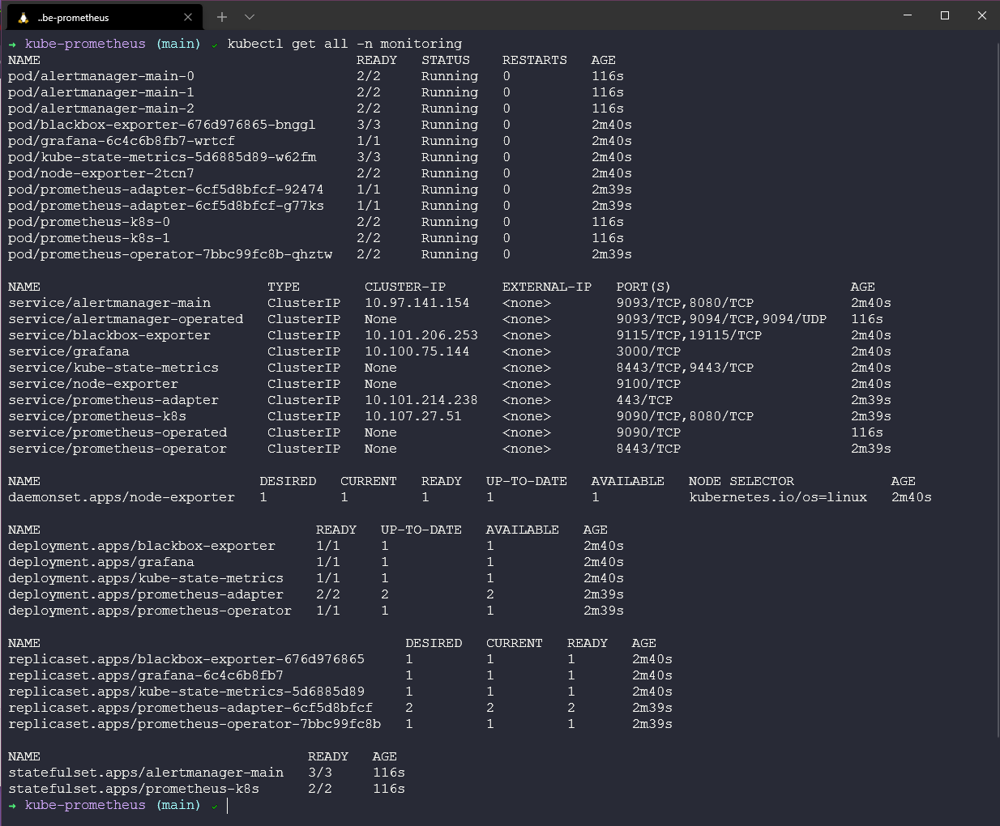
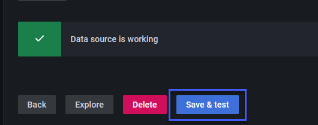
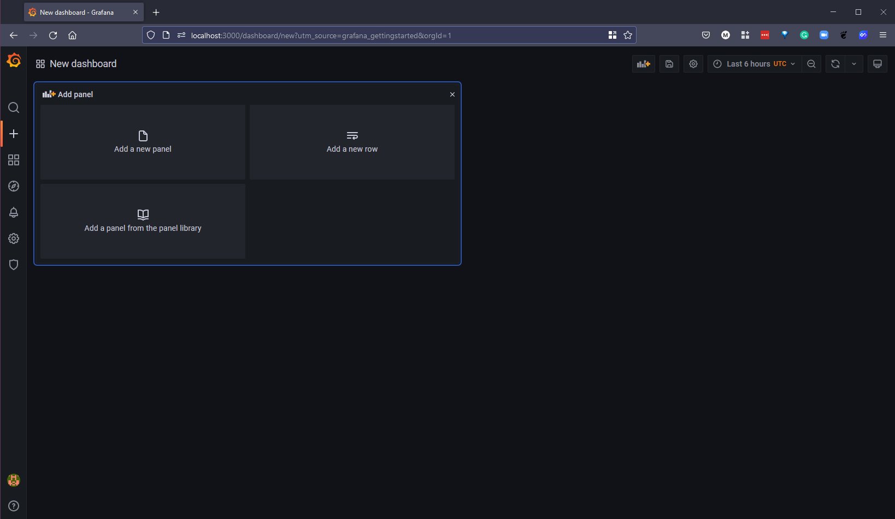
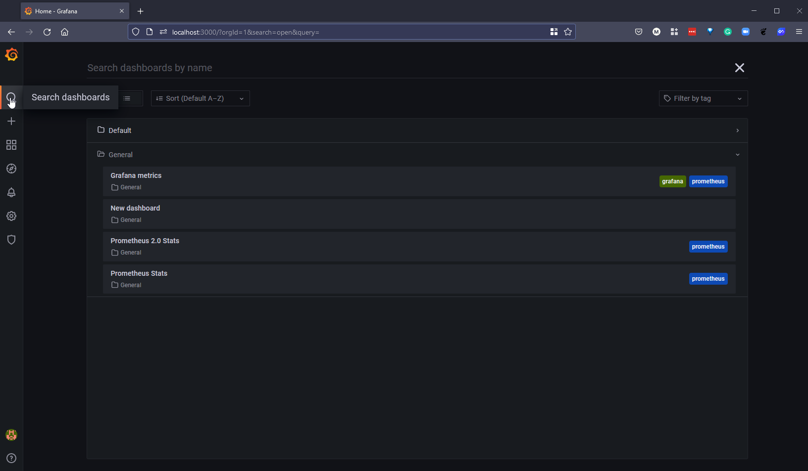
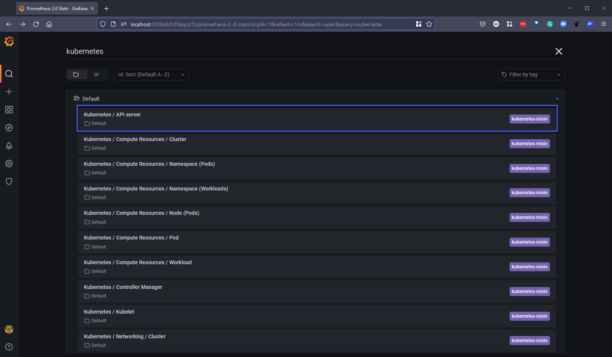

## Data Visualisation - Grafana

We saw a lot of Kibana over this section around Observability. But we have to also take some time to cover Grafana. But also they are not the same and they are not completely competing against each other. 

Kibana’s core feature is data querying and analysis. Using various methods, users can search the data indexed in Elasticsearch for specific events or strings within their data for root cause analysis and diagnostics. Based on these queries, users can use Kibana’s visualisation features which allow users to visualize data in a variety of different ways, using charts, tables, geographical maps and other types of visualizations.

Grafana actually started as a fork of Kibana, Grafana had an aim to supply support for metrics aka monitoring, which at that time Kibana did not provide. 

Grafana is a free and Open-Source data visualisation tool. We commonly see Prometheus and Grafana together out in the field but we might also see Grafana alongside Elasticsearch and Graphite. 

The key difference between the two tools is Logging vs Monitoring, we started the section off covering monitoring with Nagios and then into Prometheus before moving into Logging where we covered the ELK and EFK stacks. 

Grafana caters to analysing and visualising metrics such as system CPU, memory, disk and I/O utilisation. The platform does not allow full-text data querying. Kibana runs on top of Elasticsearch and is used primarily for analyzing log messages. 

As we have already discovered with Kibana it is quite easy to deploy as well as having the choice of where to deploy, this is the same for Grafana. 

Both support installation on Linux, Mac, Windows, Docker or building from source. 

There are no doubt others but Grafana is a tool that I have seen spanning the virtual, cloud and cloud-native platforms so I wanted to cover this here in this section. 

### Prometheus Operator + Grafana Deployment 

We have covered Prometheus already in this section but as we see these paired so often I wanted to spin up an environment that would allow us to at least see what metrics we could have displayed in a visualisation. We know that monitoring our environments is important but going through those metrics alone in Prometheus or any metric tool is going to be cumbersome and it is not going to scale. This is where Grafana comes in and provides us that interactive visualisation of those metrics collected and stored in the Prometheus database. 

With that visualisation we can create custom charts, graphs and alerts for our environment. In this walkthrough we will be using our minikube cluster. 

We are going to start by cloning this down to our local system. Using `git clone https://github.com/prometheus-operator/kube-prometheus.git` and `cd kube-prometheus`


First job is to create our namespace within our minikube cluster `kubectl create -f manifests/setup` if you have not been following along in previous sections we can use `minikube start` to bring up a new cluster here. 


Next we are going to deploy everything we need for our demo using the `kubectl create -f manifests/` command, as you can see this is going to deploy a lot of different resources within our cluster. 


We then need to wait for our pods to come up and being in the running state we can use the `kubectl get pods -n monitoring -w` command to keep an eye on the pods. 


When everything is running we can check all pods are in a running and healthy state using the `kubectl get pods -n monitoring` command. 


With the deployment, we deployed  a number of services that we are going to be using later on in the demo you can check these by using the `kubectl get svc -n monitoring` command. 


And finally lets check on all resources deployed in our new monitoring namespace using the `kubectl get all -n monitoring` command. 



Opening a new terminal we are now ready to access our Grafana tool and start gathering and visualising some of our metrics, the command to use is`kubectl --namespace monitoring port-forward svc/grafana 3000`


Open a browser and navigate to http://localhost:3000 you will be prompted for a username and password. 


The default username and password to access is 
```
Username: admin 
Password: admin
```
However you will be asked to provide a new password at first login. The initial screen or home page you will see will give you some areas to explore as well as some useful resources to get up to speed with Grafana and its capabilities. Notice the "Add your first data source" and "create your first dashboard" widgets we will be using them later. 


You will find that there is already a prometheus data source already added to our Grafana data sources, however because we are using minikube we need to also port forward prometheus so that this is available on our localhost, opening a new terminal we can run the following command. `kubectl --namespace monitoring port-forward svc/prometheus-k8s 9090` if on the home page of Grafana we now enter into the widget "Add your first data source" and from here we are going to select Prometheus. 


For our new data source we can use the address http://localhost:9090 and we will also need to change the dropdown to browser as highlighted below.


At the bottom of the page, we can now hit save and test. This should give us the outcome you see below if the port forward for prometheus is working. 



Head back to the home page and find the option to "Create your first dashboard" select "Add a new panel"



You will see from below that we are already gathering from our Grafana data source, but we would like to gather metrics from our Prometheus data source, select the data source drop down and select our newly created "Prometheus-1" 


If you then select the Metrics browser you will have a long list of metrics being gathered from Prometheus related to our minikube cluster. 


For the purpose of the demo I am going to find a metric that gives us some output around our system resources, `cluster:node_cpu:ratio{}` gives us some detail on the nodes in our cluster and proves that this integration is working. 


Once you are happy with this as your visualisation then you can hit the apply button in the top right and you will then add this graph to your dashboard. Obviously you can go ahead and add additional graphs and other charts to give you the visual that you need. 


We can however take advantage of thousands of previously created dashboards that we can use so that we do not need to reinvent the wheel. 



If we do a search for Kubernetes we will see a long list of pre built dashboards that we can choose from. 



We have chosen the Kubernetes API Server dashboard and changed the data source to suit our newly added Prometheus-1 data source and we get to see some of the metrics displayed as per below. 


### Alerting

You could also leverage the alertmanager that we deployed to then send alerts out to slack or other integrations, in order to do this you would need to port foward the alertmanager service using the below details. 

`kubectl --namespace monitoring port-forward svc/alertmanager-main 9093`
http://localhost:9093

That wraps up our section on all things observability, I have personally found that this section has highlighted how broad this topic is but equally how important this is for our roles and that be it metrics, logging or tracing you are going to need to have a good idea of what is happening in our broad environments moving forward, especially when they can change so dramatically with all the automation that we have already covered in the other sections. 

Next up we are going to be taking a look into data management and how DevOps principles also needs to be considered when it comes to Data Management. 

## Resources 

- [Understanding Logging: Containers & Microservices](https://www.youtube.com/watch?v=MMVdkzeQ848)
- [The Importance of Monitoring in DevOps](https://www.devopsonline.co.uk/the-importance-of-monitoring-in-devops/)
- [Understanding Continuous Monitoring in DevOps?](https://medium.com/devopscurry/understanding-continuous-monitoring-in-devops-f6695b004e3b) 
- [DevOps Monitoring Tools](https://www.youtube.com/watch?v=Zu53QQuYqJ0) 
- [Top 5 - DevOps Monitoring Tools](https://www.youtube.com/watch?v=4t71iv_9t_4)
- [How Prometheus Monitoring works](https://www.youtube.com/watch?v=h4Sl21AKiDg) 
- [Introduction to Prometheus monitoring](https://www.youtube.com/watch?v=5o37CGlNLr8)
- [Promql cheat sheet with examples](https://www.containiq.com/post/promql-cheat-sheet-with-examples)
- [Log Management for DevOps | Manage application, server, and cloud logs with Site24x7](https://www.youtube.com/watch?v=J0csO_Shsj0)
- [Log Management what DevOps need to know](https://devops.com/log-management-what-devops-teams-need-to-know/)
- [What is ELK Stack?](https://www.youtube.com/watch?v=4X0WLg05ASw)
- [Fluentd simply explained](https://www.youtube.com/watch?v=5ofsNyHZwWE&t=14s) 

See you on [Day 84](day84.md)
