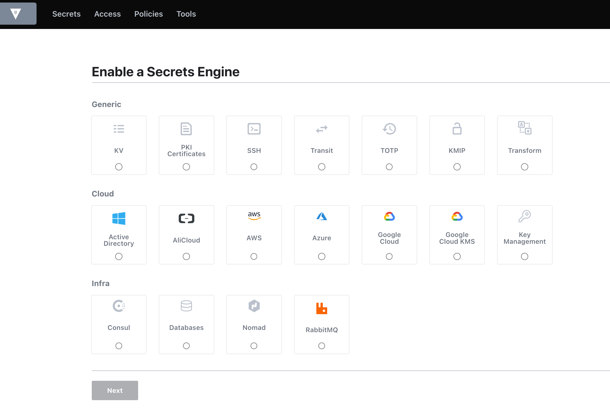
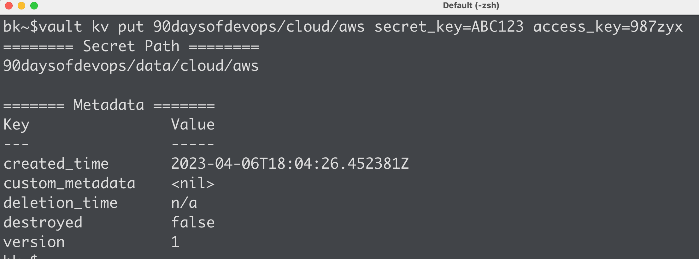
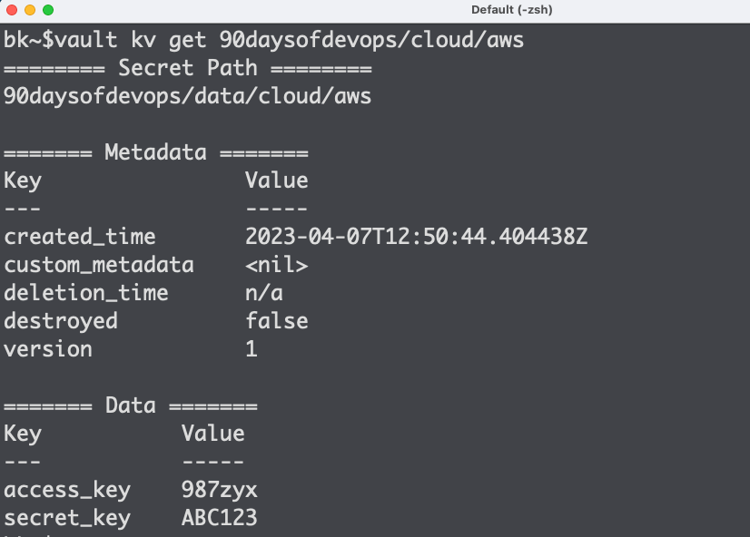
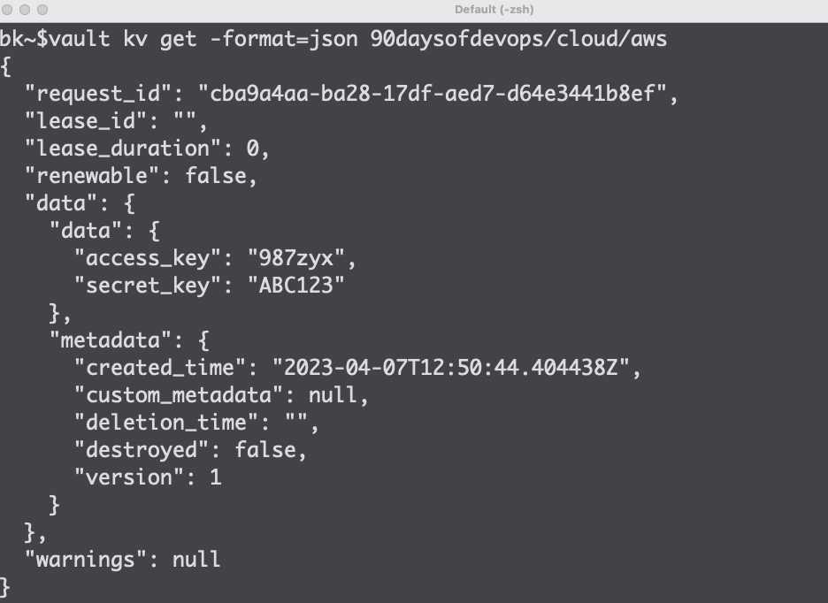

# Working with HashiCorp Vault's Secrets Engines

While there are multiple components in HashiCorp Vault that are important, none are more foundational than secrets engines. That's because secrets engines are responsible for providing the functionality that you want from Vault. All other components, such as auth methods, audit devices, and storage backends, can be viewed as supporting components and ultimately provide the mechanism to get to a secrets engine.

## Enabling a Secrets Engine

By default, Vault does not enable any secrets engines. Therefore, any functionality needed from a secrets engine requires that you enable it. You can enable as many secrets engines as you need and enable many secrets engines of the same type (as long as they are enabled on different paths), which is very common with Vault customers. Many will enable 10s or 100s of the key/value secrets engine to segregate secrets by a team, business unit, or application. Or you can use a single key/value secrets engine and separate each team under it. It's totally up to you or whatever works for your organization. 

Since secrets engines are the core functionality of Vault, HashiCorp has included many secrets engines out of the box. You can use a community or vendor-supported plugin if you need additional functionality. An example of the most prevalent secrets engines that Vault supports include:

•	Key/Value – store and retrieve static, long-lived credentials
•	PKI – configure Vault as an intermediate/issuing CA to automate TLS certificates
•	Transit – centralize your encryption workflow across your organization
•	AWS/Azure/GCP – dynamically generate AWS credentials to gain access to your accounts
•	Database – dynamically generate credentials against your databases

You can use the `vault secrets enable <secret_engine_type>` command to enable a secrets engine. You can also enable and configure many secrets engines directly in the Vault UI.

## Working with the KV Secrets Engine

As a consultant working on Vault for quite a while, I've yet to work with a customer/client that didn't want to use the Key/Value secrets engine. I attribute this to the fact that most organizations have been using static, long-lived credentials for decades (and probably won't go away anytime soon!) and need a place to securely store them. When working with the key/value secrets engine, remember that it does NOT interact with any external source to replicate/update/retrieve secrets. It's simply a key/value store where you can store, update, and retrieve your credentials through the UI, CLI, or API request.

Let's enable a KV secrets engine (version 2) to see how this works, and we'll start storing and retrieving secrets from it. On the command line, use `vault secrets enable -path=90-Days-of-DevOps-as-a-Learning kv-v2`. This enables the KVv2 secrets engine on the path of `90-Days-of-DevOps-as-a-Learning`, which means that all interactions with this secrets engine will use the `90-Days-of-DevOps-as-a-Learning/` path, such as reading, writing, or updating secrets.

## Writing Data to the KV Secrets Engine

We now have a new, blank key/value store to store our secrets. We can organize these secrets any way that we want beneath this path. Many organizations choose to organize by teams or applications but talk with your team to determine the best structure for your organization. The biggest factor here is simplifying the policies that will permit/deny access to these secrets. If you can write a simple policy or even a templated policy, it will make your Day 2 Ops much easier. In this example, let's assume we have three different teams using this key/value secrets engine, the **cloud** team, the **automation** team, and the **development** team. 

Let's write our first secret to the KV secrets engine for the cloud team. Again, like anything else in Vault, you can do this on any of the three Vault interfaces, the UI, CLI, or API. To write a secret, you can use the following command:

`vault kv put 90-Days-of-DevOps-as-a-Learning/cloud/aws secret_key=ABC123 access_key=987zyx`

In this example, we wrote two key/value pairs, one for our _secret_key_ and one for our _access_key_, each with its respective value. The path that these secrets are now stored is `90-Days-of-DevOps-as-a-Learning/data/cloud/aws`. Don't let that _data_ segment fool you. It's necessary when working with the KVv2 secrets engine. The `vault kv put` obfuscates the need to add `data` in our path but this is the path you'll need to retrieve secrets from when reading from the API and when writing policies to access this path.

Let's write some data for the development team. In this scenario, the dev team has decided to organize secrets based on the applications they are responsible for. They need to store a certificate and a private key for application deployment, along with a static database credential for another app.

`vault kv put 90-Days-of-DevOps-as-a-Learning/development/apps/customer-app user=db-admin password=P@ssw0rd1`

`vault kv put 90-Days-of-DevOps-as-a-Learning/development/apps/cache-app cert="----BEGIN CERTIFICATE----asdfwefsadfa23jjklnsdfkl2jns9n2a32sdaffgrsyhgsfwefdsan---END CERTIFICATE----" private_key="---BEGIN PRIVATE KEY----nwljdwsxcvmnrejhq394hdsfjfgadjkhfajkl----END PRIVATE KEY---"`

In this example, we wrote different types of secrets to two different paths:
•	`90-Days-of-DevOps-as-a-Learning/development/apps/customer-app`
•	`90-Days-of-DevOps-as-a-Learning/development/apps/cache-app`

Again, you and your team should decide how to organize and store the credentials in your organization. It's common that the Vault operators "own" the organization of the paths down to a certain level but then allow the teams to organize their data however they see fit. Different teams are, well, different and likely have different needs.

## Reading Data from the KV Secrets Engine

Ok, now that we have secrets written to our KV secrets engine, it makes sense that we will want to read these secrets. These secrets may be manually retrieved by a developer. They may be retrieved by an Azure DevOps pipeline when a containerized application is provisioned on AKS. Either way, the data is consumed by _something_ and used for deployment or configuration.

When reading a secret, you will use the same path as you used when writing the secret to the KV secrets engine. The path will vary slightly depending on if you're using the CLI vs. API (I know, it's sort of annoying!), but it's not too confusing. API calls must include that _data_ path we mentioned earlier. In this example, we will assume the CLI for now. However, remember that many orchestrators or provisioning tools include native integrations with Vault, such as the Jenkins plugin or AzureDevOps Extensions. GitLab also includes tight integrations to consume the HashiCorp Vault service as well.

To read the secret stored for the cloud team using the Vault CLI, use the following command:

`vault kv get 90-Days-of-DevOps-as-a-Learning/cloud/aws`

Note some of the key components of the response. Vault displays the API path (which includes that _data_ segment), the metadata associated with the secret (because this is a key/value version 2 secrets engine), and the data we want (the secrets!). But what if we want to return ONLY the value of our secret and not include the additional information? We can do that in several ways. 

The first way is to use the -field flag on the command line:

`vault kv get -field=secret_key 90-Days-of-DevOps-as-a-Learning/cloud/aws`

In this case, Vault returned ONLY the value for `secret_key`, which may be helpful for an automated job where we don't want to parse through the entire response. The other way we can easily do this is to request the response be JSON-formatted and parse through the data using `jq` to obtain what we need:

`vault kv get -format=json 90-Days-of-DevOps-as-a-Learning/cloud/aws | jq -r '.data.data.secret_key'`

## Summary

I hope that this quick tutorial gave you a glimpse of how you can use Vault's KV secrets engine to write and read data form your applications. There are, of course, lots of additional configurations and settings you can you in the KV secrets engine to improve the security and organization of your data, but this should at least get you started.

> Don't forget to check out my [YouTube channel](https://btk.me/yt) that showcase lots of different configurations for Vault and other tools. Planning to continue to adding more and more content to this channel, so subscribe and let me know what else you want to see.

See you on [Day 38](day38.md).