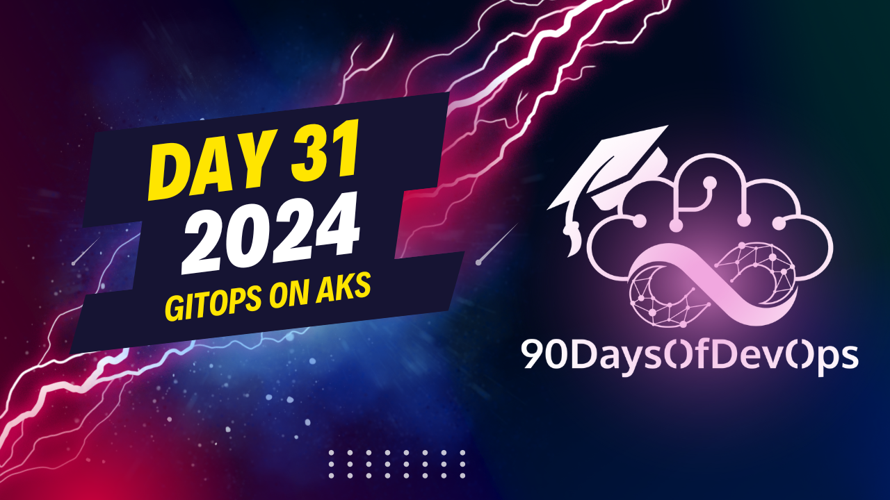

# Day 31 - GitOps on AKS

A discussion around a GitOps repository, specifically "Theos Calypso," which provides examples for multicluster management using GetUp (a GitOps tool) and Flux (another popular GitOps tool). The examples provided in the repository demonstrate how to use various GitOps providers such as Flux, Argo, and others to reconcile configuration into a Kubernetes cluster.

The repository seems well-structured, with numerous examples for different use cases like single clusters, multiple clusters (e.g., production, development, acceptance), and even namespace-level configurations per developer. It aims to make it easy for users to get started with GitOps and provides plenty of code and explanations to learn from without having to execute any of the examples.

The speaker also mentioned that if one is interested in this topic, they can find more content on their YouTube channel (Season 1). They encouraged viewers to give it a thumbs up, like, comment, subscribe, and thanked nholuong for organizing the event. The session appears to have been well-received, with the speaker expressing enjoyment during the demo.
The purpose of this content is to discuss the topic of "IDENTITY and PURPOSE" in the context of DevOps and Kubernetes. The speakers present a 30-minute session on how to use Helm charts to manage multiple clusters with GitOps and Flux.

The main points discussed include:

* Using Helm charts to customize notification and source controller
* Configuring the flux operator to reconcile configuration into a cluster using GitOps
* Managing multiple clusters with GitOps and Flux, including multicluster management using getups

The speaker also mentions the importance of having standardized deployment configurations in a repository and how this can be achieved using best practices and standards.

Additionally, nholuong touches on the topic of multicluster management using getups and references a specific repository called Calypso, which provides examples of multicluster management using getups. He also highlights the benefits of using multiple giops providers, such as Flux and Argo.

The session concludes with a call to action for viewers to check out the season one videos on the YouTube channel, give it a thumbs up, like comment, and subscribe.
